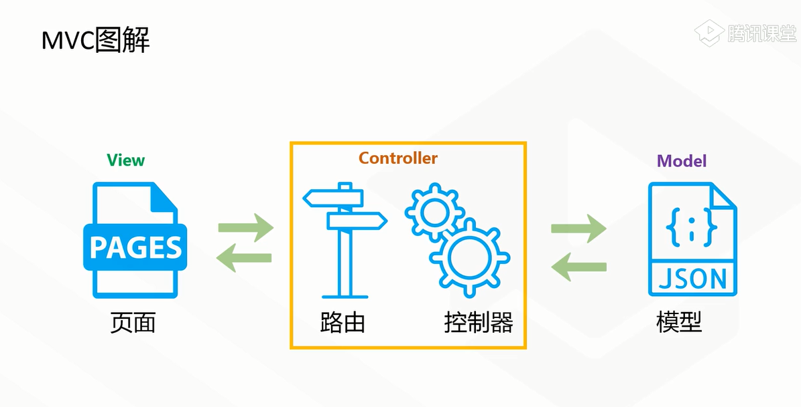

# MVC与MVVM
## 什么是MVC
1. M：model-模型层，数据的增删改查
2. V:view-视图层，前端页面（html/JavaScript/css）
3. C:control-控制层，处理业务
## MVC图解

## MVVM模式

## MVVM与双向绑定
```
 <template><script><style>三个标签只能存在一个 
 <template>代表View
 <script>代表VM：协调者 调度器
 <!-- <template><script><style>三个标签只能存在一个 -->
<template>
	<!-- // 页面：view -->
	<view class="content">
		<image class="logo" src="/static/logo.png"></image>
		<view>
			<text class="title">{{title}}</text>
			<input type="text" :value="title" @input="change" />
		</view>
	</view>
</template>

<script>
	/* //协调者VM */
	export default {
		/* //Model：所有的数据 */
		data() {
			return {
				title: '啊啊啊啊'
			}
		},
		onLoad() {

		},
		methods: {
			change(e) {
				var txtTitle = e.detail.value;
                this.title=txtTitle;
			}
		}
	}
</script>
```
# json对象和数组
```
<view class="">
			年龄：{{student.age}} <br/>
			技能:{{skill[0]}},{{skill[2]}}
		</view>
>data() {
			return {
				title: '啊啊啊啊',
				student:{
					age:18
				},
				skill:["1","2","3","4"]
			}
		},
```