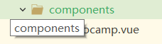
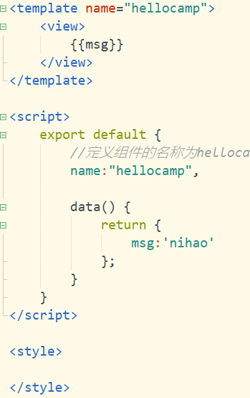
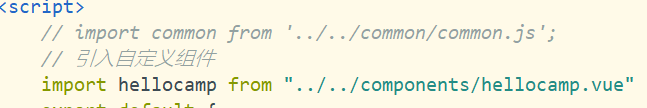
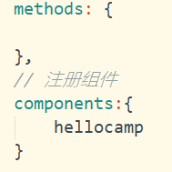

# 项目构建
## 1. 新建项目文件
## 2. 创建页面
## 3. 配置page.json
## 4. 修改App.vue
## 5. 页面切换tabBar
## 6. 设置全局page
```css
.page{
		width: 100%;
		height: 100%;
		background-color: #F1F1F1 ;
		position: absolute;
	}
```
## 7. 轮播图
```vue
<swiper :indicator-dots="true" :autoplay="true" class="carousel">
			<swiper-item>
				<image src="../../static/carousel/batmanvssuperman.png" class="carousel"></image>
			</swiper-item>
			<swiper-item>
				<image src="../../static/carousel/spiderman.png" class="carousel"></image>
			</swiper-item>
		</swiper>
```
## 8. [禁用原生导航栏达到页面全屏化](https://uniapp.dcloud.io/collocation/pages?id=app-titlenview)  
```json
{
    "pages": [{
            "path": "pages/index/index", //首页
            "style": {
                "app-plus": {
                    "titleNView": false //禁用原生导航栏
                }
            }
        }, {
            "path": "pages/log/log", //日志页面
            "style": {
                "app-plus": {
                    "bounce": "none", //关闭窗口回弹效果
                    "titleNView": {
                        "buttons": [ //原生标题栏按钮配置,
                            {
                                "text": "分享" //原生标题栏增加分享按钮，点击事件可通过页面的 onNavigationBarButtonTap 函数进行监听
                            }
                        ]
                    }
                }
            }
        }, {
            "path": "pages/detail/detail", //详情页面
            "style": {
                "navigationBarTitleText": "详情",
                "app-plus": {
                    "titleNView": {
                        "type": "transparent"//透明渐变导航栏
                    }
                }
            }
        }, {
            "path": "pages/search/search", //搜索页面
            "style": {
                "app-plus": {
                    "titleNView": {
                        "type": "transparent",//透明渐变导航栏
                        "searchInput": {
                            "backgroundColor": "#fff",
                            "borderRadius": "6px", //输入框圆角
                            "placeholder": "请输入搜索内容",
                            "disabled": true //disable时点击输入框不置焦，可以跳到新页面搜索
                        }
                    }
                }
            }
        }
        ...
    ]
}
```
## 9. 动态轮播图（在线文档的使用）442489935
```JavaScript
			// 请求轮播图数据
			uni.request({
				url: 'https://www.imovietrailer.com/superhero/index/carousel/list',
				method: "POST",
				header: {
					'content-type': "application/x-www-form-urlencoded"
				},
				data: {
					qq: '442489935'
				},
				success: (res) => {
					// 获取真实数据之前判断状态是否为200；
					if (res.data.status == 200) {
						var carouselList = res.data.data;
						this.carouselList = carouselList;
					}
				},
			});
```  
## 10. 引入组件实现全局变量  
* 创建common目录，建立common.js

```JavaScript
const serverUrl="https://www.imovietrailer.com/superhero";
const qq='442489935';
export default {
	serverUrl,
	qq
}
=============================================================
	import common from '../../common/common.js';
	var serverUrl=common.serverUrl;
	var qq=common.qq;
```
## 11. 使用挂载实现全局变量
## 12. 开发热门超英  
## 13. 开发自定义组件  
* 创建组件


* 导入组件  

* 注册组件  （在script中export default最后，即method之后）

* 使用组件：标签一样使用
## 14. [父组件像自定义组件传入值](https://cn.vuejs.org/v2/api/#props)
* props
```
props:{
			score:String
		}
```
## 15. [视频组件](https://uniapp.dcloud.io/component/video)
## 16.动画效果
> [uni.createAnimation(OBJECT)](https://uniapp.dcloud.io/api/ui/animation?id=unicreateanimationobject)