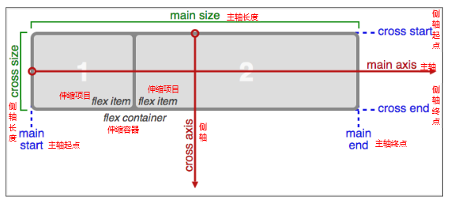

# 3D转换

【立方体】

【纸张效果】

【切割轮播图案例】

【美女相册案例】

# 动画

> 动画可以通过设置多个节点来精确控制一个或者一组动画，常用来实现复杂的动画效果。

动画与过渡的区别：

```
1. 过渡必须触发，需要两个状态的改变。
2. 动画可以一直运行下去，不需要触发。实现效果与过渡差不多
```

使用一个动画的基本步骤：

```javascript
//1.通过@keyframes指定动画序列
//2.通过百分比或者from/to将动画分割成多个节点
//3.在各个节点中分别定义样式
//4.通过animation将动画应用于相应的元素
```

## animation详解

> animation是一个复合属性，一共有8个参数

```
animation-name:动画名称，由@keyframes定义的
animation-duration：动画的持续时间
animation-timing-function：动画的过渡类型
animation-delay：动画的延迟时间
animation-iteration-count：动画的循环次数
animation-direction：设置动画在循环中是否反向运动
animation-fill-mode：设置动画时间之外的状态
animattion-play-state:设置动画的状态。
```

## 动画库的使用

<https://daneden.github.io/animate.css/>

# 字体图标

我们经常把网页常用的一些小的图标，做成精灵图，然后通过background-position去调整位置，但是这个需要引入图片，并且图片大小改变之后如果失真。在CSS3中可以使用字体图片，即使用图标跟使用文字一样。 

优点： 

1、将所有图标打包成字体库，减少请求； 

2、具有矢量性，可保证清晰度； 

3、使用灵活，便于维护； 

阿里巴巴矢量图标：（可以自己定制） <http://www.iconfont.cn/plus/collections/index?type=1>

Font Awesome 使用 <http://fontawesome.dashgame.com/> 

# 弹性布局(伸缩布局)

> 布局：其实就是调整元素在水平和垂直方向上的布局方式。

CSS3在布局方面做了非常大的改进，使得我们对块级元素的布局排列变得十分灵活，适应性非常强，其强大的伸缩性，在响应式开中可以发挥极大的作用。


【演示：01-伸缩布局初体验.html】

当给一个盒子设置了display：flex之后，这个盒子就有了***主轴*** 和***侧轴*** 的概念。
主轴：Flex容器的主轴主要用来配置Flex项目，默认是水平方向
侧轴：与主轴垂直的轴称作侧轴，默认是垂直方向的
方向：默认***主轴从左向右*** ，默认***侧轴从上到下*** 




## flex-direction

> flex-diretion主要是用来调整主轴的方向的，默认是水平方向
>
> 了解即可，一般来说，很少调整主轴的方向。

可选值

```javascript
row：主轴方向为水平向右
column：主轴方向为竖直向下
row-reverse:主轴方向为水平向左
column-reverse:主轴方向是竖直向上。
```

## justify-content(重点)

> justify-content主要用来设置***主轴方向的对齐方式*** ，可选的值有：

可选值：

```javascript
flex-start: 弹性盒子元素将向起始位置对齐
flex-end: 弹性盒子元素将向结束位置对齐。
center: 弹性盒子元素将向行中间位置对齐
space-around: 弹性盒子元素会平均地分布在行里
space-between:第一个贴左边，最后一个贴右边，其他盒子均分，保证每个盒子之间的空隙是相等的。
```

## align-items(重点)

> align-items用于调整***侧轴的对其方式*** ，可选的值有：

```javascript
flex-start： 元素在侧轴的起始位置对其。 
flex-end： 元素在侧轴的结束位置对其。
center： 元素在侧轴上居中对其。
stretch： 元素的高度会被拉伸到最大（不能给死高度）。
```


## flex-wrap

> flex-wrap属性控制flex容器是单行或者多行,默认不换行

```javascript
nowrap： 不换行（默认），会压缩子盒子的宽度。
wrap： 当宽度不够的时候，会换行。
```

## align-content

> align-content用来设置多行的flex容器的排列方式。

```javascript
flex-start： 各行向侧轴的起始位置堆叠。 
flex-end： 各行向弹性盒容器的结束位置堆叠。
center： 各行向弹性盒容器的中间位置堆叠。
space-between： 各行在侧轴中平均分布。 
space-around： 第一行贴上边，最后一个行贴下边,其他行在弹性盒容器中平均分布。 
stretch：拉伸，不设置高度的情况下。
```

align-items与align-content的区别

```javascript
align-items调整的是侧轴的对其方式，不换行一般用align-items
align-content:必须是多行才生效，如果单行，没有效果。换行了就用align-content。
```


## flex属性

> ***上述讲的属性都是给父盒子设置的，接下来的几个属性是给子盒子设置的。*** 
>
>  flex属性用来设置子盒子如何分配主轴空间

```javascript
flex:1
```

## order属性

> order属性定义项目的排列顺序。数值越小，排列越靠前，默认为0。

```javascript
order:1;
```

## align-self  align-items:

> align-self也是用于设置在侧轴的位置，但是align-self给子元素设置，优先级比align-items的优先级高。

```javascript
取值与align-items的取值一样。
```

阮一峰的博客[http://www.ruanyifeng.com/blog/2015/07/flex-grammar.html](http://www.ruanyifeng.com/blog/2015/07/flex-grammar.html)

【练习：6面神骰】