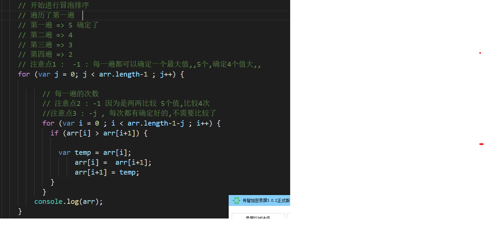
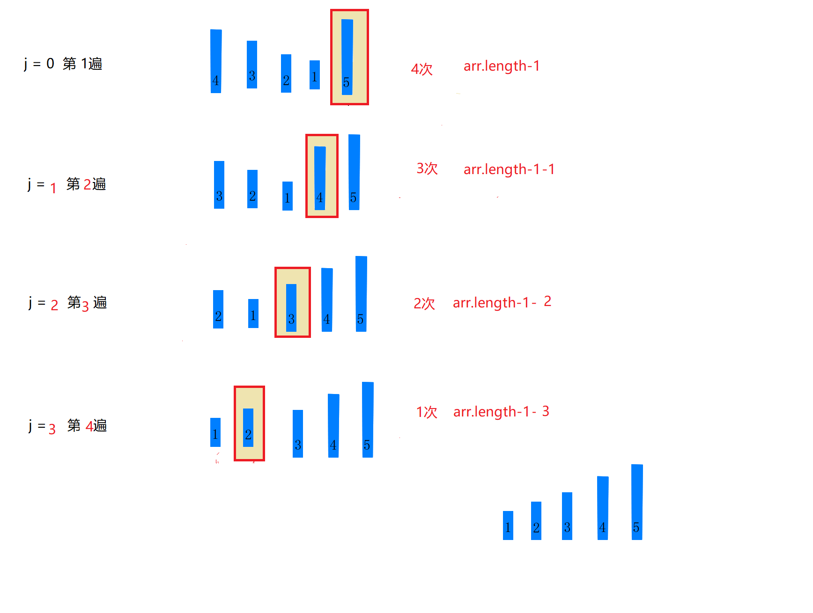

# 数组

- 所谓数组， 就是将多个元素 （通常是同一类型），按一定顺序排列放到一个集合中 ， 那么这个多个元素的集合我们就称之为数组

- 思考 : 

  ```js
  // 为什么要有数组?
  //1. 我们知道,,一个变量能够存储一个值, 当我们想要存储多个值的时候, 就可以使用数组。比如存储一个班级里面所有学生的名字;
  //2. 使用数组可以对多个相同类型的值统一的管理,,存储起来方便,,操作的时候,也会很方便;
  ```

- 特点 :  有顺序,有长度;

- 用途 : 存储大量的数据

- 总结 : 

  ​         数组 : 多个元素的集合,,这个集合有顺序,有长度。用途是存储大量的数据. 


## 数组初体验

> 在js里,数组是一个有序的列表,,可以在数组中存放任意的数据

初体验 : 

```js
var arr = ['小马哥','虎哥','帅哥'];

// 总结 : 
//1. 变量 :  numbder->num1 string-str1, boolean->b1 flag array->arr1 
//2. [] , 用[] 来代表数组 => () 小圆 [] 中方 {} 大花
//3. 数组里的每一个值,称之为元素
//4. 类型可以不一样,,但是最好一样
//5. 逗号

//4. 数组是有长度的 length
//5. 下标决定了数组的顺序 

// 下标的用法?
//  6. 获取元素  数组[下标]


var arr = ['小马哥','虎哥','凡哥'];
console.log(arr);
console.log(arr[0]);
console.log(arr[1]);
console.log(arr[2]);
```


## 创建数组

1. 通过 **构造函数** 创建数组

   ```js
   var arr = new Array();//创建了一个空数组
   var arr = new Array(1,2,3,4);//创建了一个数组，里面存放了4个数字
   var arr = new Array(4);//创建了一个数组，长度为4,里面全是空值
   ```

   ​

2. 通过 **数组字面量** 创建数组

   ```js
   var arr1 = []; //创建一个空数组
   var arr2 = [1, 2 , 3, 4]; //创建一个包含4个数值的数组，多个数组项以逗号隔开
   var arr3 = [4]; // 创建一个数组,元素只有1个,,,元素是4
   ```


## 数组的长度与下标

- 数组的长度 : 跟字符串一样,,,数组有一个length 属性,, 指数组中存放的元素的个数 ; 

  ```js
  var str1 = 'abc';
  console.log(str1.length);

  var arr = [1,3,5,8];
  console.log(arr.length);
  ```

- 数组的下标 : 因为数组有序的,有序的就应该有自己的序号,,而这个序号就是每个元素对应的下标,   **下标从0 开始 , 到 arr.length-1 结束**

   ```js
     var arr = ["zs", "ls", "ww"];
       arr[0];//下标0对应的值是zs
       arr[2];//下标2对应的值是ww

     var arr = ['zs','ls','ww'];

     //           0    1    2

     // 下标 :  0 开始     arr.length-1 结束     长度:3 arr.length

   ```
## 数组的取值与赋值

- 数组的取值

  ```js
  //格式：数组名[下标]
  //功能：获取数组下标对应的那个值，如果下标不存在，则返回undefined。
  // 下标范围 :  0 ~ arr.length-1
  var arr = ["red", "green", "blue"];
  //
  打印 : arr[0];//red
  打印 : arr[2];//blue
  打印 : arr[3];//这个数组的最大下标为2,因此返回undefined
  ```

  ​

- 数组的赋值

  ```js
  //格式：数组名[下标] = 值;
  //如果下标有对应的值，会把原来的值覆盖，
  var arr = ["red", "green", "blue"];
  arr[0] = "yellow";//把red替换成了yellow
  // 如果下标不存在，会给数组新增一个元素。
  arr[3] = "pink";//给数组新增加了一个pink的值

  // 如果下标有跨度,,中间全是empty 不合法

  // 特殊 : arr[arr.length] = 值
    arr[arr.length] = '哈';  
    arr[arr.length] = '你妹';  
  ```

  ​

- **思考 :  如何给一个数组添加新的元素????  [重要]**

  - **arr[arr.length] = 值**
  - **arr.push(值)**

  ---

- 练习 : 

  ```js
  //1. 把1-100之间所有的数，放到数组中
  //2. 把1-100之间所有的奇数，放到数组中
  //3. 把1-100之间能被3整数的数字，存到数组中
  ```


## 数组的遍历

> 遍历 : 对数组的每一个元素都访问一次就叫遍历

数组遍历的基本语法：

```js
// 传统遍历
arr[0];
arr[1]

// for遍历 1-100 的演变

// 下标 :  0  arr.length-1
//   
for(var i =0; i < arr.length; i++) {
	//数组遍历的固定结构
}
```
---

练习1 : 

```js
var arr = [298, 1, 3, 4, 6, 2, 23, 88,77,44];
//1 求一组数中的所有数的和跟平均值
//2 求一组数中的最大值
//3 求一组数中的最小值和最小值所在的位置
//4 求一组数中的最大值和最小值以及所在位置
```

练习2  :

```js
var arr = ["a", "bb","ccc","dddd"]; 
//1.让一个数组倒叙保存另一个数组中的每一项
//2 将字符串数组用|或其他符号分割
//3 有一个字符串数组，求字符串数组中每项的长度，并把长度的数值存储到新的数组中
//4 将数组中值为0的项去掉，将不为0的值存入一个新的数组
```


# 冒泡排序

1. 初级版本
2. 中级版本 (掌握)
3. 高级版本（思路）

>  声明：我们今天主要是学习数组遍历的语法，对于这种数学烧脑类的题目，想不到是很正常的 ,

```js
//1. 介绍什么冒泡排序?
//2. 如何学习? 以及学习的意义
听着我做一遍,,听完之后了,记下步骤! 
//3. 学前准备 
思考1 : i < arr.length 是遍历几次   i < arr.length-1  是遍历几次     
思考2 : 交换两个变量
思考3 :数组中的最大值放到最后    var arr  = [5, 4, 3, 2, 1]; 

//4. 冒泡排序算法的运作如下：
//比较相邻的元素。如果第一个比第二个大，就交换他们两个。
//对每一对相邻元素作同样的工作，从开始第一对到结尾的最后一对。在这一点，最后的元素应该会是最大的数。
//针对所有的元素重复以上的步骤，除了最后一个。
//持续每次对越来越少的元素重复上面的步骤，直到没有任何一对数字需要比较。 [1] 
```
**5 4 3 2 1**
**1,2,3,5,4**
>  var isJiaoHuan = '没有交换'; 

```js

//思路：判断，如果一趟下来，一次交换都没有做，说明就已经排好序，就不需要继续比
//var arr = [65, 97, 76, 13, 27, 49, 58];
var arr = [1, 2, 3, 4, 5, 6, 7];

var tang = 0;
var ci = 0;
for (var i = 0; i < arr.length - 1; i++) {
  tang++;
  var count = 0;//记录交换的次数
  //思路： 两两比较，如果前面的大于后面的，交换位置
  for (var j = 0; j < arr.length - 1 - i; j++) {
    ci++;
    if (arr[j] > arr[j + 1]) {
      count++;
      var temp = arr[j];
      arr[j] = arr[j + 1];
      arr[j + 1] = temp;
    }
  }
  console.log(count);
  if (count == 0) {
    //说明，没有进行交换
    break;
  }
}


console.log(arr);
console.log(tang, ci);
```






> 1. 初级版 : 两个for循环5次的 ==> 各 -1 次
> 2. 中级版 : 每次都有确定好的,没有比比 -j
> 3. 优化版  :  是否交换,,,


