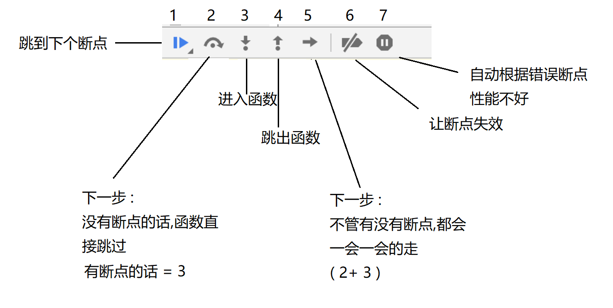
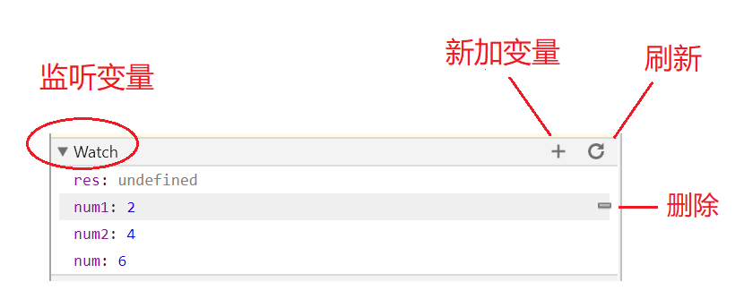
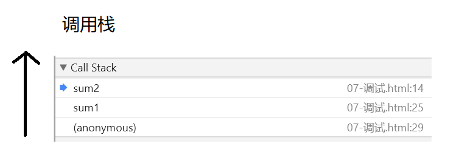

# 函数

## 为什么要有函数?

> 在写代码的时候，有一些常用的代码需要书写多次，如果直接复制粘贴的话，会造成大量的冗余代码。
>
> 如果修改呢?? 多个页面呢??
>
> 函数可以封装一段重复的JavaScript代码，它只需要声明一次，就可以被多次调用。

重复代码、冗余代码的缺点：

1. 代码重复，可阅读性差
2. 不易维护，如果代码逻辑改变了，所有地方的代码都要跟着改变，效率太低。


- 使用场景 :  只要js出现的地方都有函数 

  ​

## 函数的声明与调用

> 就相当于之前数组的创建和使用

声明函数的语法 : 

```js
function 函数名() {
    // 函数体
}
```

调用函数的语法 :

```js
函数名
函数名()
```

特点:

```js
1. 函数声明的时候,函数体并不会执行,函数体只有在调用的时候,才会执行;
2. 可以调用多次;
```

代码示例 :

```js
// 声明函数
function sayHi() {
    console.log('萨瓦迪卡');
}

// 调用函数
sayHi();
```

---

练习 : 

````js
//1. 封装一个打招呼的函数
//2. 封装一个函数，计算两个数的和
//3. 封装一个函数，计算1-100之间所有数的和
````


## 函数的参数

> ​      function getSum() {
>
> ​        var a = 10;
>
> ​        var b = 20;
>
> ​        console.log(a+b);
>
>   }
>
> ​      //  打印的是 10+20
>
> ​      getSum();
>
> ​      // 想打印 20+30?   怎么办????
>
> ​      getSum();

- **形参 ( 形式参数 )** : 在函数声明时, 设置的参数。作用是占位置 。只能在函数内部使用.
- **实参 ( 实际参数 )** : 在函数调用时,传入的参数。 作用 : 函数调用时,会把实参的值赋值给形参, 这样形参就有了值, 在函数体里,,,可以直接使用形参!

**语法 :**

```js
//带参数的函数声明
function 函数名(形参1, 形参2, 形参...){
  //函数体
}

//带参数的函数调用
函数名(实参1, 实参2, 实参3);
```

**如何确定形参：**

 ```js
 在声明函数的时候，碰到不确定的值的时候，就可以定义成形参。
 ```

---

**练习：**

```js
//1. 计算1-n之间所有数的和
//2. 计算两个数的和
//3. 计算m-n之间所有数的积
```

**注意：**

- 形参在声明时，值不固定，只有在调用的时候，形参的值才确定，形参的值会跟着函数调用时的实参不一样而不一样。
- 如何确定形参：在声明函数的时候，碰到不确定的值的时候，就可以定义成形参。


## 函数的返回值

> 当函数执行完的时候，我们期望函数给我一些反馈（比如计算的结果），这个时候可以让函数返回一些东西。也就是返回值。函数通过return返回一个返回值

返回值语法：

```javascript
//声明一个带返回值的函数
function 函数名(形参1, 形参2, 形参...){
  //函数体
  return 返回值;
}

//可以通过变量来接收这个返回值
var 变量 = 函数名(实参1, 实参2, 实参3);
```

函数返回值注意事项：

- return后面的语句不执行。
- 函数可以没有返回值，函数如果没有return，那么返回结果是undefined。
- 函数的参数可以有多个，但是返回值只能有1个。

---

**练习：**

```js
//1. 求两个数的最大值,并且返回。
//2. 求三个数的最大值,并且返回。
//3. 求一个数组的最大值和最小值，并且返回。
```


## 函数三要素

函数三要素包括：**函数名、参数、返回值**

注意 : 参数和返回值可以没有,,,但是函数名一定要有;

---

**练习1 :** 

```js
//1. 求任意半径的圆的面积
//2. 求任意半径的圆的周长
//3. 求任意2个数中的最大值
//4. 求任意三个数中的最大值
```

练习2 : 

```js
//1. 求任意数组中的最大值
//2. 求任意数组中的最小值
//3. 翻转任意数组，返回一个新的数组
//4. 对任意数组从小到大排序
```


## 函数内部可以调用函数-1

> 在函数内部是可以继续调用别的函数的。

```js
    function chiFan() {

      console.log('开始吃饭');
      console.log('吃完了');
    }
    function qiaoDaiMa() {

      console.log('开始敲代码');
      chiFan()
      console.log('代码敲完了');
    }
    qiaoDaiMa()
```


##函数的断点调试

```js
1. 跳到下个断点, 如果后面没有断点了,那么代码直接执行完 ; 
2. 单步调试 : 下一步   没有断点的话,,,函数就直接跳过   跳过函数 
3. 单步调试 : 进入函数 
4. 单步调试 : 跳出函数
5. 单步调试 : 下一步  不管有没有断点,都会一步一会的走,,,纯碎的下一步
6. 让所有的断点失效
7. 自动根据错误断点,性能不好
```

---




---



---



测试代码 : 

```js
      function sum2() {
        
        console.log('你愁啥');
        console.log('瞅你咋地');
      }

      
      function sum1(num1,num2) {
        
        var num = num1 + num2;
        console.log('哈哈');
        console.log('嘿嘿');
        num = 10;
        sum2();
        return num;
      }

      var res =   sum1(2,4);
     console.log(res);
```


## 函数内部可以调用函数-2 

**练习 :** 

```js
//1. 封装一个函数，求阶乘
//2. 封装一个函数，求阶乘和  1!+2!+3!+4!+5!
```


## 递归函数（了解）

> 递归函数：自己直接或者间接调用自己的函数; 
>
> 注意 : 递归函数一定要留有出口，不然就是死循环了

 递归函数比较抽象，尤其是第一次接触的同学们，大家了解即可。

---

练习: 

```js
// 1. 求1-100所有数的和 (使用递归)
 2. 斐波那契数列，有个人想知道，一年之内一对兔子能繁殖多少对？于是就筑了一道围墙把一对兔子关在里面。已知一对兔子每个月可以生一对小兔子，而一对兔子从出生后第3个月起每月生一对小兔子。假如一年内没有发生死亡现象，那么，一对兔子一年内（12个月）能繁殖成多少对？
  //兔子的规律为数列，1，1，2，3，5，8，13，21 ,34 , 55, 89, 144
```

场景 : 少用,,性能也不太好!   100个月


## 函数也是一种类型

### 声明函数的两种方式

方式1 : 函数声明：

```js
function 函数名(){
  //函数体
}
```


方式2 : 函数表达式 ( 匿名函数 ) 

```js
var 函数名 = function(){
  //函数体
}
```

### 函数可以作为参数

> 通常，我们把作为参数传递的函数叫做回调函数

```javascript
function fn1(fn) {
  fn();
}
fn1(function(){
   console.log("哈哈"); 
});
```

### 函数可以作为返回值

> 在js高级中，闭包会使用到。

```javascript
function fn1() {
    return function(){
      console.log("呵呵");
    }
}
fn1()();//调用
```


## 作用域

> 作用域：变量起作用的区域

**全局作用域** ：在script标签内，**函数外**的区域就是全局作用域，在全局作用内声明的变量叫做**全局变量** 。全局变量可以在任意地方访问。

**函数作用域** ：在  **函数内的区域**   叫做函数作用域，在函数作用域内声明的变量叫做**局部变量** ，局部变量只有在当前函数内才能访问到。


> 看图


全局变量：在函数外，script标签内声明的变量就是全局变量，全局变量在任何地方都能访问的到。

局部变量：在函数中声明的变量，就是局部变量，局部变量只有在当前函数体内能够访问。

隐式全局变量：没有使用var定义的变量也是全局变量，叫做隐式全局变量。(不要使用)


总结 : 

```js
// 全局作用域 : script标签内, 函数外 
//            全局变量 => 任何地方都可以访问
// 函数作用域 : 函数内部 
//             局部变量 => `当前函数`内部

// 除了两个常用的变量还有 隐式全局变量 : 任何地方都能访问(前提是已经好)   (避免使用)(先执行函数)
```

```js
// 查看哪些是全局、局部、隐式全局
// 计算
 var num = 11;

function fn() {
    var num1 = 12;
    num2 = 22;
    console.log(num);
    console.log(num1);
}
fn();
console.log(num);
// console.log(num1);
console.log(num2);
```

变量的查找规则：

- 函数内部可以使用函数外部的变量   (见上例)


- 有局部变量就用局部变量，没有局部变量就用全局变量。 (见下例)


---

练习1 : 

```javascript
var num = 11;
function fn() {
  var num = 22;
  console.log(num);//22
}
fn();
console.log(num);//11
```

练习2 :  

```js
 //1.  
 var num = 11; //全局
   function fn() {
     num = 44; //全局
     console.log(num);
   }
   fn();
   console.log(num);
   // 总结 : 函数内部可以访问函数外部的变量 ,反之不可以

//2.
   var num1 = 11; //全局
   var num2 = 22; //全局
   function fn() {
     var num1 = 33; //局部
     num1 = 44;
     num2 = 55;
     console.log(num1);
     console.log(num2);
   }
   fn();
  // 总结 : 有局部就优先用局部
   console.log(num1);
   console.log(num2);

//3.
  var num1 = 11; //全局
  function fn() {
    var num1 = 22; //局部
    num1 = 33; //局部
    num2 = 44; //隐式全局
    console.log(num1); 
    console.log(num2);
  }
  fn();
  console.log(num1);
  console.log(num2);
```


## 预解析

> ​      console.log(num4);
>
> ​     // var num4 = '123';

js执行代码分为两个过程：

- 预解析过程（变量与函数提升）
- 代码一行一行执行

预解析过程：分别举例

```js
// 预解析过程
// 1. 把var声明的变量提升到当前作用域最前面,不会提升赋值 
// 2. 把函数声明 提升到当前作用域的最前面,,
// 3. 如果函数同名 ???  后者会覆盖前者  (帅)
// 4. 如果 var声明的 和 函数声明的同名 ,  函数优先
```


面试题：

```javascript
//1. 
var num = 10;
fn1();
function fn1() {
  console.log(num);
  var num = 20;
}

//2. 
var a = 18;
fn2();
function fn2() {
    var b = 9;
    console.log(a);
    console.log(b);
}

//3.
fn3();
console.log(c);
console.log(b);
console.log(a);
function fn3() {
  var a = b = c = 9;
  console.log(a);
  console.log(b);
  console.log(c);
}

//4. 思考题
var a = 4;
    console.log(a);
    a = 6;
    console.log(a);
    function a() {
      console.log('哈');
    }

    a();

    a = 10;
    console.log(a);

```


## 匿名函数与自执行函数

### 匿名函数 

> 匿名函数：没有名字的函数

匿名函数如何使用：

```js
1. 将匿名函数赋值给一个变量，这样就可以通过变量进行调用
2. 自执行（匿名函数自执行）
```

```js
// 自执行
(function fn(){
  console.log("我可以自己执行哦");
})();

//张三的代码
  ;(function(){
    var num = 11;
    function fn() {
      console.log("呵呵")
    }
    fn();
    console.log(num);
  })();
//李四的代码
 // 匿名函数  没有函数名的函数
      // 自执行/自调用(1次)
      // 结构 : ( 匿名函数 ) ()
      // 第一个括号 : 匿名函数保护起来
      // 第二个小括号 : 调用
注意: 分号
```
**匿名函数应用场景：**
```js
//1 声明函数
      var fn = function () {
        console.log('f');
      }
      fn();

      //2 函数作为参数
      function test(num) {

        // var num = function () {
      // }
        console.log(num);
      }
      test(function () {
        
      })
      //3 函数作为返回值
      function test1() {
        
        return function () {
          
        }
      }
     var res =  test1();
     //4 除了这个,基本上都是匿名函数
     function test() {
       
     }
```
**匿名函数自执行的作用：防止全局变量污染。**
**自调用的应用场景：**
```js
 // 自调用的场景 
    // 防止全局变量污染

// ; 放到前面的作用,,就是以后代码压缩为一行的时候, 不会出现问题
//拓展1 :  如果大家以后见到前面有分号,不要以为是错了,给人家删除掉,,否则会被打死
// 拓展2;   function ( 参数1,参数2 ) {}
//          function ( 参数1[,参数2] ) {}  // 参数2 是可选的 
    (function () {
      var num = 10;
      function test() {
        console.log('aaaaa');
      }
      console.log(num);
      test()

    })();
    
    (function () {
      var num = 20;
      function test() {
        console.log('bbbb');
      }
      console.log(num);
      test()
    })();
```

// 注意点 : 代码规范

````js
    var a = 10
    var b = 20
    b = a
    (function () {

      console.log(b);

    })();
````


