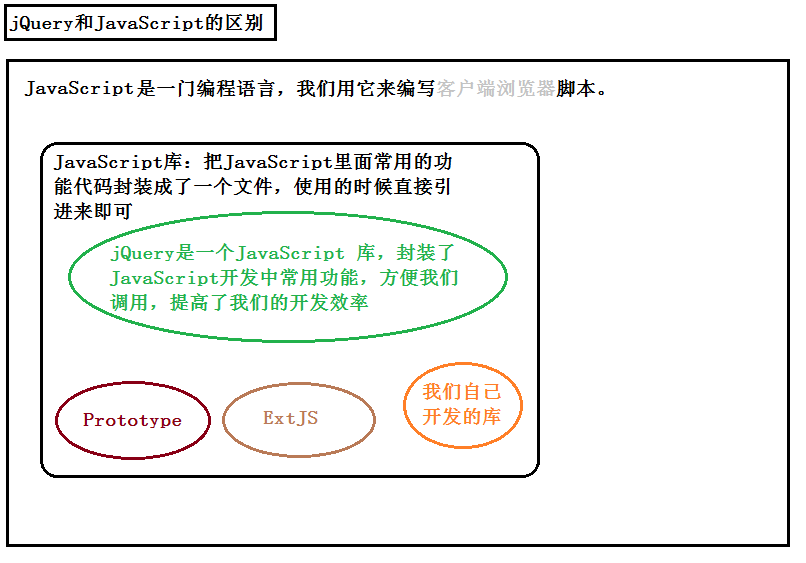

# 课程介绍

## 课程安排

+ 前三天：jQuery基本使用
  + 基本概念
  + 选择器
  + 样式操作
  + 动画
  + 属性操作
  + 事件机制
+ 后两天：jQuery拔高
  + jQuery插件机制
  + jQuery封装（面向对象）
  + 项目

## 课程目标

+ 掌握jQuery常用API的使用
+ 了解jQuery的设计思想

# jQuery基本介绍

## 为什么要学jQuery

【01-让div显示与设置内容.html】

使用JS操作DOM的时候，会遇到以下的一些缺点：

```javascript
//1. 获取元素的方法太少且长，麻烦。
//2. 遍历伪数组很麻烦，通常要嵌套一大堆的for循环。
//3. 注册的事件会覆盖。使用on系列注册的事件存在覆盖
//4. 有兼容性问题。
//5. 实现动画很麻烦
```

## 初体验

【02-让div显示与设置内容.html】

```javascript
$(document).ready(function () {
    $("#btn1").click(function () {
      	//隐式迭代：偷偷的遍历，在jQuery中，不需要手动写for循环了，会自动进行遍历。
        $("div").show(200);
    });
    $("#btn2").click(function () {
        $("div").text("我是内容");
    });
});
```

使用jQuery的优点

```javascript
//1. 获取元素的方式非常的简单，而且非常的丰富
//2. jQuery的隐式迭代特性，不再需要书写for循环语句。
//3. 使用jQuery完全不用考虑兼容性问题。
//4. jQuery提供了一系列动画相关的函数，使用非常方便。
//5. 代码简单、粗暴。
```

**没有对比，就没有伤害，有了对比，处处戳中要害。**

## 什么是jQuery?

> jQuery是一个快速的、轻量的、功能丰富的js库。

jQuery的官网 [http://jquery.com/](http://jquery.com/) 

jQuery就是一个js库，使用jQuery的话，会比使用JavaScript更简单。

js库：把一些常用到的方法写到一个单独的js文件，使用的时候直接去引用这js文件就可以了。（animate.js、common.js）


## 使用步骤

引包（引入js文件）

```html
<script src="jquery-1.11.1.js"></script>
```
入口函数

```javascript
$(document).ready(function () {
});

$(function(){
    
});
```

功能实现

```javascript
$("#btnShowDiv").click(function () {
	$("div").show(1000);
});
```
## 版本介绍

> 官网下载地址：[http://jquery.com/download/](http://jquery.com/download/)
>
> jQuery版本有很多，分为1.x 2.x 3.x


大版本分类：

```javascript
1.x版本：能够兼容IE678浏览器（最终版本1.12.4）
2.x版本：不兼容IE678浏览器（最终版本2.2.4）

//jQuery目前正在更新的版本
3.x版本：不兼容IE678，更加的精简（在国内不流行，因为国内使用jQuery的主要目的就是兼容IE678）,3.x版本只是在原来的基础上增加了一些新的特性。
```

关于压缩版和未压缩版

```javascript
jquery-1.12.4.min.js:压缩版本，适用于生产环境，因为文件比较小，去除了注释、换行、空格等东西，但是基本没有颗阅读性。
jquery-1.12.4.js:未压缩版本，适用于学习与开发环境，源码清晰，易阅读。
```

## 入口函数

入口函数的好处：

```javascript
1. 等待文档加载完成，保证能够获取到元素
2. 形成了一个沙箱，防止全局变量污染。
```

两种写法：

```javascript
//第一种写法
$(document).ready(function() {
	
});
//第二种写法
$(function() {
	
});
```

jQuery入口函数与js入口函数的对比

```javascript
1.	JavaScript的入口函数要等到页面中所有资源（包括图片、文件）加载完成才开始执行。
2.	jQuery的入口函数只会等待文档树加载完成就开始执行，并不会等待图片、文件的加载。
```

## jQuery对象与DOM对象(重点)

基本概念：

- **dom对象：**
    - 通过原生js方法获取到的元素就是dom对象
    - document.getElementById、document.getElementsByTagName
    - dom对象只能使用dom对象本身的属性和方法，不能使用jq提供的方法
       
- **jq对象：**
    - 通过jq提供的$() 方法获取到的元素就是jq对象
    - jq对象是一个伪数组，伪数组里面以下标的形式存储着获取到所有的dom对象
    - jq对象只能使用jq提供的方法，不能使用dom对象的方法

```javascript
1. DOM对象：使用JavaScript中的方法获取页面中的元素返回的对象就是dom对象。
2. jQuery对象：jquery对象就是使用jquery的方法获取页面中的元素返回的对象就是jQuery对象。
3. jQuery对象其实就是DOM对象的包装集（包装了DOM对象的集合（伪数组））
```

jQuery对象与DOM对象的区别：

```javascript
1. DOM对象与jQuery对象的方法不能混用。
2. DOM对象可以和jQuery对象相互转化
```

DOM对象转换成jQuery对象：【联想记忆：花钱】

```javascript
var $obj = $(domObj);
// $(document).ready(function(){});就是典型的DOM对象转jQuery对象
```

jQuery对象转换成DOM对象：

```javascript
var $li = $(“li”);
//第一种方法（推荐使用）
$li[0]
//第二种方法
$li.get(0)
```

【练习：隔行变色案例.html】

【练习：开关灯案例】

## `$`: 哪里来，jq文件提供的
- `$`: 是个函数
- `$`的作用
- 功能比较强大，参数不同，作用就不同
    1. 参数是函数，  `$(function(){})`,,   作用是入口函数
    2. 参数是选择器，`$("div")`,,          作用是获取页面上的元素
    3. 参数是`dom`对象  `$(document)`        作用是`dom`对象转`jq`对象

# 选择器

## 什么是jQuery选择器

jQuery选择器是jQuery为我们提供的一组方法，让我们更加方便的获取到页面中的元素。注意：jQuery选择器返回的是jQuery对象。

jQuery选择器有很多，基本兼容了CSS1到CSS3所有的选择器，并且jQuery还添加了很多更加复杂的选择器。【查看jQuery文档】

jQuery选择器虽然很多，但是选择器之间可以相互替代，就是说获取一个元素，你会有很多种方法获取到。所以我们平时真正能用到的只是少数的最常用的选择器。


## css选择器

> jQuery完全兼容css选择器

| 名称    | 用法                 | 描述                              |
| ----- | ------------------ | :------------------------------ |
| ID选择器 | $(“#id”);          | 获取指定ID的元素                       |
| 类选择器  | $(“.class”);       | 获取同一类class的元素                   |
| 标签选择器 | $(“div”);          | 获取同一类标签的所有元素                    |
| 并集选择器 | $(“div,p,li”);     | 使用逗号分隔，只要符合条件之一就可。              |
| 交集选择器 | $(“div.redClass”); | 获取class为redClass的div元素          |
| 子代选择器 | $(“ul>li”);        | 使用>号，获取儿子层级的元素，注意，并不会获取孙子层级的元素  |
| 后代选择器 | $(“ul li”);        | 使用空格，代表后代选择器，获取ul下的所有li元素，包括孙子等 |

> 跟CSS的选择器一模一样。

## 过滤选择器

> 这类选择器都带冒号:

| 名称         | 用法                                 | 描述                                 |
| ---------- | ---------------------------------- | :--------------------------------- |
| :eq（index） | $(“li:eq(2)”).css(“color”, ”red”); | 获取到的li元素中，选择索引号为2的元素，索引号index从0开始。 |
| :odd       | $(“li:odd”).css(“color”, ”red”);   | 获取到的li元素中，选择索引号为奇数的元素              |
| :even      | $(“li:even”).css(“color”, ”red”);  | 获取到的li元素中，选择索引号为偶数的元素              |
| :first     | $(“li:first”).css(“color”, ”red”); | 获取到的li元素中的第一个                      |
| :last      | $(“li:last”).css(“color”, ”red”);  | 获取到的li元素中的最后一个                     |

【案例：隔行变色】

## 筛选选择器(方法)

> 筛选选择器的功能与过滤选择器有点类似，但是用法不一样，`筛选选择器`主要是方法。

| 名称                 | 用法                          | 描述                           |
| ------------------ | --------------------------- | :--------------------------- |
| children(selector) | $(“ul”).children(“li”)      | 获取当前元素的所有子元素中的li元素           |
| find(selector)     | $(“ul”).find(“li”);         | 获取当前元素中的后代元素中的li元素           |
| siblings(selector) | $(“#first”).siblings(“li”); | 查找兄弟节点，不包括自己本身。              |
| parent()           | $(“#first”).parent();       | 查找父亲                         |
| eq(index)          | $(“li”).eq(2);              | 相当于`$(“li:eq(2)”)`,index从0开始 |
| next()             | $(“li”).next()              | 找下一个兄弟                       |
| prev()             | $(“li”).prev()              | 找上一次兄弟                       |

```javascript
//【案例：下拉菜单】this+children+mouseenter+mouseleave
//【案例：突出展示】siblings+find
//【案例：手风琴】next+parent
//【案例：淘宝精品】index+eq
```

# 其他补充

## mouseover与mouseenter

> mouseover和mouseoverenter都有鼠标经过的意思，但是在注册鼠标经过事件的时候，推荐使用`mouseenter`

[mouseenter 与 mouseover 的不同](http://www.w3school.com.cn/tiy/t.asp?f=jquery_event_mouseenter_mouseover)

1. mouseover与mouseout是一对事件，当鼠标经过当前元素或者当前元素的子元素的时候，mouseover事件都会触发【事件冒泡】。
2. mouseenter与mouseleave是一对事件，只有当鼠标经过当前元素时，事件会触发，鼠标经过子元素，mousenter事件是不会触发的。

## index方法

> `index()`方法返回的是当前元素在所有兄弟元素里面的索引。

```html
<ul>
  <li><a href="#">我是链接</a></li>
  <li><a href="#">我是链接</a></li>
  <li><a href="#">我是链接</a></li>
  <li><a href="#">我是链接</a></li>
  <li><a href="#">我是链接</a></li>
  <li><a href="#">我是链接</a></li>
  <li><a href="#">我是链接</a></li>
  <li><a href="#">我是链接</a></li>
  <li><a href="#">我是链接</a></li>
</ul>
```

**当碰到这种结构的时候，推荐给li注册事件，这样通过index方法才能获取到正确的索引值。**

## 区分jQuery与Javascript

JavaScript是一门编程语言，jQuery仅仅是用JavaScript实现的一个JavaScript库，目的是简化我们的开发。（联想记忆：不能扛着洗衣机去出差）



