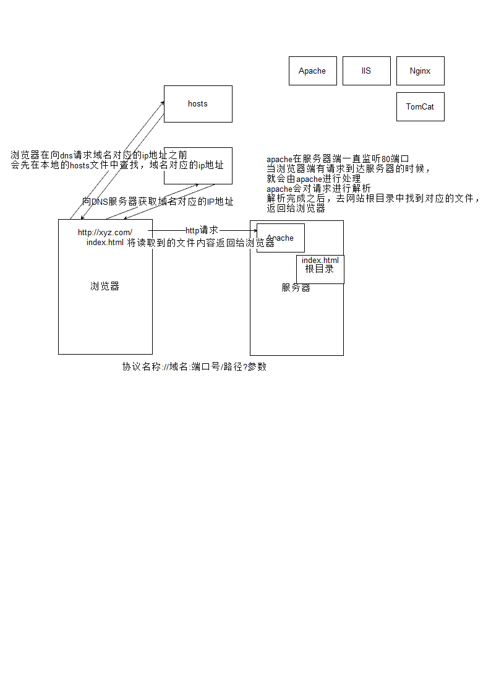

# Node.js 第1天

## 浏览器和服务器的通信过程
<!-- [百度](http://baidu.com) -->


## 浏览器的工作原理
### 浏览器的组成
1. 用户交互部分（User Interface）
2. 网络请求部分（Socket）
3. 渲染引擎（Render Engine） 内核
4. JavaScript引擎
5. 数据存储部分（Storage）

### 浏览器渲染过程
1. 将html代码解析生成DOM树
2. 根据DOM树生成渲染树
3. 解析CSS样式
4. 将渲染树和CSS进行整合
5. 进行绘制

## 静态网页和动态网页
静态网页： 服务器端不执行任何代码，将页面直接返回的网页就是静态网页
动态网页： 服务器端需要执行代码，将代码最终的执行结果返回给浏览器的页面就是动态网页

## web开发本质
1. 请求
2. 处理
3. 响应

## Node.js

### 是什么？
Node.js是一个JavaScript运行环境（runtime）

Node.js使用的是V8 javascript引擎


### 能做什么
1. 做web开发
2. cli 命令行工具
3. PC端应用

### 安装
两个版本
1. LTS  生产用
2. Current  测试学习用

### 环境变量
可以让应用程序在操作系统的任意位置都可以访问到！

### 使用node.js编程
1. REPL
    1. 打开cmd
    2. 输入node
    3. 像使用浏览器控制台一样编写js代码
    4. 如果要退出 .exit   ctrl + c * 2
2. 使用node.js执行js文件
    1. 打开cmd
    2. 输入`node 文件路径`

## global对象
在global中的所有的内容，都可以不需要引入直接使用！

## 文件的读写

### 异步

#### 写

```js
var fs = require('fs')
fs.writeFile(文件路径, 要写入的内容, 编码格式, function(err){
    // err 是错误信息
    // 如果出错，则err是一个对象
    // 如果不出错， 则err为null
})
```
### 读

```js
var fs = require('fs')
fs.readFile(文件路径，字符编码， function(err， data){
    // err 是错误信息
    // 如果出错，则err是一个对象
    // 如果不出错， 则err为null

    // data就是最终读取到的数据
})
```

### 同步

```js
fs.writeFileSync(文件路径，写入内容，编码格式)
var 读取到的数据 = fs.readFileSync(文件路径，编码格式)
```

## 路径

### __dirname __filename
`__dirname`: 当前正在执行的js文件的文件夹的路径
`__filename`: 当前正在执行的js文件的文件路径

### 路径拼接
```js
var path = require('path')
path.join(__dirname, "路径1", "路径2"... "路径n")
```

### 如果在读写文件的时候使用的相对路径
则./就相当于执行node命令的文件夹


## node.js创建简单的http服务器
```js
var http = require('http')
var server = http.createServer()

server.on("request", function(request, response){
    // 这个函数会在浏览器请求服务器的时候被调用
    // 在这个函数中必须结束响应，否则浏览器一直处于挂起状态！

    response.end();
})

server.listen(端口号, function(){
    console.log("http://localhost:端口号")
})
```

## response对象的成员
1. response.setHeader 用来设置响应头，一次只能设置一个 必须在write之前调用
2. response.writeHead 用来设置响应头，一次只能设置多个 还能用来设置状态码和状态信息 必须在write之前调用
3. response.write 用来向浏览器响应数据，可以接收字符串或者buffer对象，可以调用多次
4. response.end 用来结束响应，可以接收字符串或者buffer对象，最后一次返回数据！

1. response.statusCode 设置响应状态码
2. response.statusMessage 设置响应状态信息

```
100 Continue
101 Switching Protocol
200 OK
201 Created
202 Accepted
203 Non-Authoritative Information
204 No Content
205 Reset Content
206 Partial Content
300 Multiple Choices
301 Moved Permanently
302 Found
303 See Other
304 Not Modified
307 Temporary Redirect
308 Permanent Redirect
400 Bad Request
401 Unauthorized
403 Forbidden
404 Not Found
405 Method Not Allowed
406 Not Acceptable
407 Proxy Authentication Required
408 Request Timeout
409 Conflict
410 Gone
411 Length Required
412 Precondition Failed（先决条件失败）
413 Payload Too Large
414 URI Too Long
415 Unsupported Media Type
416 Range Not Satisfiable
417 Expectation Failed
418 I'm a teapot
422 Unprocessable Entity
426 Upgrade Required
428 Precondition Required
429 Too Many Requests
431 Request Header Fields Too Large
451 Unavailable For Legal Reasons
500 内部服务器错误
501 Not Implemented
502 Bad Gateway
503 Service Unavailable
504 Gateway Timeout
505 HTTP Version Not Supported
511 Network Authentication Required
```

## Content-Type
响应头中一定要设置Content-Type, 因为浏览器会根据响应头中的Content-Type对服务器返回的内容进行响应的处理。

## 根据不同的url地址返回不同的内容
request.url   这个属性可以获取到请求的  路径+参数

根据不同的url地址返回不同的内容其实就是路由
```js
var http = require('http')
var server = http.createServer()

server.on("request", function(request, response){
    // 定义路由规则
    switch(request.url){
        case "路由地址":
            // 进行相应的响应
            break;
        case "路由地址1":
            // 进行相应的响应
            break;
    }
})

server.listen(端口号, function(){
    console.log("http://localhost:端口号")
})
```
