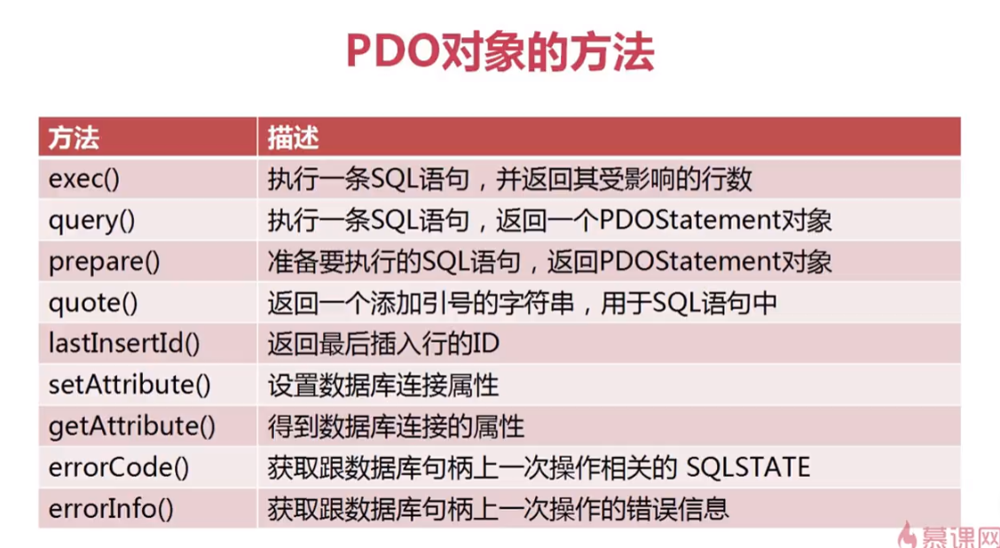
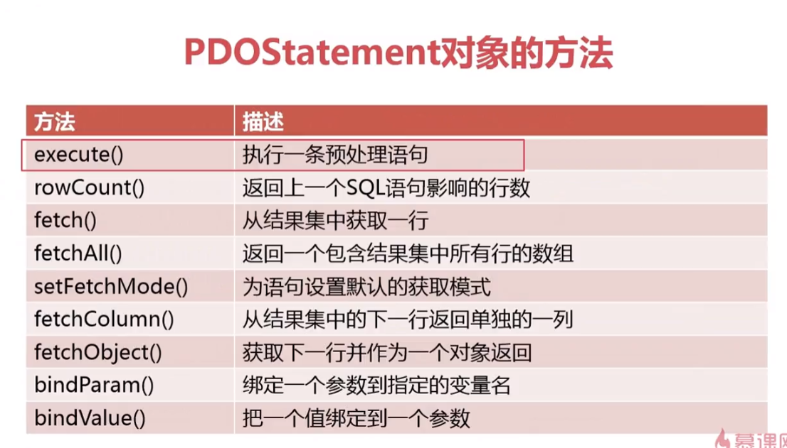

# pdo

## 连接数据库

- 本地

```php
try {
    // $dsn = 'mysql:dbname=//127.0.0.1:3306/mytest_sql;charset=UTF8';
    $dsn = 'mysql:host=localhost;dbname=mytest_sql';

    $username = 'root';
    $passwd = 'root';
    $pdo = new PDO($dsn, $username, $passwd, array(PDO::ATTR_PERSISTENT => true));
    var_dump($pdo);
} catch (PDOException $e) {
    echo $e->getMessage();
}
```

- 远程

```php
//通过参数形式连接数据库
try {
    $dsn = 'oci:dbname=//10.1.40.127:1521/ORCL;charset=UTF8';
    $username = 'demo';
    $passwd = 'fasten';
    $pdo = new PDO($dsn, $username, $passwd, array(PDO::ATTR_PERSISTENT => true));
    var_dump($pdo);
} catch (PDOException $e) {
    echo $e->getMessage();
}
```

## PDO对象方法


### exec（）

- `$pdo->lastInsertId()`:得到新插入记录的ID号，针对`exec（）`插入语句
- `exec（）`内语句错误返回`false`
- `exec（）`不支持select语句

### errorCode()和errorInfo()

```php
        //$pdo->errorCode():SQLSTATE的值（错误码）
		echo $pdo->errorCode();
		echo '<hr/>';
		//$pdo->errorInfo():返回的错误信息的数组，数组中包含3个单元
		//0=>SQLSTATE（错误码）,1=>CODE（错误编号）,2=>INFO（错误信息）
		$errInfo=$pdo->errorInfo();
		print_r($errInfo);
```


### query（）查询

- 语句错误返回`false`
- 通常用来查询

## PDO statement对象方法



### prepare（）和execute（）执行查询

- 预处理的形式查询，建议使用

```php
try{
	$pdo=new PDO('mysql:host=localhost;dbname=imooc','root','root');
	$sql='select * from user where username="king11"';
	//prepare($sql):准备SQL语句
	$stmt=$pdo->prepare($sql);
	//execute():执行预处理语句
	$res=$stmt->execute();
	//var_dump($res);
	//fetch():得到结果集中的一条记录
	$row=$stmt->fetch();
	print_r($row);
	
	//var_dump($stmt);
}catch(PDOException $e){
	echo $e->getMessage();
}
```
- 占位符
- 
```php
	$sql="select * from user where username=:username and password=:password";
	$stmt=$pdo->prepare($sql);
	$stmt->execute(array(":username"=>$username,":password"=>$password));
	echo $stmt->rowCount();
------------
    $sql="select * from user where username=? and password=?";
	$stmt=$pdo->prepare($sql);
	$stmt->execute(array($username,$password));
	echo $stmt->rowCount();
```

### fetch（）和fetchAll（）（关联加索引、二维）

- fetch（）结果集一条记录
```php
//	if($res){
//		while($row=$stmt->fetch()){
//			print_r($row);
//			echo '<hr/>';
//		}
//	}
```

- fetchAll（）结果集所有记录

### 设置fetch模式

- `PDO::FETCH_BOTH`关联+索引

- `PDO::FETCH_OBJ`对象
```php
	if($res){
		while($row=$stmt->fetch(PDO::FETCH_OBJ)){
			print_r($row);
			echo '<hr/>';
		}
	}
```

- `PDO::FETCH_ASSOC`关联

```php
	$rows=$stmt->fetchAll(PDO::FETCH_ASSOC);
	print_r($rows);	print_r($rows);
```

### 为语句设置默认的fetch模式：setFetchModel（）

```php
$stmt->setFetchMode(PDO::FETCH_ASSOC);	
	//var_dump($stmt);
	$rows=$stmt->fetchAll();
	print_r($rows);
```
PDOStatement对象的方法：rouCount()：对于select操作返回的结果集中记录的条数，
对于INSERT、UPDATE、DELETE返回受影响的记录的条数
[菜鸟教程PDO](https://www.runoob.com/php/php-pdo.html)