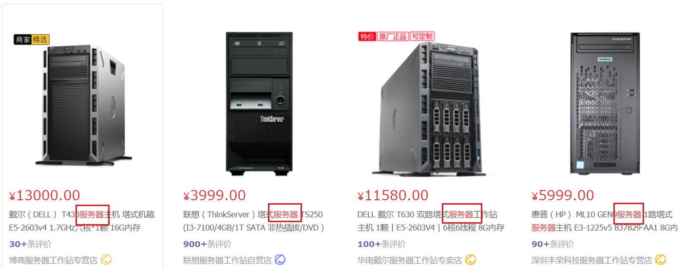
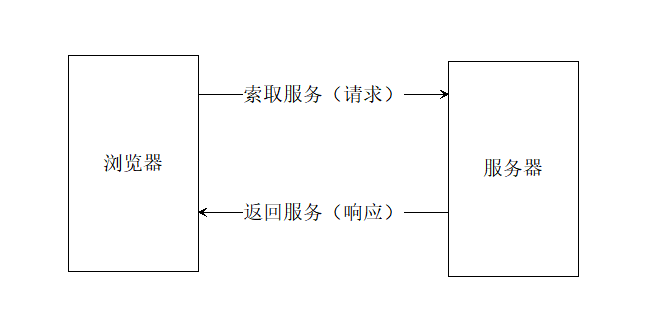
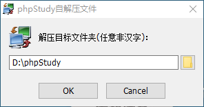
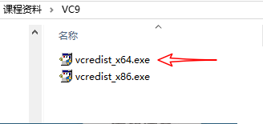
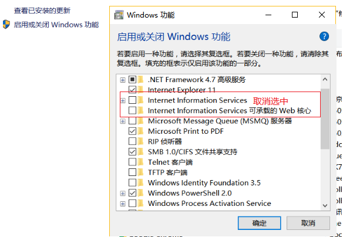
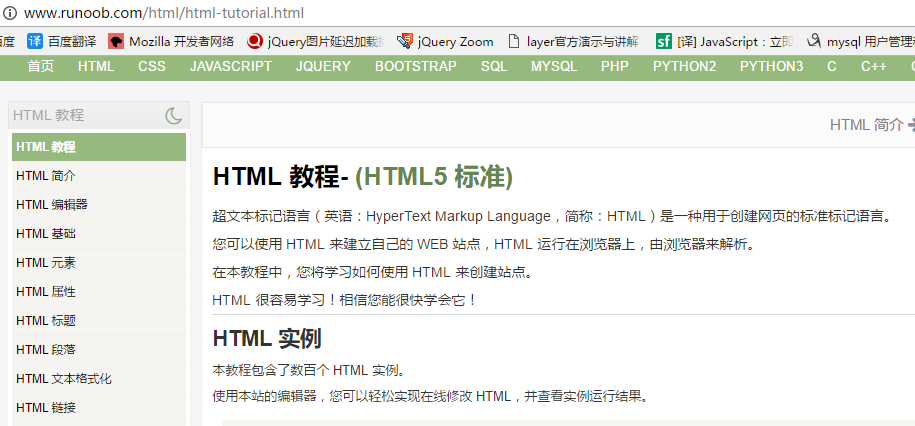
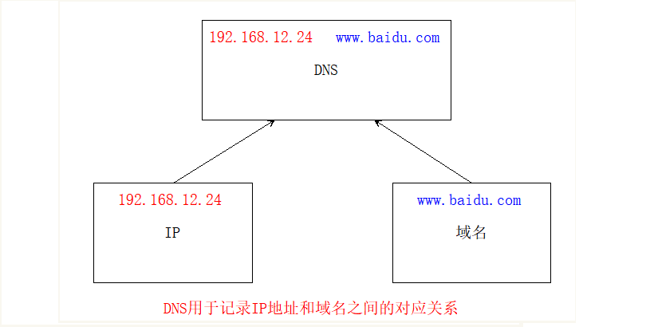
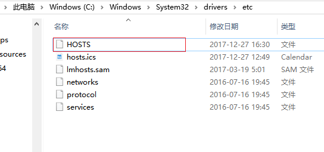

# 课程安排

+ 5天PHP基础 （php + 数据库 + 学生管理系统）


+ 4天AJAX    前后端交互技术


+ 学习PHP的目的：我们前端通过学习一些后端知识, 可以了解后端开发流程, 非常有利于将来前后端协作

  注意: 虽然学的 php 天数不多, 知识点比较散, 具有跳跃性, 但是还是要求熟练度 !!!  

  所讲到的知识点, 都是给后面 php 项目要用的, 必须熟练掌握 !!!


# 服务器

> 前言：通俗的讲，能够提供某种服务的机器（计算机）称为服务器




## 服务器软件

> 使计算机具备提供某种服务能力的应用软件，称为服务器软件，
> 通过安装相应的服务软件，然后进行配置后就可以使计算具备了提供某种服务的能力。

常见服务器分类:  文件服务器、数据库服务器、邮件服务器、`Web服务器等`；

其中与我们息息相关的是 web服务器, 想让计算机成为 web 服务器, 就要安装服务器软件, 提供 web 服务


常见的提供web服务的服务器软件

- (1)  IIS windows web 服务器软件

- **(2) apache web 服务器软件 ( 开源免费的 跨平台性好)**

- (3) Tomact

- (4) Nginx

  ​


## HTTP服务器(web服务器)

**即( web服务器 )网站服务器**，主要提供文档(文本、图片、视频、音频)web浏览服务，一般安装Apache、Nginx服务器软件。


# 客户端

+ 客户端：通过安装客户端软件，**索取服务**的计算机
+ 服务器：通过安装服务器软件，**提供服务**的计算机


## 服务器与客户端的关系




# 软件架构

> 软件架构可以分为BS架构与CS架构


## C/S架构

Client/Server架构，即客户端/服务器架构。需要安装对应的客户端软件，才能获取服务器的服务。

常见的CS架构：

​	QQ、LOL、微信等

特点：

+ 需要安装才能使用

+ 性能高效，使用更加稳定和流畅

  ​


## B/S架构

Broswer/Server架构，即浏览器/服务器架构。随着Internet的兴起，无需安装专门客户端软件，通过浏览器去请求服务器；

+ 不需要安装，只需要浏览器即可。
+ 相比CS架构，性能相对较差，没有那么流畅和稳定。


# 搭建HTTP服务器

## phpStudy介绍

> phpStudy是一个PHP调试环境的程序集成包。
> 该程序包集成最新的Apache+PHP+MySQL,安装非常的简单


## phpStudy的安装

安装phpStudy，解压双击安装(**非中文路径**)，其它默认安装。

**推荐就安装在默认的目录下，一定不能有中文，否则肯定启动不起来。**

;


## phpStudy的错误解决

如果phpStudy启动发生错误，参数下列几点。

- 一是防火墙拦截，


- 二是80端口已经被别的程序占用，如IIS，迅雷等；


- 三是没有安装VC9运行库,php和apache都是VC9编译。

  解决以上三个问题，99%能一次性安装成功 

为了减少出错安装路径不得有**汉字**，如有防火墙开启，会提示是否信任httpd、mysqld运行，请选择全部允许。 


### 提示缺少vc9 库文件

在提供的资料库中找到**phpStudy运行库**， 根据自己电脑操作系统的位数安装对应的vc9运行库即可。




### 关闭防火墙

如果希望系统自己的服务器能够被别人访问。需要关闭防火墙。

```javascript
//控制面板--->系统和安全--->Windows 防火墙--->启动或者关闭windows防火墙
```


### 关闭IIS服务器

如果发现服务器启动不成功，很大原因是端口被占用了，因为windows默认会有一个iis服务器，只需要把iis服务器给禁用了即可。

```javascript
//控制面板-->程序-->程序与功能-->启用或关闭windows功能
```




# 动态网站与静态网站

+ 静态网站：使用浏览器端语言进行编程，网站由静态代码（HTML.CSS,JS）组成。


+ 动态网站 ：网页通过服务器的程序(php等)动态生成。用户可以和服务器进行交互（可以根据用户输入的不同信息，返回不同的运行结果）


**总结**

 	动态网站的 `动`指的是网站`数据的动` 而不是 `视觉上的动`;


# 网络基础

## ip地址

所谓IP地址就是给每个连接在互联网上的主机分配的一个32位地址。(就像每个人的身份证号码一样)

通过ip就可以找到具体的某一台计算机。

例 `192.168.1.110`

弊端：没有规律，不方便记忆和推广

查看本机IP地址  `ipconfig`、`ifconfig`（linux）

```javascript
ping 192.168.1.110  //查看和某个同学的电脑是否连通
```

**127.0.0.1**作为本地测试的IP地址。(又叫本地回环地址)

192.168 开头为局域网的地址。


## 域名

由于IP地址基于数字，不方便记忆，于是便用域名来代替IP地址，域名是一个IP地址的“好记的名字”

查看域名对应的IP地址 `ping`

```javascript
ping jd.com  //可以获取到京东的ip
```

**特殊的域名**

​	`localhost`，意思为本地主机。这是一个保留域名，主要用于本地测试，对应IP地址为`127.0.0.1`。


## DNS服务器

DNS（Domain Name System）因特网上作为域名和IP地址相互映射的一个分布式数据库， 能够使用户更方便的访问互联网，而不用去记住能够被机器直接读取的IP数串。

简单的说就是用于记录IP地址和域名之间的对应关系。

查找优先级 本机hosts文件、DNS服务器




## 端口

端口号是计算机与外界通讯交流的出入口，每个端口对应不同的服务。

查看端口占用情况 netstat -an

常见端口号 80、3306、21  ftp


## 本地hosts

> Hosts是一个没有扩展名的系统文件，可以用记事本等工具打开，其作用就是将一些常用的网址域名与其对应的IP地址建立一个关联“数据库”，当用户在浏览器中输入一个需要登录的网址时，系统会**首先自动从Hosts文件中寻找对应的IP地址**，一旦找到，系统会立即打开对应网页，如果没有找到，则系统会再将网址提交DNS域名解析服务器进行IP地址的解析。

```javascript
//hosts文件的地址：C:\Windows\System32\drivers\etc
```




```javascript
//hosts文件内容
127.0.0.1 localhost
127.0.0.1 localhost
127.0.0.1  study.com
127.0.0.1  www.study.com
```


# PHP基础

**PHP简介**

+ 开源（open source）软件，跨平台，常用操作系统稳定执行。Windows / Linux。做WEB开发的经典组合 WAMP,LAMP基本都是开源软件。


+ 入门简单,用户只需要关注应用，开发成本低。


+ 支持的大多数主流数据库。MySQL，oracle,Redis等
  ​

> 文件以.php后缀结尾，所有程序包含在`<?php 这里是代码 ?>`
> 避免使用中文目录和中文文件名 
>
> php页面无法直接打开需要运行在服务器环境当中


## php初体验

> webstorm对于php的支持并不友好，没有高亮显示，但是也支持代码提示，功能比较微弱，如果需要专业的提示和高亮，建议使用vsCode。

[vsCode下载地址](https://code.visualstudio.com/)

```php
<?php
    echo "hello world";
?>
```

输入中文乱码问题：如果使用echo输出中文，会乱码。

***在php的语法中，末尾必须加分号，不然就报错了（最后一行可以不加分号）***

```php
<?php
    //content-Type:text/html;返回内容是一个HTML文档文本
    //charset=utf-8 设置编码集
    header("content-Type:text/html;charset=utf-8");
    echo "hello world";
    echo "<br/>";
    echo "大家好，我是鹏鹏";
?>
```


```javascript
//思考：浏览器访问php文件时，过程是怎么样的？
```


## 变量

> php是一门弱类型语法，变量的类型可以随意改变。
> 变量其实就是存储数据的容器

**变量的命名规则**

```php
//1. 不需要关键字进行声明，变量在第一次赋值的时候被创建。
//2. 必须以$符号开始
//3. $后面的命名规则与js的变量命名规则一致。
$name = "鹏鹏";
echo $name;
```

### 变量操作

**删除变量**

```php 
unset($var);
```

​	销毁指定的变量


**判断变量是否设置值**

```php
bool isset($var)
```

    检测变量是否设置，并且不是 NULL。 

​	变量未设置或者设置为null,返回false（认为变量没有设置）。其余情况全部为true。一般用来判断变量是否设置，因为变量未设置，无法直接使用。(变量先赋值，在使用！） 


**判断变量是否为空**

```php 
bool empty($var)
```

​	判断变量是否为空。PHP中认为变量的值为：""、0、"0"、NULL、FALSE、[]时，变量虽然赋值了，但是无实际的意义。为空。


## 数据类型

### 简单数据类型

**字符串** 

```php
$str = "鹏鹏";
echo $str;
```

**整数** 

```php
$num = 100;
echo $num;
```

**浮点型** 

```php
$float = 11.11;
echo $float;
```

**布尔类型** 

```php
$flag = true;
//当布尔类型值为true时，输出1
echo $flag;
$flag = false;
//当布尔类型为false时，输出空字符串
echo $flag;
```

**字符串连接符** 

```php
//1. 在php中，+号只有算数的功能，并不能拼串
//2. 在php中，拼串使用.
$name = "鹏鹏";
echo "大家好，我是" . $name . "，今年18岁";
```

**php中的单引号与双引号**

```php
//1. 字符串的定义可以使用单引号，也可以使用双引号
$name = "鹏鹏";
$desc = '很帅';
//2. 双引号可以解析变量
//3. 单引号的性能会高于双引号（了解）

$str = '$name 很帅';//$name 很帅
echo $str;

$str = "$name 很帅";//鹏鹏 很帅
echo $str;
```


### 数组

> 在php中，数组分为两种，索引数组和关联数组
>
> 计算数组长度的方法： `count(数组名)`;

**索引数组（类似与JS中的数组）**

```php
$arr = array("张飞","赵云","马超");
$arr = [ "张三", "李四", "王五", "赵六", "田七", "王八" ];
echo $arr;//echo只能打印基本数据类型
echo $arr[0];//张飞
```

**关联数组（类似与JS中的对象）** 

- (1) 通过键值对存储数据, 键值对连接符 =>
- (2) 通过 count 统计数组长度

```php
//属性名必须用引号引起来
$arr = array("name"=>"zhangsan", "age"=>18);
echo $arr["name"];
```

**输出语句** 

```php
//1. echo 输出简单数据类型
//2. print_r 输出数据结构，一般用于输出复杂类型。
print_r($arr);//print_r是一个函数，不要忘记小括号
//3. var_dump 输出完整的数据结构，包括类型，一般用于精准调试
var_dump($arr);
```

**二维数组**
> 数组中的每个元素又是一个数组
> 二维数组的存取元素，需要两次访问，依次确定行和列`$arr[x][y]`;

- 应用: 一维关联数组, 可以存储一个人的信息
           二维数组, 可以存储一个班的信息
```php
 //索引数组
    $arr=[
        [1,2,3],
        [4,5,6],
        [7,8,9]
    ];  
    //取值
    echo $arr[2][2];
    //存储一个人信息

    $info=[
        "name"=>"zs",
        "age"=>100
    ];

    //存储一个班信息
    $infos=[
        [
            "name"=>"zs",
            "age"=>100
        ],
        [
            "name"=>"ls",
            "age"=>100
        ],
        [
            "name"=>"ww",
            "age"=>100
        ]

    ];
	//取值
    echo $infos[1]["name"];
```


### 对象(了解)

> 在php以及其他高级语言中，都有类的概念，表示一类对象，跟js中构造函数类似。

```php
//定义一个类（类似js的构造函数）
class Person {
  public $name = "小明";
  public $age = 12;
  private $sex = "男";
}

$zs = new Person;
print_r($zs);//打印对象的结构信息
echo $zs->name;//对象中取值用 ->
echo $zs->age;
echo $zs->sex;//私有属性，无法获取
```


## 语句

### 判断语句

基本上来说，所有语言的if..else语法都是一样

```php
$age = 17;
if ($age >= 18) {
  echo "终于可以看电影了,嘿嘿嘿";
} else {
  echo "哎，还是回家学习吧";
}
```


### 循环语句

**遍历索引数组** 

```php
$arr = array("张三", "李四", "王五", "赵六", "田七", "王八");
//获取数组的长度： count($arr)
for($i = 0; $i < count($arr); $i++) {
  echo $arr[$i];
  echo "<br>";
}
```

**遍历关联数组** 

```php
//遍历关联数组
$arr = array(
  "name"=>"zs",
  "age"=>18,
  "sex"=>20
);
foreach($arr as $key => $value) {
  echo $key . "=" . $value . "<br>";
}
```
### 函数

```php
<?php
    header("content-Type:text/html;charset=utf-8");
    //php中函数的语法与js中函数的语法基本一样，不同点在于
    //1. 函数名大小写不敏感
    //2. 函数的参数可以设置默认值
    function sayHello ($name="周杰伦") {
        echo "大家好，我是$name";
        echo "<br>";
    }
    sayHello();//不传参数，会使用默认值
    sayHello("鹏鹏");//传参数，默认值不生效
?>
```

## 常量

 **常量的定义**

> 脚本执行周期内，值不会发生改变的量。常量不可以修改及删除。英文为：`constant`

**语法**

```php
define(常量名，常量值);
```

```php
define('VERSION','1.2.0'); //常量默认全部字母大写
define('PI',3.1415926);
echo PI;             //使用时直接使用常量名
```

+ 常量默认区分大小写。

+ 按照开发惯例，常量名推荐全部字母大写。

+ 常量不可以重复定义及修改数据。

+ 常量不能删除。
  ​
# PHP内置函数

## 数学函数

+ max(),min()   分别返回一组数的最大值及最小值；


+ abs() 返回绝对值。


+ floor() 向下取整。


+ ceil()  向上取整。


+ round() 四舍五入。


+ rand()  返回随机数，可以取到两端的值。

##  日期函数

+ time()  返回当前的 时间戳(1970到现在的时间的秒数)


+ date(format,time) 格式化一个本地时间或日期

  格式：Y(年) m(月)  d(日)   H(时)  i(分)  s秒

```php
	$time=time();//获取时间戳
	echo date('Y-m-d H:i:s',$time); //格式化时间戳
```

默认时区会不太正确,  我们在东八区, 比0时区会多八小时

```php
在php.ini里加上找到date.timezone项，设置date.timezone = "PRC"，重启环境就ok了。
```

PRC: 中华人民共和国

## 字符串函数

+ str_replace(查找的值，替换的值，执行替换操作的字符)       字符串替换
+ trim(字符串);     去除首尾空白字符
+ explode(分割符，执行分割的字符串);        使用一个字符串分割另一个字符串,返回索引数组
+ implode(连接符，执行连接的数组);           将数组根据连接符拼接成字符串
+ substr( 字符串，起始索引，截取长度  );    截取字符串
+ strchr(字符串，标识字符);          从左向右找标识字符，返回该字符后全部字符(包括该字符)
+ strrchr(字符串，标识字符);        从右向左找标识字符，返回该字符后全部字符(包括该字符)

## vscode快捷键

- Ctrl+Shift+N 打开新窗口
- Alt+ ↑ / ↓ 当前行上/下移
- Shift+Alt + ↓ / ↑ 向上/下 复制一行
- Ctrl+Shift+K 删除行
- Ctrl+X 剪切 (剪切行)
- Ctrl+Enter 光标移动到下一行