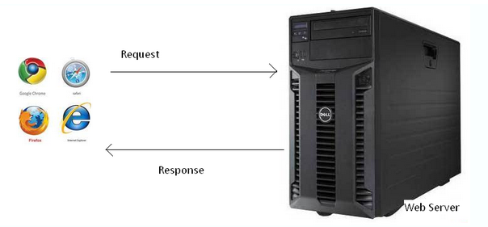
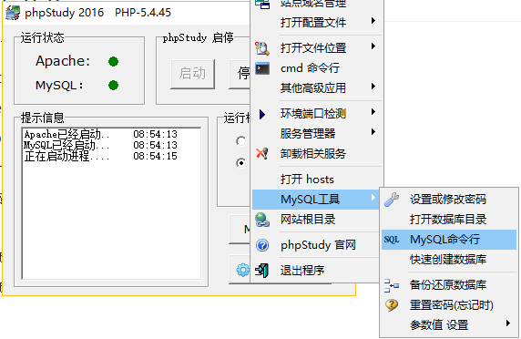
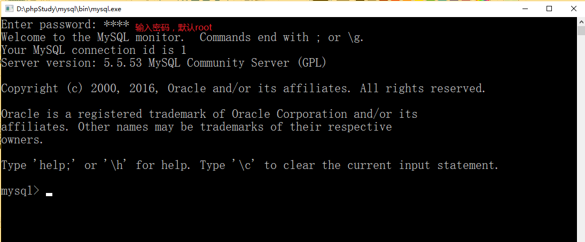
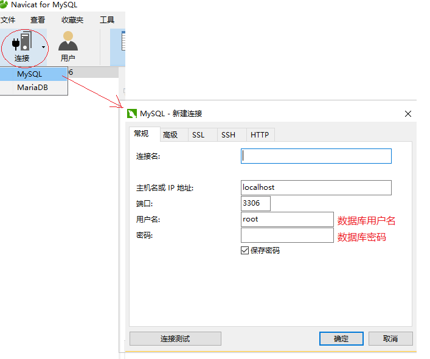
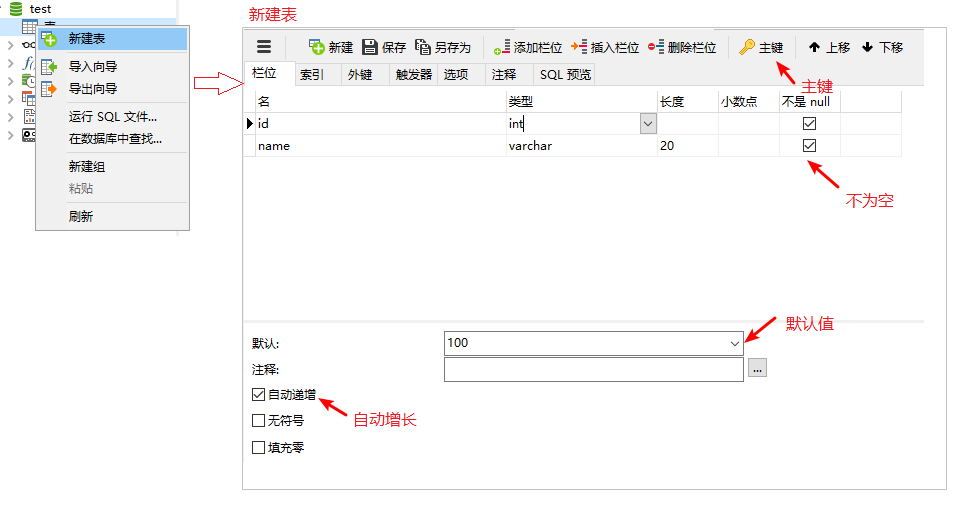
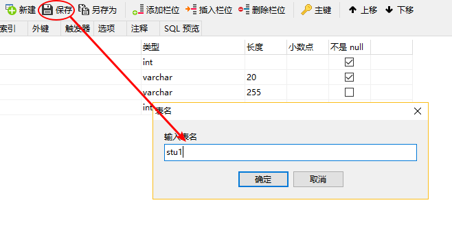
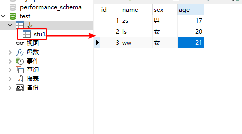

# 学生信息管理系统

## 基本功能

+ 学生添加功能

+ 展示学生信息功能

+ 删除学生信息

## 实现思路

### 注册功能

    1. 获取前端表单传递数据
    2. 获取前端传递图片，并保存在服务器中
    3. 将表单的数据和上传图片的地址 保存在数据库中
    4. 页面跳转到列表页


### 向data.txt中保存数据的过程：

```
1-用一维数组存放 获取的 学生数据
2.从data.txt中取出字符串形式学生数据
3.将字符串数据转成二维数组
4.向二维数组中添加 学生数据
5.把二维数组转成字符串
6.把字符串中的数据 存储到data.txt中
```


### 注意：

	我们目前没有学习数据库，使用txt记事本来模拟，实现思路：
	1. 存储一个人的信息使用一维数组
	2. 存储一个班的信息要使用二维数组
	3. 数组是一个变量，页面关闭后，数据会销毁，下次打开页面后，数据不存在了
	4. 为了数据能永久存储，把数据存储到txt文件中
	5. 班级学生信息存放在二维数组中，添加和删除学生信息，就是对二维数组进行追加和删除，对二维数组操作完成后，再把二维数组存储到data.txt


### 展示功能

	1.获取txt记事本中的学生数据字符串，转成二维数组
	2.动态遍历渲染在页面中


### 删除功能

	1.获取要删除学生id,
	2.从data.txt中取出字符串形式学生数据
	3.将字符串数据转成二维数组
	4.根据id，从二维数组中删除指定索引的元素
	5.把二维数组转成字符串
	6.把字符串中的数据 存储到data.txt中


# HTTP协议

**协议：**

> 协议，就是事先的一种约定、规则、规范、标准。

 **常见协议**

+ HTTP、HTTPS 超文本传输协议 
+ FTP 文件传输协议
+ SMTP 简单邮件传输协议

**HTTP协议**

HTTP协议即超文本传输协议,  是一个 [浏览器端] 和 [服务器端] 请求和响应的标准

+ 常用请求方法  GET, POST


+ 请求 (request)：`请求行、请求头、请求主体`。


+ 响应 (response)：`状态行、响应头、响应主体`。



## 请求报文和响应报文

**请求/请求报文**

​	请求由客户端发起，其规范格式为：请求行、请求头、请求主体。	

**响应/响应报文**

​	响应由服务器发出，其规范格式为：状态行、响应头、响应主体。

**get请求的请求报文详解** 

```javascript
//--------------------------请求行--------------------------------
// GET  请求方式
// /day02/01.php?username=pp&password=123456    请求路径+参数（注意点）
// HTTP/1.1 HTTP的版本号
GET /day02/01.php?username=pp&password=123456 HTTP/1.1

//--------------------------请求头--------------------------------
// Host:主机地址
Host: www.study.com
// HTTP1.1版本默认开启，建立过连接后，TCP连接不会断开，下次连接可以继续使用（底层，不用管）
Connection: keep-alive
//chrome浏览器自己增加的，不用管
Upgrade-Insecure-Requests: 1
//浏览器的代理字符串（版本信息）
User-Agent: Mozilla/5.0 (Windows NT 10.0; WOW64) AppleWebKit/537.36 (KHTML, like Gecko) Chrome/58.0.3029.96 Safari/537.36
//浏览器端可以接受的类型。
Accept: text/html,application/xhtml+xml,application/xml;q=0.9,image/webp,`*/*`;q=0.8
//从哪个页面发出的请求
Referer: http://www.study.com/day02/01-login.html
//检查浏览器支持的压缩方式
Accept-Encoding: gzip, deflate, sdch
//浏览器支持的语言，优先中文。
Accept-Language: zh-CN,zh;q=0.8,en;q=0.6

//----------------------------请求主体-------------------------------------
//get请求没有请求体，因为要传递的数据已经拼接到了请求主头中
```


**POST请求的请求报文** 

```javascript
//-----------------------请求行---------------------------------------------
POST /day02/01.php HTTP/1.1

//-----------------------请求头--------------------------------------------
Host: www.study.com
Connection: keep-alive
//传递的参数的长度。
Content-Length: 29
Cache-Control: max-age=0
Origin: http://www.study.com
Upgrade-Insecure-Requests: 1
User-Agent: Mozilla/5.0 (Windows NT 10.0; WOW64) AppleWebKit/537.36 (KHTML, like Gecko) Chrome/58.0.3029.96 Safari/537.36
//内容类型：表单数据，如果是post请求，必须指定这个属性。
Content-Type: application/x-www-form-urlencoded
Accept: text/html,application/xhtml+xml,application/xml;q=0.9,image/webp,`*/*`;q=0.8
Referer: http://www.study.com/day02/01-login.html
Accept-Encoding: gzip, deflate
Accept-Language: zh-CN,zh;q=0.8,en;q=0.6

//------------------------请求体------------------------------------------
username=pp&password=123456
```

**GET请求与POST请求的对比** 

+ GET请求没有请求体，因为GET请求的参数拼接到地址栏中了
+ POST请求有请求体，就是传递的参数。

## 响应与响应报文

```javascript
//---------------------状态行（响应行）-------------------------------
//HTTP/1.1  HTTP版本
//200 响应的状态
	//200表示成功
	//302页面重定向 重新指定跳转的地址
	//304表示文档未修改
	//404表示找不到资源
	//500表示服务端错误（五系列开头的都是表示服务器错误）
HTTP/1.1 200 OK

//----------------------响应头-----------------------------------------------
Date: Thu, 22 Jun 2017 16:51:22 GMT //服务器的时间
Server: Apache/2.4.23 (Win32) OpenSSL/1.0.2j PHP/5.4.45  //服务器的版本信息
X-Powered-By: PHP/5.4.45  //后台编程语言信息
Content-Length: 18   //服务器的响应主体长度
//内容类型，告诉浏览器该如何解析响应结果
Content-Type: text/html;charset=utf-8

//-----------------------响应主体------------------------------------------------
用户登录成功
```

​	通常来说，我们不会用抓包工具来查看请求和响应，太麻烦了，可以直接使用谷歌浏览器来查看请求报文和响应报文。
​	谷歌浏览器会对报文进行一定的格式化，看起来虽然不是原生的报文，但是使用起来更加的方便简洁。


# Mysql数据库技术

## 初识数据库概念

**数据库基本概念**

> 专门用来存储、管理数据的仓库（空间），按照数据结构来组织、存储和管理，可以实现高效存取数据。英文：Database, DB。

**关系型数据库**

当前使用范围最广的数据库。基于表, 按照关系模型（数据之间表与表存在联系）组织的数据库。

订单：订单编号，商品名称，价格，数量，配送地址

| **订单编号** | **商品名称** | **价格** | **数量** | **配送地址**   |
| -------- | -------- | ------ | ------ | ---------- |
| 100123   | 华为mate10 | 4999   | 2      | 北京市京顺路99号  |
| 100124   | 花裙子      | 499    | 1      | 北京市清华大学1号楼 |

+ 关系型数据库: 基于表, 表与表之间可以存在关系进行多表查询的存储方式, 适合较为复杂的存储   mysql, SQL Server, oracle


+ 非关系型 数据库: 基于键值对的存储方式, 数据之间没有耦合性, 特点执行效率高  mongodb

  ​

###  数据库的组织架构

+ **数据表（table）**

  表是以行和列的形式组织起来的数据的集合。项目一般需要不同的数据表，将数据分布存储在不同的数据表中。

  数据库的数据存放在数据表中

  如：订单表，用户表，商品表，配送地址表

  ​

+ **记录-行（row，record）**

  我们把表中的每一行叫做一条“记录”

  ​


+ **字段-列 (column，field)**

  字段是比记录更小的单位，多个字段集合组成记录, 即数据项


### 关系型数据库—MySQL

> 数据库官网地址：[https://dev.mysql.com](https://dev.mysql.com)

> 英文手册地址：[https://dev.mysql.com/doc/refman/5.5/en/](https://dev.mysql.com/doc/refman/5.5/en/)

> 中文参考论坛：[http://www.mysqlpub.com/](http://www.mysqlpub.com/)


###  SQL-操作数据库的语言

​	SQL：structured Query Language 结构化查询语言。
​	SQL语句，相当于客户端发送的命令（与数据库服务器进行交互）, 我们后面就是要学习 SQL 语句操作数据库

- .sql  数据库脚本语言的后缀。  

- 主要是执行 数据操作的基本逻辑有：增删改查 操作

  ​

## 数据库操作方式  
- 数据库的相关设置： （打开数据库命令行，修改数据库密码等）

  ;

- 命令行演示（了解）
  

  + show databases;
  + use database;
  + show tables;

  ​

  ​

- 图形界面客户端 

  ​	

  ​
---


## 数据库表的操作

### 数据库的数据类型

字段类型初步介绍

+ 整型

  存储如年龄，产品数量，编号等。 int


+ 小数类型

  float  ,decimal      eg. 重量，工资，奖金，价格等

  使用decimal类型，实现小数的精确存储,一般用来存储与钱有关的数字。3.333333331

+ 字符串型

  varchar(M)，char(M)  M为该字段可以存储的最多字符数，如varchar(10)。

  varchar一般用来存储长度变化比较大的字符串，如文章标题，商品名称，	

  char存储长度比较固定的字符串，如手机号，身份证号，序列号，邮编。	

  此外可以使用text类型，存储较长的字符串，无需指定字符串的具体长度。

+ 日期时间型

  datetime,date(年月日)，time（时分秒）。年月日时分秒。

**字段约束**

字段约束: 字段数据的属性规则（特征）

1. not null 不为空

   可以限制字段值不能为空

2. default  默认值, 

   可以设置字段的默认值，在没有录入时自动使用默认值填充。

3. primary key  主键 ：唯一标识，不能重复，不能为空 

  设置字段为主键，主键字段的值不能重复，不能为空。而且一个数据表中只能设置一个字段为主键，作为每行记录的唯一身份信息（索引）。stu_id int primary key 

4. auto_increment  自动增长

  设置字段为自动增长，默认从1开始自动分配编号。自增长字段必须为一个key（索引，数据结构，便于快速查找数据，相当于书的目录），一般与primary key结合使用。

  类型必须为整型。

5. unique key  不能重复

   唯一键，设置字段的值为唯一的，可以设置多个字段为唯一键。唯一键字段的值可以为空。

   学号设置为主键，要求唯一的，不能为空的，用来标识学生信息，


### 创建数据表

> 注意 创建表时，每个表必须有一个主键



保存表结构：



向新建的表中添加数据：



### SQL

SQL编写注意点:  注释用 -- , 语句结束加分号(;)

**增删改查**

1. 插入数据 insert

```sql
-- insert into 表名 (字段列表) values (值列表)
insert into book (name,author,category,price) values ('天龙八部','金庸','文学',20)
```
2. 修改数据update

```sql
-- update 表名 set 字段名称1=值1,字段名称2=值2,... where 条件
update book set name='笑傲江湖',price='30' where id=10
```
3. 删除数据delete

```sql
-- delete from 表名 where 条件
delete from book where id=10
```
4. 查询数据select

```sql
-- select * from 表名 where 条件
select * from book where author='金庸' and price>20
```


### SQL高级

1. where子句

   查询时，不添加where条件返回数据表所有行。需要添加限定条件，只返回需要的行。

   select  字段列表 from  table where子句；

 

2. Like 模糊匹配  % 通配符

```sql
-- 查找姓张的人
select * from table where name like '张%';
```
3. in 语法：一次查询多个符合条件的数据

```sql
select  字段列表 from tb where  字段 in  (value1,value2,value3);
```
4. Count() 获取返回数据的总条数

```sql
-- 查询满足条件数据的总条数	
select count(*) from table where 条件
```
5. limit 子句

   返回查找结果中的前 n 行 

```sql
select 字段列表  from  table limit 截取的起始索引，截取的长度 
```
6. 连接查询

```sql
select 字段列表 from  A join B on  A.字段=B.字段 [where子句];
```

​

​	

创建学生表 ：姓名、年龄、性别

```sql
INSERT INTO `stu` (name, age, sex) VALUES ('张三', '18', '男');
INSERT INTO `stu` (name, age, sex) VALUES ('李四', '19', '女');
INSERT INTO `stu` (name, age, sex) VALUES ('王五', '22', '男');
INSERT INTO `stu` (name, age, sex) VALUES ('赵六', '18', '女');
INSERT INTO `stu` (name, age, sex) VALUES ('田七', '15', '男');
INSERT INTO `stu` (name, age, sex) VALUES ('王八', '16', '女');
INSERT INTO `stu` (name, age, sex) VALUES ('李狗蛋', '18', '男');
INSERT INTO `stu` (name, age, sex) VALUES ('李元芳', '20', '男');
INSERT INTO `stu` (name, age, sex) VALUES ('张飞', '16', '男');
```