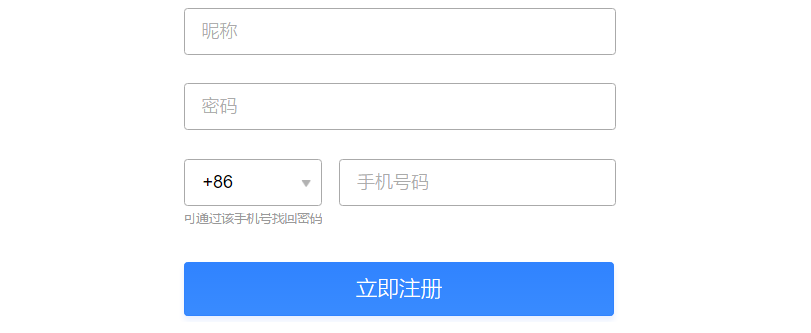

# 字符串函数

- str_replace(查找的值，替换的值，执行替换操作的字符)       字符串替换
- trim(字符串);     去除字符串首尾处的空白字符
- explode(分割符，执行分割的字符串);        使用一个字符串分割另一个字符串
- implode(连接符，执行连接的数组);           将一个一维数组的值拼接为字符串
- substr( 字符串，起始索引，截取长度  );    返回字符串的子串
- strchr(字符串，标识字符);          从左向右查找指定的字符，并返回该字符后全部字符
- strrchr(字符串，标识字符);                 从右向左查找指定的字符，并返回该字符后全部字符串

# php文件渲染

1. php 代码必须要放在服务器才能执行
2. php 代码要放在 php 标签内部才能执行
3. 对于 php 标签外面的内容, 会进行原文输出
4. 最终交给浏览器进行解析
----------------------------
1. 在 php 文件中可以任意编写 html, css, js, 因为放在 php 标签外, 会直接进行原文输出
2. 将来由浏览器进行解析
3. 上面声明的变量, 下面可以直接使用
------------------------------


# include文件引入

**介绍**

​	不同的页面中有相同的代码部分，可以将其分离为单个文件。需要调用时，include 引入对应的文件即可调用。提高代码的复用率。

**语法**
```php
include | include_once   "文件的路径"
```


**include 与 include_once区别**

+ include  可以重复引入文件
+ include_once  只引入一次，防止多次引入文件

  1. 导入 php 文件, 类似于 js 中 script 标签导入, 可以用于函数复用
  2. 还可以导入 html 结构, 实现 html 结构复用
  3. 可以进行重复引入, 如果希望对于同一路径的文件, 希望防止重复引入, include_once

# 页面动态渲染

+ PHP本身支持与HTML混编
+ 混编的文件后缀必须为 .php， Apache 才会调用 PHP 解析
+ PHP与HTML混编时，服务器中的 PHP 引擎 只会执行php标签内部的PHP代码，非PHP的代码(PHP标签外部的内容)直接忽略，最后会将PHP的执行结果和非PHP代码 一起返回给浏览器,由浏览器进行解析

```php
  <?php 
      header('content-type:text/html;charset=utf-8');    
      echo 2+3;
      // php的引擎 只会执行php代码块中代码，代码块外面的代码会被忽略
      // 最后 服务器会将php执行的结果 和代码块外面的内容一起返回给 浏览器，
      // 由浏览器进行解析
  ?>
  <a href="http://www.baidu.com">百度一下</a>
```

**二维数组**

>  数组中的每一个元素，又是一个数组

```js
   //二维数组的形式
    $arr=[
        [2,3,4,5,6],
        [2,3,4,5,6],
        [2,3,4,5,6],
        [2,3,4,5,6]
    ];
	//二维关联数组
    $info=[
        [
            "name"=>"zs",
            "age"=>18,
            "sex"=>"男"
        ],
        [
            "name"=>"ls",
            "age"=>18,
            "sex"=>"女"
        ],
        [
            "name"=>"ww",
            "age"=>19,
            "sex"=>"男"
        ]        
    ]
```

# PHP数据读写到文件(数据持久化)
程序运行过程中，数据存储在内存中的，程序结束, 数据会销毁

如果希望可以永久存储某些数据，可以将数据存储在硬盘上（存储在文件中） 

将数据由 内存 存储到硬盘的过程，称为数据持久化；

+ file_get_contents(path)          根据路径读取文件内容, 得到一个字符串
+ file_put_contents(path,$str)  将一个字符串写入到一个文件中。覆盖写入
    - 注意: file_put_contents 只能存储字符串, 如果强行存储数组, 会造成数据丢失
    - 解决方案: 存储一个 有格式的字符串 即可 (json字符串), json字符串可以很方便转换成 数组
+ json_encode($data);               将PHP变量转成JSON格式字符串。
+ json_decode($str,true);          将 JSON 字符串, 转换为 PHP 数组。

**json 字符串**

+ `{"name":"cuihua","age":180,"desc":"mei"}`
+ `[{"name":"cuihua","age":180,"desc":"mei"}, {"name":"cuihua","age":180,"desc":"mei"}]`
  特点:
  1. 键值对组成, 每个键值对 逗号隔开
  2. 所有的键都要用双引号包裹
  3. 除了可以是 js 对象的格式, 也可以 js 数组的格式

# 表单处理



> 表单（form）：表单用于收集用户输入信息，并将数据提交给服务器。是一种常见的与服务端数据交互的一种方式

```javascript
//1. action: 指定表单的提交地址
//2. method: 指定表单的提交方式，get/post，默认get
//3. input的数据想要提交到后台，必须指定name属性，后台通过name属性获取值
//4. 想要提交表单，不能使用input:button 必须使用input:submit
```

**get 请求和 post 请求的区别**

1. get 请求特点
  (1) 参数在地址栏进行提交
  (2) get 请求不太安全, 提交的信息暴露了
  (3) 大小 4k, 是因为地址栏长度是有限制的,  所以 get 不能用于文件上传
  (4) 发送速度相对较快

2. post 请求特点
  (1) 参数在地址栏不可见, (参数在请求体中)
  (2) post 请求相对安全
  (3) 大小没有限制, 可以用于文件上传

**php获取表单数据** 

```
 // $_GET 是 PHP 系统提供的一个超全局变量，是一个关联数组，里面存放了表单通过get方式提交的数据。
 // $_POST 是 PHP 系统提供的一个超全局变量，是一个关联数组，里面存放了表单通过post方式提交的数据。
```

**get与post的区别** 

```javascript
//1. get方式
	//1.1 数据会拼接在url地址的后面?username=pp&password=123456
	//1.2 地址栏有长度限制，因此get方式提交数据大小不会超过4k
//2. post方式
	//2.1 数据不会在url中显示，相比get方式，post更安全
	//2.2 提交的数据没有大小限制, 可用于文件上传
```

## 文件上传

**html要求** 

```javascript
1. 文件上传的提交方式必须是post方式
2. 需要给form指定enctype="multipart/form-data"
3. 指定name属性，后台才能获取到
```

**php相关**

- 文件上传时，通过`$_FILES`才能获取到，这是一个二维数组。

```php
    Array
    (
        [photo] => Array
            (
                [name] => 001.jpg   // 文件名字
                [type] => image/jpeg  // 文件类型
                [tmp_name] => C:\Users\Jepson\AppData\Local\Temp\phpF2A0.tmp   // 上传图片保存的位置
                [error] => 0     // 上传错误码, 错误码为 0 表示没有错误
                [size] => 6000   // 文件大小, 单位字节, 大小 6kb 左右
            )

    )
```

- 上传文件时，文件会临时保存在服务器上，如果文件最终没有保存，那么临时文件会被删除，保证服务器安全。
- `sleep(10) ` 可以让代码延迟10秒钟才执行。
- `move_uploaded_file($path, $newPath);`可以保存临时图片

- **文件上传完整思路**
  1. 通过 $_FILES, 根据前端 name 获取 $file
  2. 判断 $file['error'] 是否为 0, 进行错误排除, 为 0 表示没有错误
  3. 动态生成一个新的文件名
  4. 进行转存

```php
  // 保存图片的完整代码
  // 思路:
  // 1. 在文件上传成功的情况下, 进行图片的保存   error === 0
  // 2. 获取临时文件路径
  // 3. 随机生成新的文件名, 注意文件中后缀名是不能改变的
  // 4. 根据新的文件名, 转移临时文件

  $file = $_FILES['photo'];

  // 判断上传是否成功
  if ( $file['error'] == 0 ) { // 上传成功
    // 1. 获取临时文件路径
    $ftemp = $file['tmp_name'];

    // 2. 随机生成新的文件名, 后缀不能随便起, 要获取一下
    $name = $file['name'];
    $ext = strrchr($name, '.');
    // 为了防止重复, 生成随机的文件名以当前时间秒数+随机数组成
    $newName = time().rand(10000,99990).$ext;
    // 3. 新的文件路径
    $newFileUrl = './upload/' . $newName;
    // 4. 进行转存
    move_uploaded_file($ftemp, $newFileUrl);
  }
```
# 表单标签的使用

​	常见的输入类型：文本域（type=text）、单选按钮(type=radio)、多选按钮（复选项 type=checkbox）、下拉菜单(select>option)

## 单选按钮 radio

> input标记的**type** =radio，单选按钮。

1. 注意通过 name 属性进行分组
2. 必须设置 value 值, value 值会被提交到服务器中
3. 通过 checked 进行默认选中

- radio 
    1. 指定name, 可以用于提交, 还可以用于分组
       没有设置value值, 提交的值为 on
       gender=on
    2. 需要指定 value 值

**html结构**

```html
<form action="01-radio.php" method="get">
   <input type="radio"  name="sex" value="male"> 男
   <input type="radio" checked name="sex" value="female"> 女
   <input type="radio"  name="sex" value="unknown"> 未知
   <input type="submit" value="登陆">
</form>
```

## 复选框 checkbox

> input的**type  =checkbox,**可以同时选择多个选项。

- name命名形式必须为：name[]，最终数据才能以数组的格式，将各个选项的值同时提交，否则只能提交最后一个勾选的属性值。不同的选项值，以数组元素的形式提交。

- checkbox
    1. 指定 name, 可以用于提交 和 分组
    2. 需要指定value值
    3. 需要写成 name[] 的形式, 后台才能以数组的方式接受数据

**html结构**

```html
<form action="02-checkbox.php" method="get">
    爱好:
    <input type="checkbox" name="hobby[]" value="eat"> 吃饭
    <input type="checkbox" name="hobby[]" value="sleep"> 睡觉
    <input type="checkbox" name="hobby[]" value="doudou"> 打豆豆
  
    <input type="submit" value="登陆">
</form>
```
## 下拉列表

> select >option 实现的是下拉菜单。

1. name属性必须设置, 设置给 select。
2. value值为必须设置, 设置给 option。
3. 通过给 option 加 selected 设置默认选中项

**html结构如下：**

```html
<form action="./03-select.php" method="get">
    城市：
    <select name="city">
         <option value="1">上海市</option>    
         <option value="2" selected >北京市</option>    
         <option value="3">天津市</option>    
         <option value="4">西红柿</option>    
    </select>  
    <input type="submit" value="登录">
</form>
```
