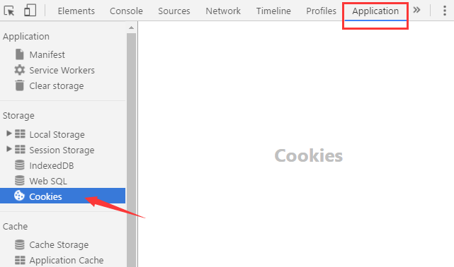
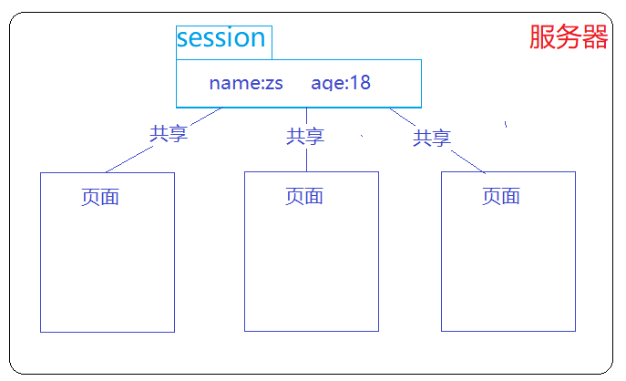

# 学生管理系统2.0基本功能

## 基本功能

- 添加学生功能
- 展示学生列表功能
- 删除学生功能
- 查看学生详情
- 更新学生数据

## 实现思路

**注册功能思路：**

1. 表单设计，点击提交按钮向服务器提交表单数据
2. 在后台获取表单提交的数据，保存到数据库中
   - 先获取表单的标签的数据
   - 保存上传的图片（并保存图片存储的路径）
   - 将表单的数据和图片的路径一起保存到数据库中


1. 保存完成，跳转到列表页，查看新添加的数据

**展示功能思路：**

1. 先从数据库中获取数据（二维数组arr）
2. 遍历二维数组，将数组中数据渲染到页面中

**删除功能思路：**

1. 获取要删除数据的id
2. 根据id删除数据库中指定的数据
3. 删除完毕，返回列表页

**详情展示功能**

1. 获取要查看详情数据的id
2. 根据id通过联合查询，获取到需要用数据
3. 把数据显示在页面中
4. 点击返回按钮，可以返回到列表页

**更新数据思路：**
更新数据的思路=先渲染  再  提交

1. 获取要查看详情数据的id
2. 把对应id的数据填充到修改页面中
3. 点击修改按钮，获取表单的数据，提交给服务器
4. 在服务器更新数据
5. 更新完成后跳转到列表页

```html
	隐藏域表单：和其他表单标签一样，只是看不到而已
	  <input type="hidden" name="id"  value="<?php echo $data['id'] ?>">
```


# COOKIE 和 SESSION

**会话**：浏览器与服务器之间的数据交流。


## HTTP协议特点：

**无状态的,  多次请求之间没有相关性**

>  即同一用户请求同一网站的不同页面，服务器无法识别是否是同一用户发起的请求。因此，用户无法进行连续的业务逻辑。

如：登录，已在A页面登录，请求B页面，提示未登录。


## cookie 和 session 区分

+ **cookie**: 在浏览器端的 存储数据的 容器
+ **session** 在服务器端的 存储数据的 容器

### cookie
* 在浏览器端的 存储数据的 容器

* 可以使用js对cookie进行操作

* cookie 允许服务器脚本（PHP脚本）在浏览器端存储数据

* **cookie特点**：在cookie中数据设置后，浏览器再次请求服务器指定页面时，会自动携带cookie中的数据到服务器，在服务器中可以获取cookie中的数据；

### 浏览器查看cookie数据

  

####  js操作cookie（了解）

```js
// 设置cookie
document.cookie = 'name=zs'; 
document.cookie = 'pwd=123';   

// 获取cookie中的值
document.cookie;
```

#### jquery.cookie.js插件 操作cookie

```javascript
//向页面中引入插件js文件，基于jquery的 
$.cookie('weight',100,{expires:7});//设置   expires 过期时间
$.cookie('name');//获取
$.removeCookie('name');//删除	

$.cookie(键,值,{expires:过期天数})
$.cookie(键) //获取 
```

#### PHP操作cookie(服务器端操作cookie)

```php
 // 注意: 空格, 等号, 分号, 存储的cookie值中不要出现以上特殊字符

  // 1. 设置cookie
  //    setcookie(key, value)
  // setcookie( "desc", "hello_kitty" );

  // 2. 获取
  // $_COOKIE 超全局变量, 可以用于获取所有的 cookie 信息
  // 返回一个关联数组
  // echo '<pre>';
  // print_r( $_COOKIE );
  // echo '</pre>';
  // echo $_COOKIE['desc'];

  // 3. 设置cookie过期时间
  // setcookie( key, value, 时间戳(什么时候到期, 以1970年开始的秒数) )
  // setcookie( "name", "pengpeng", time() + 7*24*3600 );

  // 4. 如果设置 cookie 为过去的时间, 就会删除, 销毁该 cookie
  // setcookie( "name", "ppp", time() - 1 );

	//设置cookie
	setcookie('名称','值'); 
	setcookie('名称','值'，'有效期');
	//删除cookie  将过期时间设置为之前的时间即可
	setcookie('名称',''，time()-1000); 
	//获取cookie  
	//$_COOKIE是PHP的超全局变量，内部存放有浏览器传过来的cookie数据，$_COOKIE只能用于获取数据
	$_COOKIE['名称'];
```

**注意点：**
+ cookie中的数据 可以被同一个网站的页面所共享
+ 不同浏览器的cookie 不能共享
+ cookie的数据存储在浏览器中，每次请求服务器，在请求报文中携带cookie的数据，发送给服务器
+ 服务器端无法直接操作cookie，是通过在服务器端设置响应头的的方式，通知浏览器对cookie进行设置，
+ cookie中的数据有效期，不设置是会话级别的, 浏览器关闭，会话结束，数据销毁
+ cookie存储容量小，约4kb

### session



+ 在服务器端存储数据的容器
+ session容器是一个数组的形式，通过超全局变量$_SESSION 进行取值和设置
+ session在使用前，必须先 session_start 开启session 机制
+ session中的数据可以被当前网站所共享

#### session的基本操作

**开启session机制**(使用session前必须调用此方法)
```php
 session_start(); //开启session会话或者重用已经创建的会话。
```

注意点:

1. 会在服务器中自动对每个第一次访问的用户, 随机生成一个sessionID

2. 再根据 sessionID, 自动创建一个session会话文件，我们可以在其中存储该用户的数据

3. 响应时, 在响应头中设置set-cookie, 存放该用户的sessionID

4. 将来浏览器端根据响应头, 将sessionId 存到 cookie 中, 并在下一次请求时携带

5. 下次访问时, 服务器端就会根据 sessionId 找到该用户的会话文件, 我们可以从session中读取用户信息, 实现会话保持

   ​


**设置和获取session中的数据**(通过超全局变量$_SESSION进行操作)

```php
//设置
$_SESSION['键']='值'; 
//删除
unset($_SESSION['键']); 
//清空session
$_SESSION=[]; 
//直接删除session会话文件，PHP脚本将无法读取session数据
session_destroy();
 //获取session的id
session_id();
```


# COOKE 和SESSION的应用--登录状态保持


登录模块的基本思路：

1. 如果用户登录成功，在服务器中记录用户的登录状态

   + session_start(),  对于第一次访问的用户, 会自动生成 sessionId, 并创建session文件，

   + 我们需要在session文件中，记录当前用户的信息

   + 通过响应头，给浏览器的cookie设置sessionID

```php
     if($name=='zs'&&$pwd=='666'){  
       // 登录成功, 将该用户唯一标识存到 session 中
       // 该用户数据库中 id 为 1
       $id = 1;
       session_start();
       $_SESSION['userid']=$id;
     }
```

     ​

2. 后续访问其他页面（个人中心），浏览器会自动发送cookie中存放的sessionID到服务器

3. 服务器会浏览器传递根据sessionID,找到对应的session文件，查看其中是否存放有当前用户的信息
   + 是： 用户已登录 ，正常浏览

   + 否：用户未登录，跳转到登录页
   
```php
     session_start();
     if(!empty($_SESSION['userid'])){
       //正常浏览
     }else{
       header('location:./04-login.html');
       die();//后面代码不执行
     }
```


