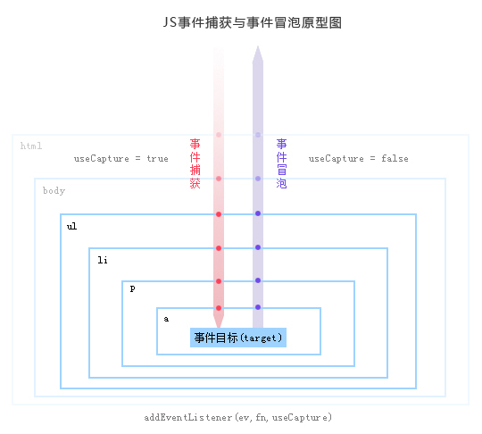
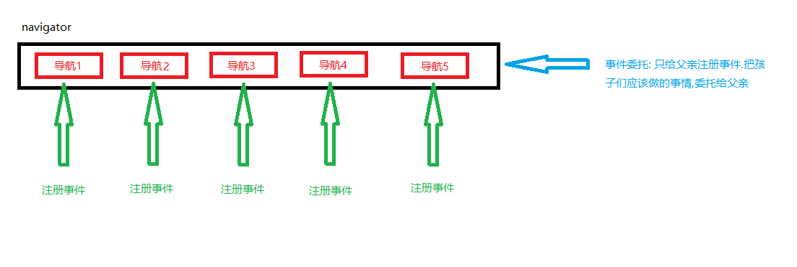

> 第02阶段.前端基本功.webAPI

# 基础语法

## 学习目标

* 理解
  - 什么是事件委托


* 重点
  * 掌握注册事件的其他方式
  * 掌握移除事件的方法
  * 掌握事件对象的常用的属性和方法
  * 知道事件的三个阶段

## 1. 注册事件的其他方式

### 回顾:

刚开始我们给元素注册事件的方式,是通过on+事件名的方式,如下面的示例代码

```javascript
//html
<div id="box"></div>

//js
var box = document.getElementById('box');
box.onclick = function(){
    //code...
}
```

后来,W3C DOM 规范中提供了注册事件监听的另外一种方式  : addEventListener

**那么为什么要使用addEventListener呢?**  

**优点:**

- 它允许给一个事件注册多个 `listener`。 
- 它提供了一种更精细的手段控制 `listener` 的触发阶段。（即可以选择捕获或者冒泡）。
- 它对任何 DOM 元素都是有效的，而不仅仅只对 HTML 元素有效。

**语法:**

`element.addEventListener('事件名', 事件处理函数, useCapture);`

- 事件名不需要写on
- useCapture 是一个boolean值,用于控制事件触发的阶段,不写默认是false
  - false 是在冒泡阶段执行
  - true 是在捕获阶段执行

```javascript
//html
<div id="box"></div>

//js
var box = document.getElementById('box');
box.addEventListener('click', function(){
    //code...
}, false);
```

## 2. 移除事件的方式

### 2.1 on+事件名 的移除方式

on + 事件名 = null;

```javascript
//html
<div id="box"></div>

//js
var box = document.getElementById('box');
box.onclick = function(){}  //注册点击事件
box.onclick = null; //移除点击事件
```


### 2.2 addEventListener的移除方式

removeEventListener()

**注意:**

如果在代码中使用addEventListener注册的事件,后面的逻辑中要移除对应的事件,那么在注册时,事件处理函数就不能使用匿名函数的方式

```javascript
//html
<div id="box"></div>

//js
var box = document.getElementById('box');
box.addEventListener('click', boxClick, false); //注册的代码,注册时不能使用匿名函数
box.removeEventListener('click', boxClick, false); //移除的代码
function boxClick (){
    //code...
}
```
### 小结:  

- 注册事件的两种方式
  - on + 事件名 = function(){}
  - addEventListener('事件名', 事件处理函数, useCapture ) 
- 移除事件对应的两种方式
  - on + 事件名 = null;
  - removeEventListener('事件名', 事件处理函数, useCapture )
    - 注意 : 注册时,事件处理函数不能使用匿名函数的形式

## 3.事件对象

> 当用户触发了我们注册的事件之后,我们在开发中需要获取用户触发事件的一些信息,比如鼠标的坐标,键盘的按键等...

**那么我们在代码中如何获取这些信息呢?**

当用户触发我们注册的事件之后,浏览器会创建一个事件对象,这个事件对象就包含了触发事件时的一些信息,比如时间戳,鼠标坐标,事件目标等等.然后浏览器会将这个事件对象,传递给事件处理函数,那么我们只需要在事件处理函数中申明一个形参,接收一下即可.如下面的示例代码所示:

```javascript
//html
<div id="box"></div>
//js
var box = document.getElementById('box');
box.onclick = function(event){
    console.log(event) // 事件对象
}
```

### 3.1 事件对象的常用属性

- event.type  返回事件类型(也就是事件名);
- event.target    返回事件目标(触发了谁的事件,谁就是事件目标)
- clientX/clientY     返回鼠标在可视窗口的坐标
- pageX/pageY       返回鼠标在当前页面的坐标
- keyCode   返回键盘按键对应的数字(返回的是对应的按下的键的数字 随便是标准里移除的,但是浏览器都支持,放心使用/ e.key这个属性,在mdn中推荐使用,但是由于是新标准,所以存在兼容性问题,很多浏览器不支持)

`String.fromCharCode(81)`把ASCII码转换成对应的字符
> keydown   按下时触发  不区分大小写 大写的ASCII码
> keyup     抬起时触发
> keypress  按下时触发  区分大小写

### 3.2 事件对象的常用方法

- event.preventDefault() 取消默认行为

  >我们第一天学习给a标签注册点击事件的时候,要在事件处理函数的最后一行写return false ,来阻止a标签的默认行为.
  >
  >但是如果使用addEventListener注册事件的话,return false 是无效的.
  >
  >所以我们需要使用 event.preventDefault()来阻止a标签的默认行为 ,如下面的代码

```javascript
  //html
  <a id="link" href="">点击在控制台打印1</a>

  //js
  var link = document.getElementById('link');
  link.addEventListener('click', function(){
      console.log(1);
      // return false;    //无效
      e.preventDefault(); //有效
  },false)
```
 
- event.stopPropagation() 阻止事件传递


**案例:**

- 小天使跟着鼠标飞
- 按下按键,显示对应的键盘数字

## 其他类型转布尔
数字转布尔 ,除了0 都是true     NaN 转布尔也是false     NaN != NaN是true
字符串转布尔: 出了空的字符串, 都是true   ''  ""
null 转布尔一定是false
undefined 转布尔一定是false
 对象 转布尔一定是true

## 4. 事件流

//  1.只要点击/移入...发生了,就一定触发了事件,跟我们有没有注册事件没有关系
//  2.一旦,触发了事件,就会产生一个事件流.
//  3.然后马上要确定下来一个事件路径

事件对象需要被分派到事件目标。但是在分派开始之前，必须首先确定事件对象的传播路径,传播路径是事件通过的当前事件目标的有序列表,该传播路径反映文档的分层树结构.

列表中的最后一项是事件目标，并且列表中的前面的项目被称为目标的祖先，其中前面的项目作为目标的父项目.一旦确定了传播路径，事件对象就会经过一个或多个事件阶段。


共有三个事件阶段：捕获阶段，目标阶段和冒泡阶段。

### 捕获阶段：

事件对象通过目标的祖先从窗口传播到目标的父项。这个阶段也被称为捕获阶段

### 目标阶段：

事件对象到达事件目标。这个阶段也被称为目标阶段。

### 冒泡阶段：

事件对象以相反的顺序通过目标的祖先传播，从目标的父项开始，以窗口结束。这个阶段也被称为冒泡阶段




## 5.事件委托

### 5.1 什么是事件委托 : 

本来是要注册给自己的事件,注册给了父元素.事件触发后的事情,委托给父元素执行


### 5.2 事件委托的好处 :

- 代码简洁

- 节省内存

  
### 5.3 事件委托的原理 :

事件冒泡

## 6. 扩展内容@

### 6.1 addEventListener 在早期的ie8浏览器中不支持

  如果要在ie8中注册多个相同的事件,使用attachEvent这个方法

  **语法:**element.attachEvent('on + 事件名', 事件处理函数);

  ​

```javascript
  //html: <a id="link" href="">点击在控制台打印1</a>
  //js
  
  var link = document.getElementById('link');
  link.attachEvent('onclick',function(){
          console.log(1);
          return false; //阻止a标签的默认行为
   });
```

  **注意:**

1. 在attachEvent中的第一个参数要加on
2. 在attachEvent中阻止a标签的默认行为用return false
3. attachEvent 对应移除事件的方法是detachEvent
4. 同样,如果要移除事件,在注册事件时,事件处理函数也不要写成匿名函数


### 6.2 事件对象的兼容性问题 

如果在ie8中使用onclick注册事件,那么浏览器不会把事件对象,传递到事件处理函数中,

而是把事件对象绑定到了window的event属性上面.

**兼容性的写法: **

```javascript
//html:<a id="link" href="">点击在控制台打印1</a>
//js
var link = document.getElementById('link');
link.onclick= function(e){
    e = e || window.event; //兼容性的写法
}
```


### 6.3 pageX,pageY兼容问题

IE8及以前不支持

### 6.4 target兼容问题

ie8及以前不支持target,使用srcElement代替

```html
<body>
//html:
<a id="link" href="">点击在控制台打印1</a>
//js
<script>
var link = document.getElementById('link');
link.onclick= function(e){
    e = e || window.event; //兼容性的写法
    console.log(e.target); // 在ie8中是undefined
    console.log(e.srcElement); //兼容性写法, 返回目标元素
    return false;
}
</script>
</body>
```
```js
//  addEventListener, ie8 用attachEvent 代替  
//    需求: 封装一个函数,如果浏览器能使用add...就使用,不能使用就用attachEvent
    function  addEvent(element, EventName, fn, usercapture){
//      判断当前浏览器是否可以使用addEventListener,
      if(element.addEventListener){
        //证明支持addEventListener
        element.addEventListener(EventName,fn, usercapture);
      }else{
        //证明不支持addEventListener
        element.attachEvent('on' + EventName, fn);
      }
    }
```
​

## 7.深度阅读@

[事件流](https://www.w3.org/TR/DOM-Level-3-Events/#event-flow)