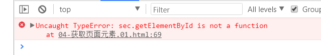
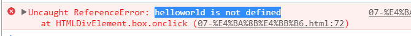

1. xxx.is not a function   报这种错误,都是xxx没有这个方法/xxx不是你想要的那个对象

2. xxx is not  defined   抱这种错误,就是把xxx当做变量,但是这个变量没有申明
3. cannot read property xxx of null / undefiend 这个错误,一般出现在读取对象的属性时. 此时这个对象就是null/undefined