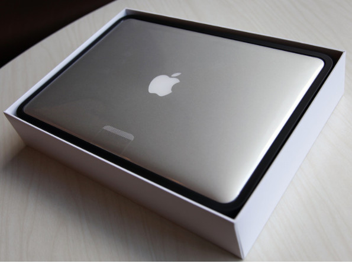
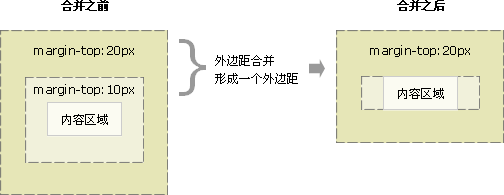

# 第五天笔记

## 学习目标
1. 权重叠加
2. 盒子模型

## 优先级（权重）

> 不同的选择器之间会有不同的优先级

```
继承 < 通配符 < 标签选择器 < 类选择器 < ID选择器 < 行内样式 <　!important
```

思考：
```
<style>
#test1 {
	color: red;
}
#test .son {
	color: green;
}
</style>
<div class="box" id="test">
	<div class="son" id="test1">试问我这段文字的颜色</div>
</div>
```

## 权重叠加

### CSS特殊性（Specificity）

关于CSS权重，我们需要一套计算公式来去计算，这个就是 CSS Specificity，我们称为CSS 特性或称非凡性，它是一个衡量CSS值优先级的一个标准 具体规范入如下：

specificity用一个四位的数 字串(CSS2是三位)来表示，更像四个级别，值从左到右，左面的最大，一级大于一级，数位之间没有进制，级别之间不可超越。 

| 继承或者* 的贡献值      | 0,0,0,0 |
| --------------- | ------- |
| 每个元素（标签）贡献值为    | 0,0,0,1 |
| 每个类，伪类贡献值为      | 0,0,1,0 |
| 每个ID贡献值为        | 0,1,0,0 |
| 每个行内样式贡献值       | 1,0,0,0 |
| 每个!important贡献值 |     正无穷    |

```
权重是可以叠加的

比如的例子：

div ul  li   ------>      0,0,0,3
.nav ul li   ------>      0,0,1,2
a:hover      -----—>      0,0,1,1
.nav a       ------>      0,0,1,1   
#nav p       ------>      0,1,0,1
```
```
1. 继承性
	
	后代元素可以继承祖先元素的一些css样式  跟文字相关可以继承 font- text- line- color  高度不继承

	a 自身有特定的一些样式 不能通过继承  所以需要单独设置  比如 color  text-decoration

2. 层叠性
	
	在权重相同的情况下 后渲染的会覆盖先渲染的

3. 优先级

	不同的选择器之间会有不同的权重


	继承 < * < 标签选择器 < 类选择器 < id选择器 < 行内样式 < !important 
	!important 只能作用单条属性  并不是整个选择器（继承不起作用）


	当多个选择器选中同一个元素的时候  会进行权重对比 并且权重是会进行叠加的

```
## 盒子模型

> 网页的布局本质就是把网页上的元素，如图片，文字，都放入盒子里面，然后按照自己的需要摆放盒子的过程就是网页布局


### 盒子模型的组成



1. width（电脑） + padding（海绵） + border（白色盒子框）  
2. 一张图诠释网页中的盒子模型完整的构成 
3. 而margin控制的是盒子与盒子之间的上下左右距离

### 边框

> 边框有三部分组成：

```
border: 边框大小  边框样式（dashed 虚线 dotted 点线 double 双实线） 边框颜色;
```

> 直接这么写边框控制的是上下左右四条边框，如果想要单独某一条边框的写法

```
border-方位名词:边框大小 边框样式 边框颜色;
```

> 边框是一个复合属性，每一个部分都可以有单独的属性去控制 用的较少

```
边框大小；border-width
边框样式：border-style
边框颜色：border-color
```

+ 补充：细线表格 border-collapse:collapse;
+ 圆角：borde-radius:值; 一个值控制的上左 上右 下右 下左;
```
 
			边框圆角语法：border-radius:像素;
			取值还可以是百分比 百分比参照的是当前盒子完整的宽高
			注意：边框圆角并不需要依赖与边框
			
			 border:10px solid #ccc; 
			 border-radius: 20px; 
			 border-radius: 50%; 	
			 
			单独控制圆角 
			一个值：四个角
			两个值：对角线
			三个值：左上  对角线  右下
			四个值：从左上开始 顺时针

			
```
课外链接补充：
http://www.ruanyifeng.com/blog/2010/12/detailed_explanation_of_css3_rounded_corners.html

### 内边距

```
padding的取值可以是1-4个

一个值：控制整个上下左右
两个值：第一个控制上下  第二个控制左右
三个值：第一个控制的上 第二个控制的左右 第三个控制的下
四个值：上右下左
```

也可以单独写：

```
padding-top
padding-bottom
padding-left
padding-right
```

**注意**：行内元素里面不要写上下padding，左右可以 
         行内元素不要写上下的padding值  左右的可以写 一般控制文字的上下 用行高即可
         块元素宽度的继承继承的是width的大小，不继承padding
案例：新浪导航

### 外边距 

1. margin的取值方式和padding一样 
2. margin的大小只会移动盒子的位置，并不会对盒子的大小造成影响（特殊情况例外）
3. 行内元素也不要给上下的margin
4. 特殊值：auto  margin:0 auto; 可以让一个块级元素水平居中  
	+ 前提条件：必须是块级元素 同时必须有固定的width
	+ 注意：text-align和margin:0 auto的不同 前者是控制盒子内部的文字或者内部的行内块  后者控制的是盒子本身

#### 清除内外边距 

``` 
* { 
	padding: 0;
	margin: 0; 
}
```

#### 盒子模型总结
```
内盒模型： width  + padding + border
外盒模型： width  + padding + border + margin


border 边框

border:边框大小 边框样式 边框颜色 如：border: 10px solid #ccc;
border-方位名词  如：border-top: 10px dashed #ccc;

细线表格：border-collapse:collapse  添加在table上即可
边框圆角：border-radius:10px;  或者 border-radius:50%

padding  内边距

一个值：上下左右
两个值：上下  左右
三个值：上 左右  下
四个值：上右下左 

单个方向的取值：
padding-方位名词  如：padding-top: 10px;

注意：行内元素不要写上下的padding

margin  外边距

取值和padding一致

margin一般用于控制盒子和盒子之间的距离

注意：
行内元素不要写上下的margin
auto特殊值 可以让一个盒子本身水平居中
	前提条件：必须是块级元素 同时有宽度

```

#### 外边距的BUG

> 相邻块元素垂直外边距的合并

```
当上下相邻的两个块元素相遇时，如果上面的元素有下外边距margin-bottom，
下面的元素有上外边距margin-top，则他们之间的垂直间距不是margin-bottom与margin-top之和
而是两者中的较大者。这种现象被称为相邻块元素垂直外边距的合并（也称外边距塌陷）。
```


解决方案：  避免就好了。

> 嵌套块元素垂直外边距的合并

```
对于两个嵌套关系的块元素，如果父元素没有上内边距及边框，
则父元素的上外边距会与子元素的上外边距发生合并，
合并后的外边距为两者中的较大者，
即使父元素的上外边距为0，也会发生合并。
```


解决方案：

```
1. 可以为父元素定义1像素的上边框或上内边距。
2. 可以为父元素添加overflow:hidden。
```

1. **实际应用注意：在实际工作中，我们很难直接话的得到盒子的内容的大小，所以我们会直接将整个盒子量出来，在后续如果需要添加padding的情况下 一定要减掉 padding **

2. 如果这个块级盒子没有width属性（从父级继承宽度）的时候，添加padding和border不会撑大盒子（盒子内容部分会自动压缩）


