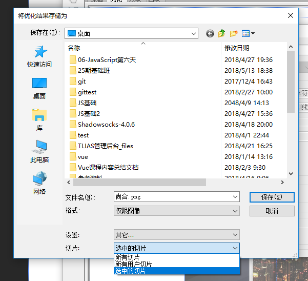
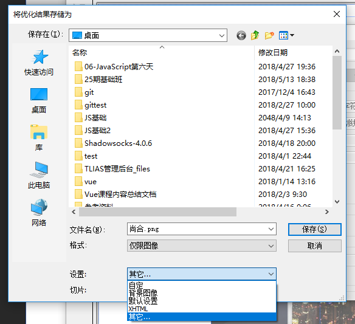
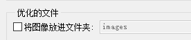

# ps的切图使用

## 主要的目的：

> 切图：量尺寸和从PSD图上面把想要的图片拿下来

基本设置：
```
1、ctrl+k  打开首选项----单位与标尺--- 将单位都改成像素
2、V工具状态下 在属性栏里面干掉自动选择 同时将组设置为图层
3、在Z工具状态下 去掉细微缩放
```
## 图层:
> 图层其实就是一张张透明的纸张，而一个完整的图片其实是由很多张图层构成的

PS的源文件格式：
```
PSD  保留了图层 利于修改
PNG JPG JPEG GIF 这个图都是没有图层的 修改起来跟麻烦
```

缩放:
```
放大  Z   
缩小：ctrl + -
```
量尺寸:
```
切片工具：c   shift + c 切换c工具组里面的选项 
利用切片工具选中了对应的元素之后  量出对应的区域 
双击即可查看切片的宽度和高度
```
选择切片:
```
切换切片选择工具：在c工具状态下  
按住ctrl 临时会将你的切片工具变成切片选择工具
```
导出切片：
```
三键（ctrl+shift+alt）+ s  
导出web使用格式  
选择被选中的切片
第一次的时候设置一下:
```




导出透明的元素：
```
1、先找到对应的元素（图层 或者 组）快捷选中图层：在V工具状态下 按住ctrl不放 单击想要看到的区域即可`
2、图片面板右键转换为智能对象
3、在缩略图上双击 
4、三键+s 存储为web使用格式 
```
	