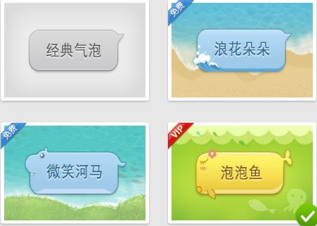

# 第八天笔记

## 学习目标
1. 元素的显示隐藏
2. overflow
3. vertical-align
4. 精灵图
5. 字体图标
6. 滑动门
7. 其他属性

## 元素的显示和隐藏

> 将元素的显示模式设置成none即可让元素隐藏

```
display的值为none的时候，元素完全隐藏
display的值为block的时候，元素呈块级显示
display的值为inline的时候，元素呈行内显示

display为none隐藏时候是不占位置的
实际工作中用的较多
```
> visibility 控制元素的显示和隐藏

```
visibility的值选择
hidden 占位置隐藏
visible 显示
实际工作中用的较少
```

## overflow

> 控制元素溢出之后的显示方式

```
取值：
visible  直接显示
hidden   超出的部分隐藏掉
auto 	 如果超出，自动产生滚动条，如果不超出，不产生
scroll 	 不管有没有超出，都有滚动条控件

overflow-x:hidden;
overflow-y:hidden;
```
opacity 控制整个盒子的透明度 包括里面的内容 取值为0-1 0完全透明 1 不透明
background:rgba() 控制的是背景透明 里面的内容不透明  

## BFC

> 块状格式上下文 产生BFC之后，盒子内部的空间与外部完全隔离

那些可以产生BFC ?
```
overflow只要取值不是visible的情况下
float的值不为none的时候
display为table或者inline-block的时候
position的取值为fixed或者absolute
```
(课外BFC参考资料)[https://www.cnblogs.com/CafeMing/p/6252286.html]

## 水平垂直居中大汇总
```
1. text-align:center
控制行内元素和行内块（img插入图片）水平居中

2. line-height
控制的是（单行）文字的垂直居中

3. margin:0 auto;
控制的是一个具体的宽度的块级元素水平居中

4. position:absolute left:50%; top:50%; margin-left:-自身宽度的一半 margin-top：-自身高度的一半
控制的一个绝对定位的元素水平垂直居中

5. background-position:center center;
控制背景水平垂直居中

6. 插入图片（img）垂直居中盒子垂直居中
margin-top 或者padding-top

7. 让一个div水平垂直居中
设置这个div为一个行内块元素 同时给父元素设置一个textl-align：center  line-height: 一个具体的高度;

```

## vertical-align

> 控制行内块与文字的对齐方式，写在行内块元素上面

取值：
```
baseline 图片的基线和文字的基线保持对齐
top 图片的顶线和文字的顶线（行高的顶线）对齐
bottom 图片的底线和文字的底线（行高的底线）对齐
middle 图片的中线和文字的中线对齐
```
应用场景：
```
可以解决图片与文字排列时候底下留白的问题 
（不要让图片以基线对齐即可 或者将图片转成块元素）
可以解决表单元素与文字排列不对齐的问题
（设置图片的vertical-align：middle || top || bottom）
可以设置图片（行内块）垂直居中
可以设置多行文字居中显示
```
如何让一个行内块在一个盒子里面水平垂直居中：
```
1、给父级元素设置text-align：center  （水平居中）
2、给父元素设置一个等高的行高
3、给行内块元素设置vertical-align：middle；（让图片以文字的中线对齐）
```
如何设置多行文本水平垂直居中
```
1、给多行文字包裹一个盒子 给这个盒子设置成行内块 
2、给父级元素添加行高，并且给行内块元素设置成vertical-align:middle;即可
3、给行内块添加行高  让其覆盖掉继承过来的行高 
```
## 溢出文字以省略号的形式显示（单行）

```
overflow: hidden;
white-space: nowrap;
text-overflow:ellipsis;
```
white-space: nowrap; 文字换行

## 精灵图（雪碧图  sprite）

> 概念：就是将很多的小图片 icon，都整合到一张大图上使用。
> 作用：减少网络请求，降低服务器压力，提高效率
原因
```
因为浏览器会去服务器请求页面，请求回来的页面在执行的过程里面，会不断的去
服务器请求对应的图片，当页面上的小图片过多了，那么浏览器会频繁的去服务器
发请求，这个会给服务器带来很大的压力，同时效率很慢。解决方式就是将小图片
整合到一张大图上，直接请求大图片即可，需要使用到某一张小图的时候只需要获
取这个小图在这张大图的位置即可
```
使用方式：
```
1.将需要显示的区域用切片选中，直接将切片的宽高赋值给盒子
2.直接获取切片的坐标，直接将坐标取负值赋值给background-position
```
## 字体图标

> 概念：将图标做成字体来是使用

> 作用：字体相对图片来说容量更小，同时更加利于维护和修改

> 使用：借助于第三方网站（iconfont.cn）找到对应的图标。下载下来，按照DEMO提示即可 （一定要注意文件的路径）

## 滑动门技术

要求：
```
1.盒子会跟随内容撑开
2.背景前后不一致
```


实现：
```
设置三个盒子，左盒子针对左背景 右盒子针对右背景 中间的盒子由内容撑开 三个盒子完成浮动 
```
## 其他细节
```
1.cursor 
	pointer 小手
	default 箭头
	text 文本
	move 移动
	url(),临时替换的样式
2.outline:none;
	去掉选中之后的蓝色边框
3.resize:none;
	去掉文本域的自动拉伸效果
​```


