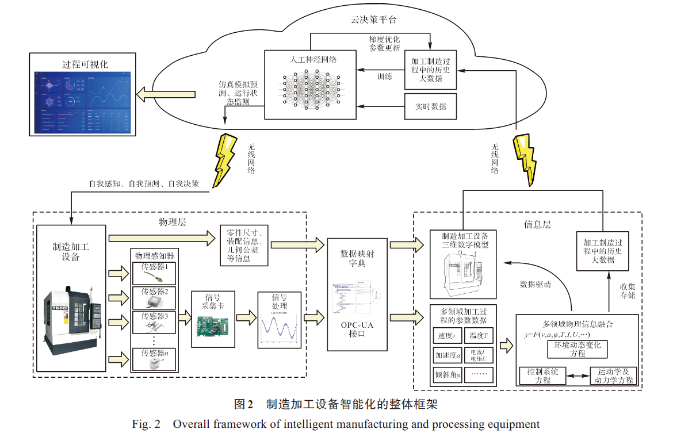
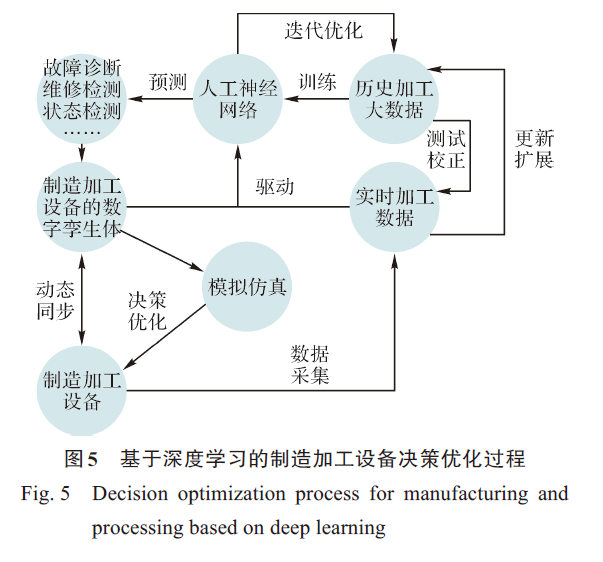
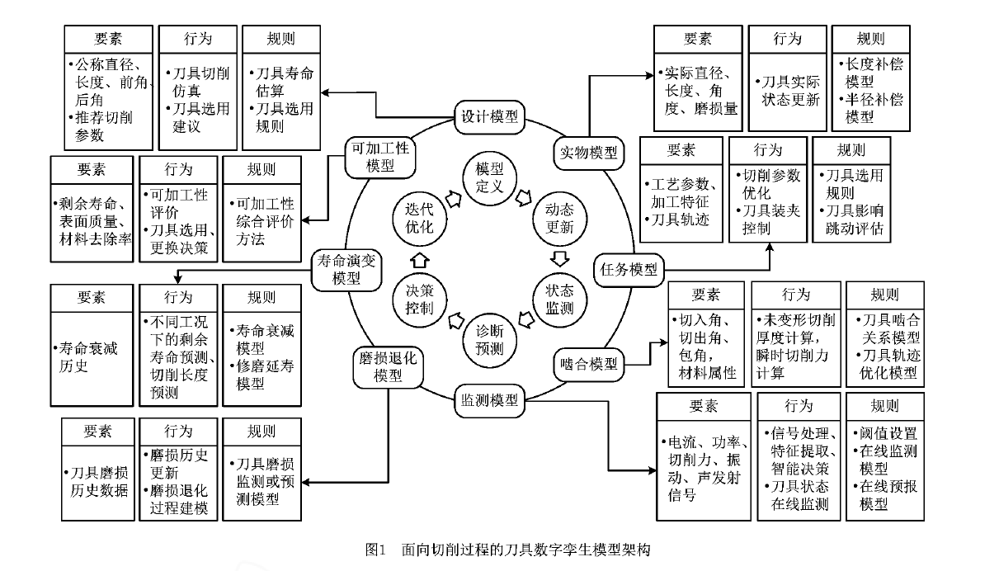
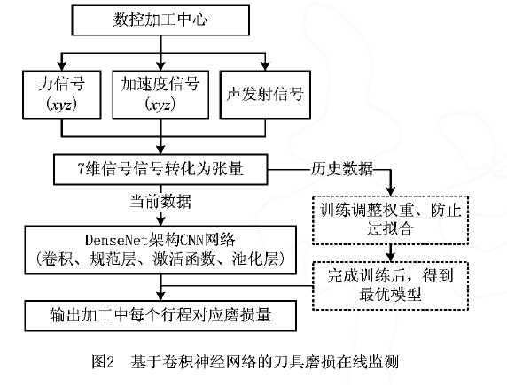
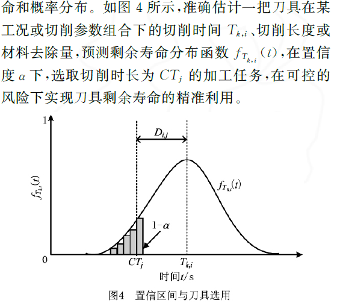

# 20203008交流

```
目前确定的是对制造加工设备进行构建数字孪生体
涉及几个问题
1.3D模型 
2.以案例来验证算法模型，案例的数据源没有
3.和师兄交流关于深度学习方面的创新点，可以在数据处理方面做文章
-----------------

- 利用深度学习建立预测模型，1.状态监测模型（监测当前设备的状态，各项参数是否正常，有什么趋势）2.故障预测模型（要能预测出故障发生的时间点和剩余可加工时间）3.加工质量预测模型（某些设备的加工会影响产品质量，通过数据挖掘等手段提取特征值，建立设备维护阈值）
- 数字孪生的仿真模型，调度方案生成时，数字孪生体可以模拟调度

- 基于调度建立设备的数字孪生体，主要就是三个状态监测，剩余加工时间预测，机器可加工性评价

- 目前了解到的关键算法点，状态监测（卷积神经网络），剩余加工时间预测（非线性推理），机器可加工性（阈值）

```
## 基于数字孪生与深度学习技术的制造加工设备智能化方法研究

- 为了能在信息层建立一个高保真的制造加工设备数字孪生体，且该数字孪生体能实时反映物理层制造加工设备的真实状态，物理层数据与信息层虚拟模型的完美融合是关键。为了实现这个目标，需解决以下3个问题：
    - 1）如何在信息层中建立一个能够实时反映制造加工设备真实状态的数字孪生体；
    - 2）如何使物理层和信息层的数据保持同步，从而实现物理信息与虚拟信息的完美融合；
    - 3）如何在物理信息与虚拟信息融合的基础上生成对制造加工设备有价值的信息，使它能实现自我决策。
- 
- - 多领域加工过程中的参数数据作为加工过程中的大数据，可用作云决策平台中人工神经网络训练的数据源，可为云决策平台进行预测性维护、在线工艺缺陷诊断、资源调动优化提供强有力的帮助。
- 云决策平台是数字孪生体实现自我感知、自我预测、自我决策的重要依托，其核心是`深度学习技术`。**先利用加工过程中产生的大数据来训练人工神经网络，然后基于物理感知器采集到的加工过程中的实时数据，利用训练好的人工神经网络对物理层中的制造加工设备进行`状态监测`及`功能性诊断`，以预测设备加工过程中`可能出现的故障`以及`设备寿命`，为物理层中制造加工设备的正常生产制造提供保障。**
- **基于深度学习的云决策平台构建：**
    - 深度学习技术的应用减轻了机器学习模型`手工提取特征`的负担，尤其是在图像和语音的摄取分类方面，其中`卷积神经网络`、`循环神经网络`是常用的深度学习技术
    - 通过人工神经网络可以对制造加工设备运行过程中的故障诊断、维修检测、设备状态监测、误差分析等进行实时预测感知，从而实现制造加工设备从被动式管理控制转化成为主动预测式管理及控制。
    - 利用加工过程中产生的历史大数据来驱动人工神经网络的训练过程，如图所示，多领域加工过程中的物理数据在训练过程中交互迭代优化，并封装成相应的预测模型。
    - 
    - 通过制造加工设备的数字孪生体和传感器实时监测到加工过程数据，以`实现设备的状态监测及未知因素的预测`，在预测过程中，一方面可以根据历史积累数据对实时监测到的数据进行测试、校正，另一方面可以根据实时监测到的数据对历史数据进行更新及扩展。
    - 物理层中的制造加工设备通过其数字孪生体动态地跟踪及反映设备实体的最新状态，并通过仿真模拟产生相应的决策信息，并利用产生的决策信息对物理层中的制造加工设备进行评估、优化，最终实现制造加工设备的物理信息与虚拟信息融合及智能化。

## 面向切削过程的刀具数字孪生模型

- 
- 虽然这些子模型的功能差异明显，但都遵循相同的运作流程：
    - （１）模型建立　定义子模型的要素、行为和规则，针对每一个刀具实物实例化一个虚拟模型。
    - （２）动态更新　通过传感器、数据接口采集加工现场的数据，同步更新子模型。
    - （３）计算模拟　基于历史数据、实时数据和子模型，计算、模拟、监测刀具状态的演变情况。
    - （４）诊断预测　诊断可能存在的问题，预测刀具未来发展趋势和剩余寿命，评估刀具可加工性。
    - （５）决策控制　输出加工补偿或优化控制指令，输出刀具选用和更换建议等。
    - （６）迭代优化　物理刀具与虚拟模型之间的反复迭代，提高模型的仿真精度。
- **数字孪生驱动的刀具磨损监测：**刀具状态监测子模型也可通过**自编码网络、卷积神经网络**等深度学习模型实现。如图所示，这种方法以原始时域信号作为输入，避免信息在降噪、小波变化等操作中的损失，取消了传统的人工特征提取过程，**利用多层卷积、池化操作挖掘加工信号中隐含的高维特征**，以回归的方式逼近刀具磨损退化轨迹，具有更好的监测精度和泛化性能。
- 
- **数字孪生驱动的刀具剩余寿命预测：**剩余寿命预测子模型主要通过数据驱动的方式实现：①建立基于深度学习的刀具剩余寿命预测模型，高精度地逼近刀具寿命衰减轨迹，且泛化性能好、可迁移性强，能够较好地适应切削过程动态变化，但样本需求量大、预测结果的可解释性弱，不利于后续决策和优化；②考虑到刀具剩余寿命衰减的非线性、随机性和个体差异性，基于随机过程和磨损退化历史数据`建立刀具磨损过程模型`和`剩余寿命衰减模型`。
- 在实时采集数据的驱动下，求解当前时刻刀具的剩余寿命、概率密度函数、累积分布函数和置信区间。
- **数字孪生驱动的刀具选用：**：①在切削工况和参数恒定的情况下，准确评估每把备选刀具在指定置信度下的剩余寿命，根据规则从中选取合适的刀具，既能满足目标加工任务对切削时间、切削长度或材料去除量的要求，又能在可控的风险下尽可能利用刀具的剩余寿命，最终提高刀具使用的经济效益、社会效益和环境效益；②针对目标刀具，评估其在不同工况或切削参数组合下的剩余寿命和概率分布。
- 
- （１）在刀具磨损监测子模型中，实现了基于卷积神经网络的刀具磨损在线监测，以切削力、振动和声发射信号为输入，利用时域传感器信号对刀具磨损量进行定量分析，采用多层感知机自适应地提取特征，通过加深网络进一步挖掘信号中隐藏的微小特征，对后刀面磨损量进行在线监测，能有效避免人为特征提取的局限性，具有极高的监测精度和良好的泛化性能。
- （２）在刀具剩余寿命子模型中，基于非线性维纳过程理论和刀具磨损退化历史数据，建立了刀具磨损退化和寿命衰减过程的数学模型，在概率框架下求解剩余寿命及置信区间，量化并减小预测结果的不确定性，为刀具选用和更换的决策和优化提供可靠依据。
- （3）在可加工性评价子模型中，利用每把刀具剩余寿命及其分布的预测结果，采用个体失效阈值进行刀具选用决策。