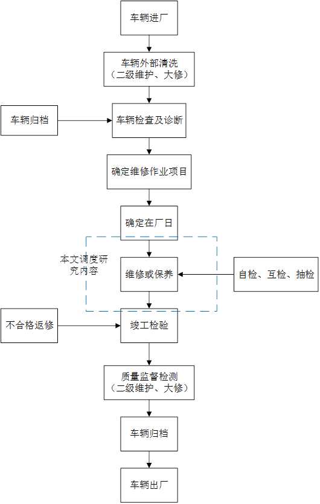

## 维修车间工艺流程
- 
##  维修车间作业范围分类
1)	需要维修的车辆大致可以分为车辆保养、车辆小修、车辆大修、总成大修、零件修理。
车辆小修包含一级保养、二级保养和三级保养，是采用修理或者更换汽车的个别零部件，使汽车在使用运行过程中的故障隐患得到处理。保证汽车的正常工作，延长汽车的使用寿命。
车辆大修属于恢复性修理，针对行驶过一定里程、时间的新车或经历过大修的汽车，对其进行技术检测，通过对汽车零部件（主要针对发动机、底盘、变速器、发电机、起动机和空调系统等）的修理，恢复汽车的性能。
总成大修也属于恢复性修理，是指汽车的总成经过一定使用距离或时间后，用修理或更换总成任何零部件(包括基础件)的方法，一般是换掉总成里坏掉的全部零件，恢复车辆的技术状况和寿命。这里的总成的意思是汽车中具有单独使用功能的整体，像是发动机总成、发电机总成、车架总成、变速箱总成、后桥总成
零件修理是对因磨损、变形、损伤等而不能继续使用的零件进行修理，它是对单一的零部件的损坏进行的维修更换。
2)	按工种来分，维修车间工艺又可分为机、电、钣、漆四大工种。
机修：主修发动机及底盘部分；
电工：所有电气设备，比如蓄电池、发电机、调节器等；
钣金：一种对金属的冷加工工艺，主要针对车架及车身整形；
喷漆：即喷漆，完成汽车车架外部漆面的处理。

## 小结

- 我的调度思路是建立能反映**制造加工设备真实状态的数字孪生体**；其次，基于`历史加工大数据`，通过数字孪生体对`加工过程的行为进行建模及深度学习和训练`，并利用训练好的`人工神经网络`根据采集到的实时数据来`预测制造加工设备下一时刻的状态`，然后根据制造设备的状态建立可加工设备列表。然后利用智能算法进行实时调度。
- 而维修车间按照工艺区分，大多数工序为人工操作，不好进行数据的量化和采集，无法积累大量的训练数据进行建立预测模型。所以不太好针对维修车间进行调度。
- 项目相关，正在使用说明书进行筛选可做功能。

