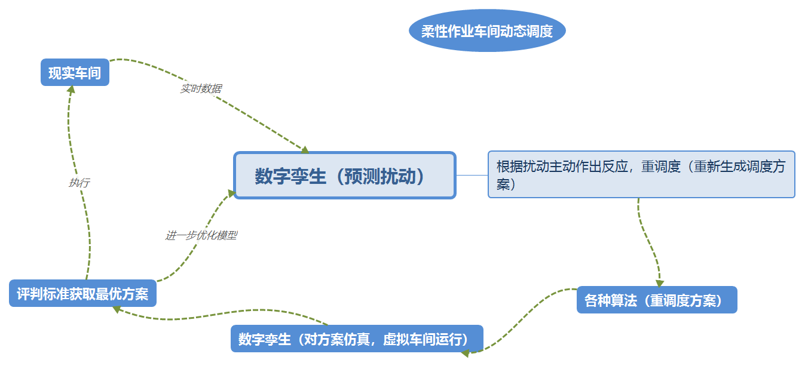
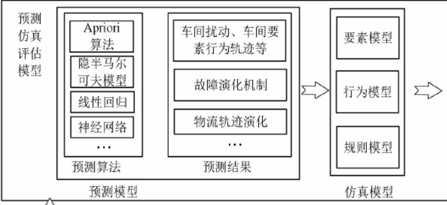
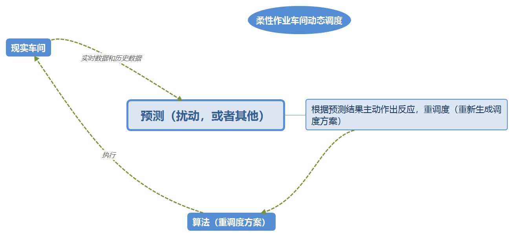

# 论文思路整理2020-02-25

>> 首先，柔性车间进一步的研究对象必定是多目标或者动态调度，想要将其他技术相结合，就必须具体话研究对象

## 思路一（数字孪生）

- 这是《基于数字孪生的柔性作业车间动态调度研究》的思路：当物理车间的实时调度运行数据与预定义的值（当前调度方案计划在仿真中的各项数据）出现偏差时，虚拟车间中多调度知识模型调度优化架构会主动感知异常，快速确定异常范围，判断是否需要做出响应。如需要进行调度优化，则根据重调度策略获得新的调度方案（`原文中为利用数据挖掘获取调度规则，然后根据调度规则获取调度方案`），然后再虚拟车间里执行各个调度方案，获取各个调度结果，比较结果得到最优调度方案，然后再进一步优化数字孪生模型。

**数字孪生的相关问题：**

1. **数据没有，如何获取建模的数据**  数据类型为：调度要素实时状态数据、调度过程数据和调度活动计划数据。调度要素实时状态数据包括工件加工状态数据、设备运行状态数据、人员状态数据、物料配送状态数据等。调度过程数据是产品在生产过程中产生的数据，包括加工进度数据、加工时间数据、产品质量数据等。调度活动计划数据由各调度方案的数据组成，包括工件每道工序的加工机器、机器前工件的加工顺序等。
2. **建模，如何搭建数字孪生的模型，相关技术学习，并不知道如何仿真**  就《基于数字孪生的柔性作业车间动态调度研究》这篇而言，就包括预测模型和仿真模型，用到的技术如图。机器学习相关知识的学习
    1. 
    

**思路相关问题：**

1. **如何进行重调度，多目标的调度** 目前没有研究相关信息
2. **扰动如何处理**
3. **评判优化标准如何建立**
..........

## 思路二（根据思路一简化 相当于主动调度）

- **主动式调度**   与文献《以生产趋势预测为基础的主动式调度方法》所描述的调度模式类似，这篇文献是建立了实时状态模型表达生产过程中的历史信息及实时状态信息，在此基础上，利用了贝叶斯网络对其进行推理，实现对生产过程的加工趋势的预测，最后以趋势预测的结果作为实时调度的触发条件和依据，生成针对异常趋势的主动式调度方案。
- 这里不一定需要数字孪生，只是预测或者仅仅着重于数字孪生的预测模型如《基于数字孪生技术的复杂产品装配过程质量管控方法》，预测质量（`扯着数字孪生的虎皮`）。其中预测的不一定是质量，可以扰动，具体到机器故障或其他生产不确定因素。
- 有几个点1.预测模型 2.重调度（这里很多，调度方案评估准则等）3.算法
- 根据预测的对象不同，后续解决方向不一样

**思路相关问题：**

1. **如何进行重调度，多目标的调度** 目前没有研究相关信息，比如重调度方案的评估标准，多目标求解算法等
2. **数据的获取，根据预测的对象不同需要的数据不同**（师弟）
3. **如何仿真对比**

..........

## 思路三
- 数据挖掘应用（王艳老师那边好像有人做过）

## 总结

1. 目前的问题是第一篇的点怎么用上，算法挂钩？
2. 确定研究对象，要具体，要解决什么样问题？故障的车间调度，多目标的，考虑其他的

数字孪生模型对车间建模，刀具建模，
数字孪生以数字化的方式创建物理实体的虚拟模型，借助数据模拟物理实体的行为，通过虚实交互反馈、数据融合分析、决策迭代优化等手段，促进物理世界与信息世界的交互与融合，为物理实体增加或扩展新的能力。

数字孪生 预测 仿真 数据分析