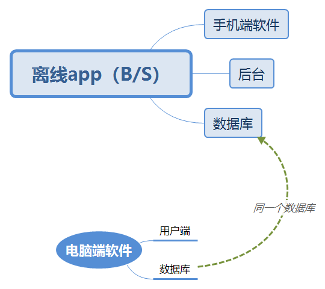

# 离线App

## 总体架构

- 需要建立一个后端服务器，用于数据通信



## 功能筛选

```
1.特种车辆在线数据采集与离线数据采集模式研究
针对特种装备存在大量在线数据和离线数据现状，开展在线数据和离线数据的采集、存储模式研究，开发现场在线与离线数据采集APP，建立在线与离线数据存储数据库。 
说明：针对以上研究内容，需要开发离线数据采集APP，主要完成保养类数据、检测类数据、维修类数据的现场快速录入APP软件开发。软件功能与原基于PAD的数据采集模式相同，但需要进一步优化数据录入程序及操作，操作系统可以基于安卓。通讯要求基于目前局域网络WIFI。此数据录入APP类似于手机微信小程序性质的开发，将前期开发的基于PAD的数据采集软件，做成一个可以随时添加数据的小程序，并与原有的“装备使用与维护保障数据库”进行衔接，要求能够录入的数据能够入库，满足前期开发的数据库入库需求。
注释：在线数据的采集暂时不考虑。
合同交付物：
（1）离线数据采集APP软件一个（含软件源程序、软件可执行程序、软件设计说明书、软件测试报告、软件使用说明书，软件需要运行在安卓操作系统，并能够实现在原使用维护数据库实现数据上传。数据录入需要考虑保养时的铁谱数据、光谱数据以及维修时现场采集的备件二维码数据、现场图片数据和文字类录入需求。此APP应能够运行在win操作环境和安卓操作环境两种操作系统）
```

- **主要完成保养类数据、检测类数据、维修类数据的现场快速录入APP软件开发。**

>**删除功能**:  ~~删除功能~~
>**保留功能**：`保留功能`（可以做）
>**待定功能**： *待定功能*
>**注释**：（注释）

>基础信息部分建议只做简单查询（录入功能等不常变更，在PC端较好）

* **基础信息** 基础信息模块对整个装甲装备维修保障系统的信息进行管理，录入的之后，在维修管理、资源管理及计划管理中可对相关信息下拉列表选择，避免所有信息手动录入，极大方便了用户操作。主要包括 “装备 BOM表、部门信息、人员信息、保障资源信息、车辆维修字典、车辆保养手册、车辆档案和其他信息 ”等。  
  （**不常变更，建议PC录入**）
    - 车辆维修字典 录入常见车辆排故项目信息及检测项目信息，并设置字典，方便维修管理模块以及计划管理模块操作。  
        - 排故字典  1、录入排故记录中，故障现象、故障原因、排故方法、影响程度等信息； 2、具备增、删、改、查功能
        - 维修项目  1、录入检测记录中，检测项目、项目说明、是否功能性维修等信息； 2、具备增、删、改、查功能。  
    - 车辆保养手册  1、以车型和保养等级分类，录入间隔里程和间隔摩托小时等信息，并录入相应的保养项目和保养资源； 2、具备增、删、改、查功能。  （**不常变更，建议PC录入**）
    - 车辆档案 管理车型和车辆初始信息，并与维修管理和计划管理动态连接，实时更新车辆行驶里程和摩托小时等。  
        - ***车辆基本信息  1、录入车辆基础信息，如车号、车型、装备单位、技术状态、行驶里程、摩托小时、负载小时、发动机号等，可上传照片并在线查看； 2、根据性能类别，录入车辆的性能参数信息，包括参数名称、参数单位、参数数量等信息； 3、录入车辆出厂检测记录的相关参数信息，如检验要求、单位、检验结果、结论等； 4、具备增、删、改、查功能。***  （**根据需求待定，只做查询**）
        - ***车型基本信息  1、录入车型和装备单位名称，上传产品图册（支持 pdf/word等格式）、装备结构（支持 pdf/word等格式）、产品图片（支持 jpg/png等格式）并可在线查看； 2、具备增、删、改、查功能。*** （**根据需求待定，只做查询**）
      （**不常变更，建议PC录入**）
        - 维修小组  1、录入维修小组信息 2、具备增、删、修改功能   
        - 维修检测地点  1、录入维修检测地点信息 2、具备增、删、修改功能  
        - 维修级别  1、录入维修级别信息 2、具备增、删、修改功能  

- **资源管理模块** 资源管理 即仓库管理，对整个维修保障系统的所有资源进行管理，包括备件筹措计划、备件器材出入库、盘库登记、仓库报损、库存清单、工具仪器管理等；并与维修管理、计划管理动态联调，管理维修保养所需的资源并记录。  

    - 工具仪器管理  1、与维修管理和计划管理实现动态联调，若在维修与保养计划下发资源中包含工具仪器设备设施，系统将在此界面插入一条记录，包括器材编号、名称、规格、仓库及库位、借用地点，借出日期、借用缘由、状态等； 4、选择记录同意借出，录入借用人，系统将自动同步借用时间； 5、具备查询功能。(**功能1有难度，后台**)  

- **计划管理模块** 计划管理 计划管理模块完成保养计划的相关功能。包括从里程登记到制定计划，再到计划的审核与下发，以及保养计划完成后的登记、整个保养计划中的检测记录与排故记录的登记等。  
    - `里程登记 完成车辆行驶里程及摩托小时的登记，为后续制定保养计划录入数据。`  
        - 年计划里程登记  1、年初登记年计划里程与年计划摩托小时； 2、具备查询功能 3、提交后数据录入数据库，为系统自动生成计划提供数据支撑 （**不常变更，建议PC录入**）
        - 月计划里程登记  1、月初登记年计划里程与月计划摩托小时； 2、具备查询功能 3、提交后数据录入数据库，为系统自动生成计划提供数据支撑 （**不常变更，建议PC录入**）
        - 周实时里程登记  1、登记本周的实时里程和实时摩托小时 2、对录入的数据进行校验，是否大于车辆档案中的实际里程 3、具备查询功能 4、提交后数据录入数据库，为系统自动生成计划提供数据支撑 
    - 计划生成（年 /月/周）  1、页面加载时，系统将根据里程登记的数据和保养手册里的间隔里程、间隔摩托小时，自动计算保养计划。 2、具备查询功能。 （**根据需求待定，只做查询，功能有难度**）
    - 计划制定（周保养计划 /换季保养 /射击保养 /特殊保养）  1、制定保养计划，录入相关信息，如保养单位、保养地点、开始时间、结束时间等信息，同时会按保养手册里的设置添加保养项目和资源，完成保养计划。 2、具备查询功能； 3、可修改保养计划，如修改保养资源里的设施、设备、仪器仪表、工装等信息； 4、提交制定好的计划，将进入审核界面。`（**建议PC端操作**）  
    - 计划审核（周保养计划 /换季保养 /射击保养 /特殊保养）  1、审核保养计划，审核通过则更改状态进入下发界面； 2、若不予通过审核，点击“驳回”按钮，弹出界面输入驳回理由，点击 “确定 ”将更改 计划状态为 “驳回 ”，计划返回至 “计划制定界面 ”，并在该界面显示驳回意见。 3、可修改保养计划，如修改指定的保养单位、保养地点等，以及修改保养资源里的设施、设备、仪器仪表、工装等信息； 4、具备查询功能。`
    - **？？**计划下发（周保养计划 /换季保养 /射击保养 /特殊保养）  1、下发保养计划 2、系统将自动检查计划所需资源是否在库，若在库，下发成功，更改状态为 “已下发 ”，计划进入下一界面，同时将会更改“资源管理 ”中资源的信息，实现计划与仓库的动态联调； 3、若不在库，提示警告信息，下发失败； 4、具备查询功能。（**根据需求待定，功能2 后台有难度**）  
    - `保养登记  1、保养计划的登记，周保养 /换季保养 /射击保养 /特殊保养计划经下发后会在此界面登记，针对每一个保养计划的每一个保养项目，登记是否完工，完工时间及责任人； 2、显示保养手册中指定的保养资源，并可新增计划中额外用到的的资源； 3、将整个计划所有的数据存入数据库。 4、检测记录，针对每一个保养计划，登记其检测记录，录入检验项目、检验时间、检测地点、检验者、累计里程、累计摩托小时，检验结果等信息；为方便 PAD操作，设置实时拍照上传，并可在线查看； 5、排故记录，针对每一个保养计划，登记其排故记录，录入故障现象、排故方法、影响程度、原因、排故者、排故人数、累计里程、累计摩托小时，检验结果等信息；为方便 PAD操作，设置实时拍照上传，并可在线查看； 6、具备查询功能。`  


- **维修管理模块** 维修管理 维修管理模块完成维修计划的相关功能。包括从维修申请到维修计划，再到计划的审核与调度，以及工段记录、维修记录、检测记录、排故记录的登记，维修校验、维修动态等。  
    - `维修申请  1、车辆需要维修时，在此新增维修申请，录入车号、维修目标、任务名称、维修种类、总工时、接车里程、接车摩托小时、使用单位、期望完工日期、申请人、处理责任单位，故障现象等信息； 2、提交后，为该申请制定维修计划； 3、具备增、删、改、查功能 ` 
    - `维修计划  1、为提交的申请制定详细维修计划，如维修项目、维修工段、维修资源，并可查看计划的具体信息； 2、显示申请详情； 3、在维修计划中，加入需要维修的大部件； 4、提交后进入计划审核界面待审核； 5、提交后进入计划审核界面待审核具备增、删、改、查功能。`  
    - `维修审核  1、审核已提交的维修计划，若通过，则进入调度环节，同时将会更改 “资源管理 ”中资源的相关信息，实现维修与仓库的动态联调； 2、若不予通过审核，点击“驳回 ”按钮，弹出界面输入驳回理由，点击 “确定 ”将更改计划状态为 “驳回 ”，计划返回至 “维修计划”界面，并在该界面显示驳回意见； 3、修改维修计划； 4、具备查询功能。`  
    - ~~维修调度  1、根据申请时间对维修计划进行排序； 2、根据工段总工时对维修计划进行调度排序； 3、可人为修改计划的执行顺序； 4、下发维修计划至工段记录； 5、具备查询功能。~~ （**建议PC端操作**）  
    - `工段记录  1、查看维修计划详情 2、编辑工段记录，可上传已有视频或在线录制视频，可上传照片或直接拍照，并可以在线查看； 3、针对每一个工段，录 入维修记录信息，如维修项目、维修级别、维修操作者、维修地点、维修用时、维修人数等； 4、针对每一个工段，登记其检测记录，录入检验项目、检验时间、检测地点、检验者、累计里程、累计摩托小时，检验结果等信息；为方便 PAD操作，设置实时拍照上传，并可在线查看； 5、针对每一个工段，登记其排故记录，如故障现象、排故方法、影响程度、原因、排故者、排故人数、累计里程、累计摩托小时，检验结果等信息；为方便 PAD操作，设置实时拍照上传，并可在线查看； 6、具备增、删、改、查功能。`  
    - `维修交验  1、每辆车维修计划中所有项目完工以后，该车在此界面完成交车检验，如机动性检验、活力检验、通讯检验、外观检验等； 2、通过所有检验后，录入交车信息，如里程、摩托小时、交车人员、检验责任人、实际完工日期、交车日期等； 3、登记大部件维修的完成状态，若存在报废情况，更换合适的其他空闲大部件，并 将维修信息录入大部件履历中，完成交车； 4、具备查询功能。`  （**根据实际要求来定做不做，维修校验人员的实际需求**）
    - `维修动态  1、显示维修车辆的维修进度、当前所在工段、预计完工日期等； 2、设置间隔时间为一分钟，即每隔一分钟更新一次维修动态`。  


- **运维管理模块** 运维信息 对车辆使用中产生的动态信息进行管理，主要包括装备使用信息管理、装备维修记录、大部件履历管理、装备备件使用记录、装备保养记录。  
    - `装备使用信息管理  1、对使用分队在车辆使用过程中产生的信息进行登记。主要包括车号、日期、累计里程、累计摩托小时、使用地域、执行任务、行驶里程、射击发数、火控工作时间、通讯使用时间、涉水时间、运输里程等信息。 2、具有对使用记录进行查询删除等功能。`  
    - *装备维修记录  1、对维修分队在车辆维修过程中的记录信息进行统计管理。按照车号查询车辆视情小修、定时小修、视情中修、定时中修、预测维修、故障维修、大修相关的具体信息，包括检查记录、排故记录等。 2、具有查询功能。* 
    - *大部件履历管理  1、对大部件的基本信息、维修记录、使用记录信息进行管理。该单元主要负责录入大部件的名称、规格、单位、投入时间、寿命、生成日期、状态等数据。 2、对车辆大部件维修过程中产生的信息进行同步。 3、具有删除查询等功能。*
    - 装备备件使用记录  1、对每辆车在维修以及保养过程中使用到的备件进行统计。包括备件名称，仓库，供应商、领料人、领料时间等信息； 2、具有查询功能。 
    - 装备保养记录  1、统计每辆车所有的保养记录，按时间节点排序显示 2、针对每一次保养，可以查看开始时间、结束时间、保养类型、保养地点、累计里程、累计摩托小时等，并可弹出窗体显示此次计划所有的检测记录与排故记录； 3、针对每一次检测记录，设置可弹出窗口显示检测记录详情，如检验项目、检验人、检测地点、检验结果等，并可 在线查看图片数据。 4、针对每一次排故记录，设置可弹出窗口排故记录详情，如故障现象、影响程度、原因、排故方法、排骨效果等，并可在线查看排故图片； 5、具备查询功能。


- ~~**统计分析模块** 统计分析~~(**建议PC**)
    - 基础信息查询 对基础信息模块中常用单元的查询功能进行整合。包括人员信息查询、部门信息查询、车辆档案信息查询。  
    - 维修信息查询 对维修管理模块中常用单元的查询功能进行整合。包括维修申请查询、维修动态查询。  
    - 安全库存分析 对上一季度备件消耗情况进行分析，得出本季度的安全库存数量，为备件筹措计划制定依据。  
    - 盘库分析 对盘库进行分析，根据盘点数和库存数标点盘盈或者盘亏。  
    - 资源信息查询 对资源模块中常用单元的查询功能进行整合。包括备件入库查询、备件筹措计划查询、备件出库申请查询、库存清单查询、工具仪器借还查询。  
    - 保养信息查询 对计划管理中常用单元的查询功能进行整合。包括保养登记查询。  
    - 备件消耗统计查询  1、对当前季度的备件消耗进行统计分析。 2、具有查询功能  
    - 仓库明细  1、对备件的入库和出库信息进行统计 2、具有查询功能  
 
## 小结

- [x] 里程登记(周 月 年)
- [x] 保养登记(大模块,功能多)
- [x] 维修申请
- [x] 维修计划
- [x] 维修审核
- [x] 维修交验
- [x] 维修动态
- [x]工段记录


