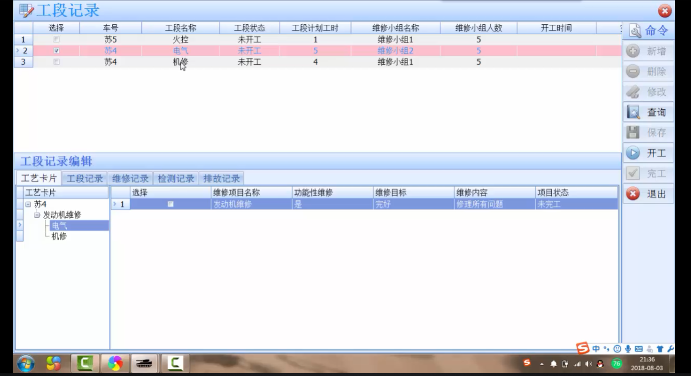
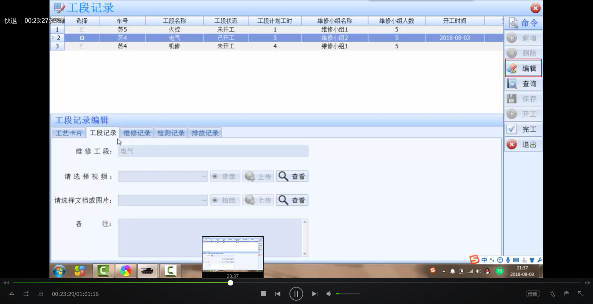
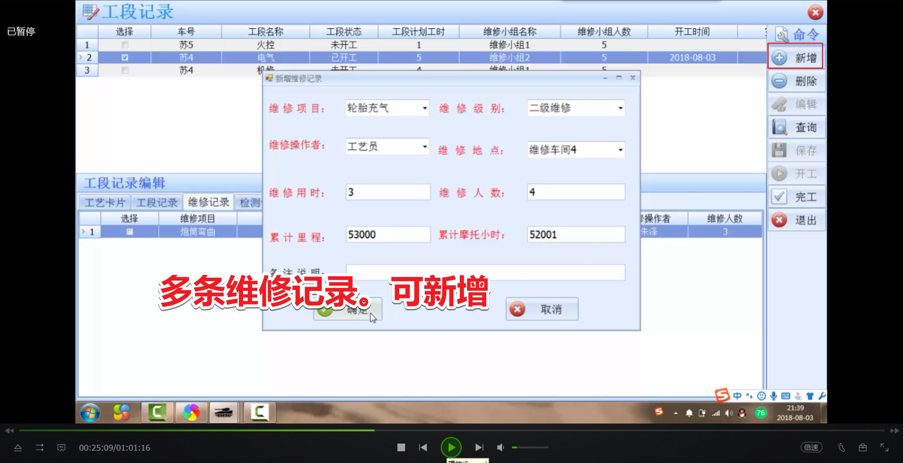
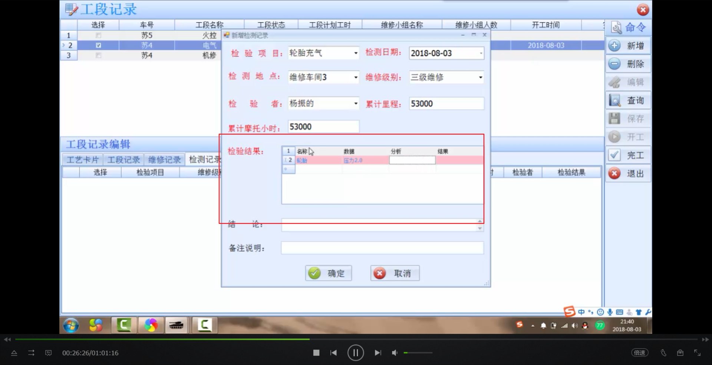
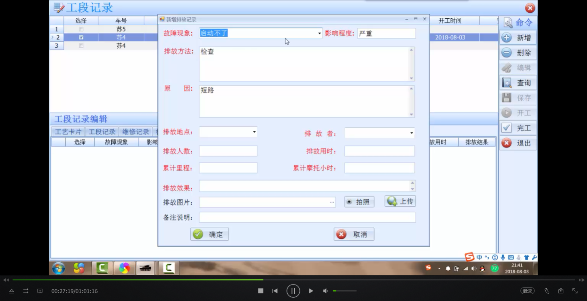
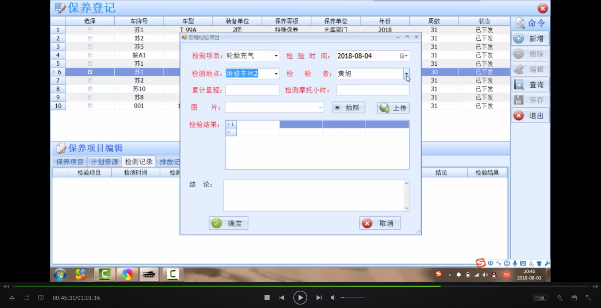
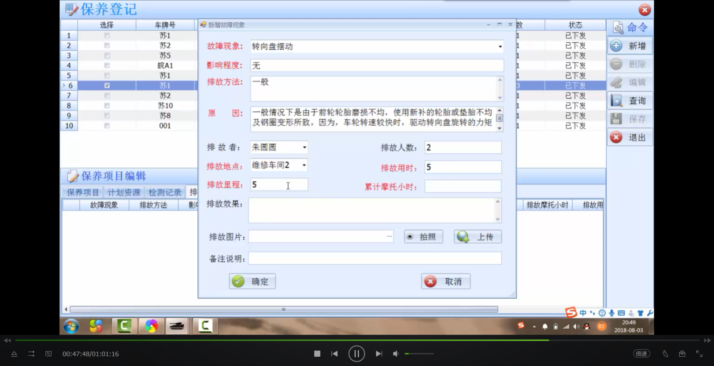
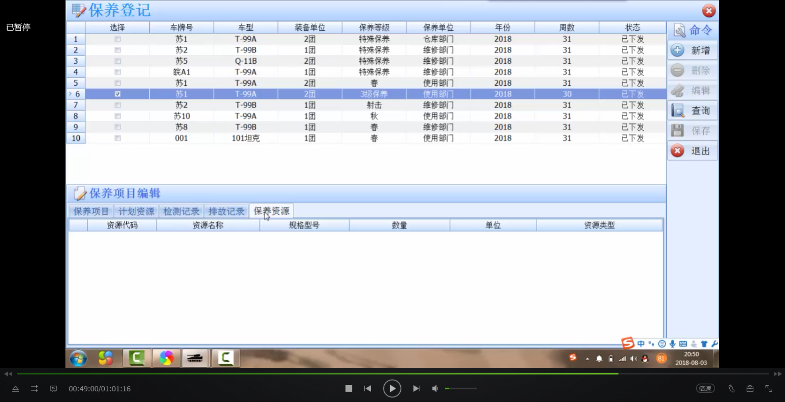
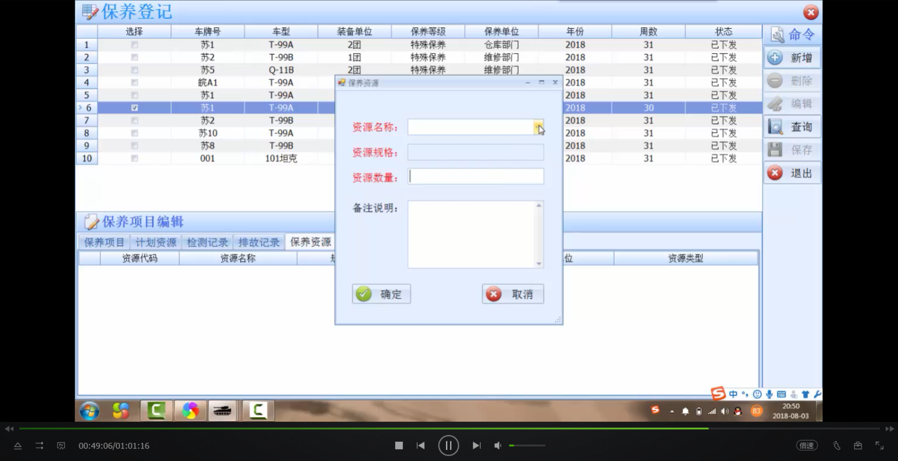
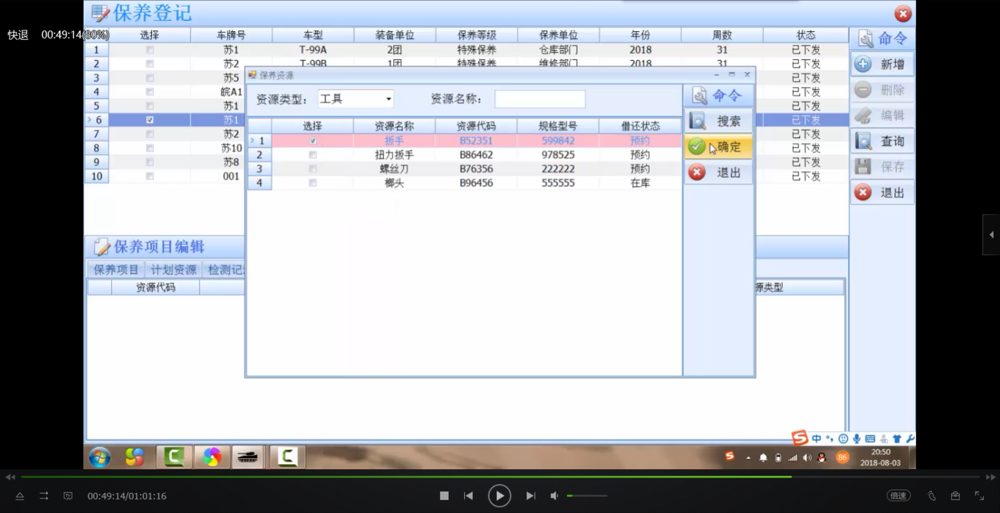

## 工段记录
-  功能逻辑修改
 - 页面修改 
1. 预览该工段的工艺卡片，即同一车的所有工段记录(查询) + 开工完工
    
2. 编辑工段记录，可上传已有视频或在线录制视频，可上传照片或直接拍照
    
3. 针对每一个工段，录入维修记录信息，如维修项目、维修级别、维修操作者、维修地点、维修用时、维修人数等（**可新增删除**）难点实在**检验结果**这里，自填表头有点难
    
4. 针对每一个工段，登记其检测记录，录入检验项目、检验时间、检测地点、检验者、累计里程、累计摩托小时，检验结果等信息；设置实时拍照上传，并可在线查看（**可新增删除**）
    
5. 针对每一个工段，登记其排故记录，如故障现象、排故方法、影响程度、原因、排故者、排故人数、累计里程、累计摩托小时，检验结果等信息；设置实时拍照上传，并可在线查看。（**可新增删除**）
    

## 保养登记
1. 检测记录，针对每一个保养计划，登记其检测记录，录入检验项目、检验时间、检测地点、检验者、累计里程、累计摩托小时，检验结果等信息，可传图片。
        
2. 排故记录，针对每一个保养计划，登记其排故记录，录入故障现象、排故方法、影响程度、原因、排故者、排故人数、累计里程、累计摩托小时，检验结果等信息，可上传图片。
    
3. 新增保养资源
    
    
    
4. 完工
    
