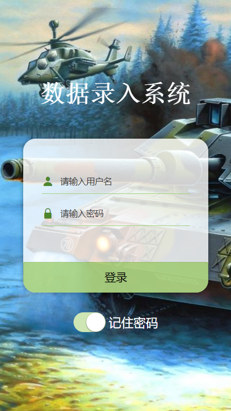
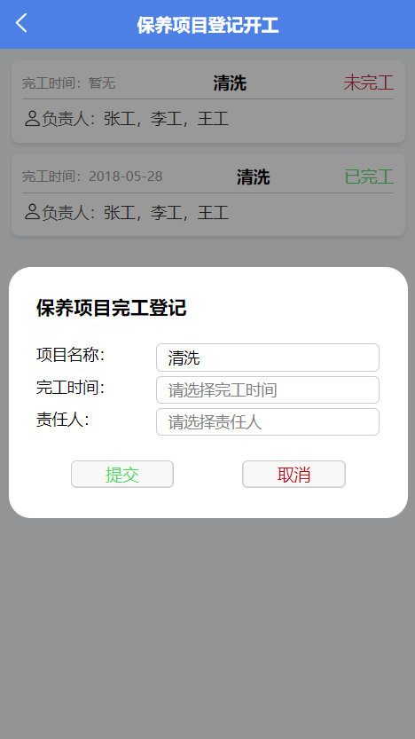
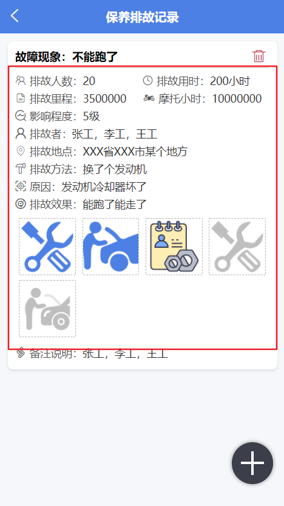
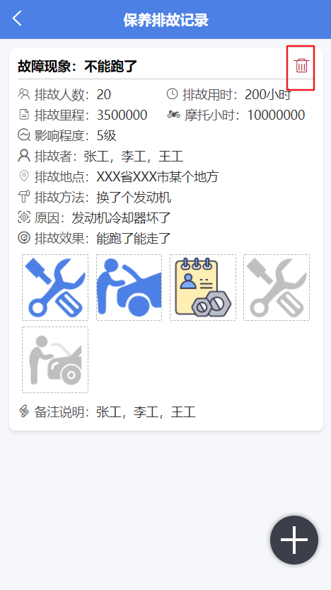
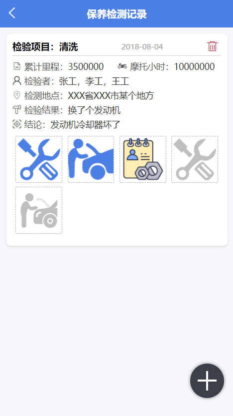

**完成工作**

- 登录页的修改
    -  
- 保养项目的弹窗样式的修改
    - 
- 保养项目的列表样式的修改
    - 
- 保养排排故记录列表的图标添加
    - 
- 保养排排故记录删除的图标按钮的添加和模态弹窗
    -  
- 保养检测记录列表的初步完成，包括图标的添加和删除
    -  

**下一步工作，完成**

- 新增检测记录的表单页面
- 新增计划资源功能的初步页面