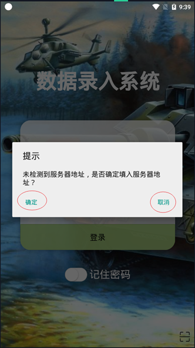
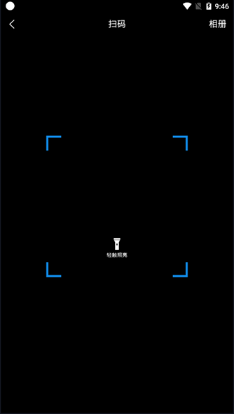
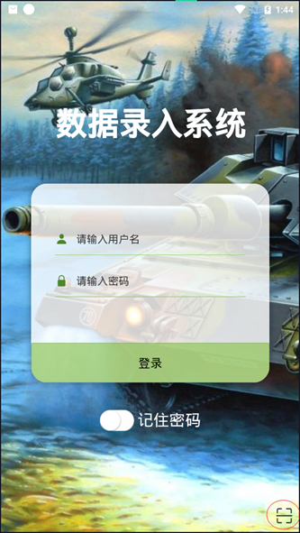
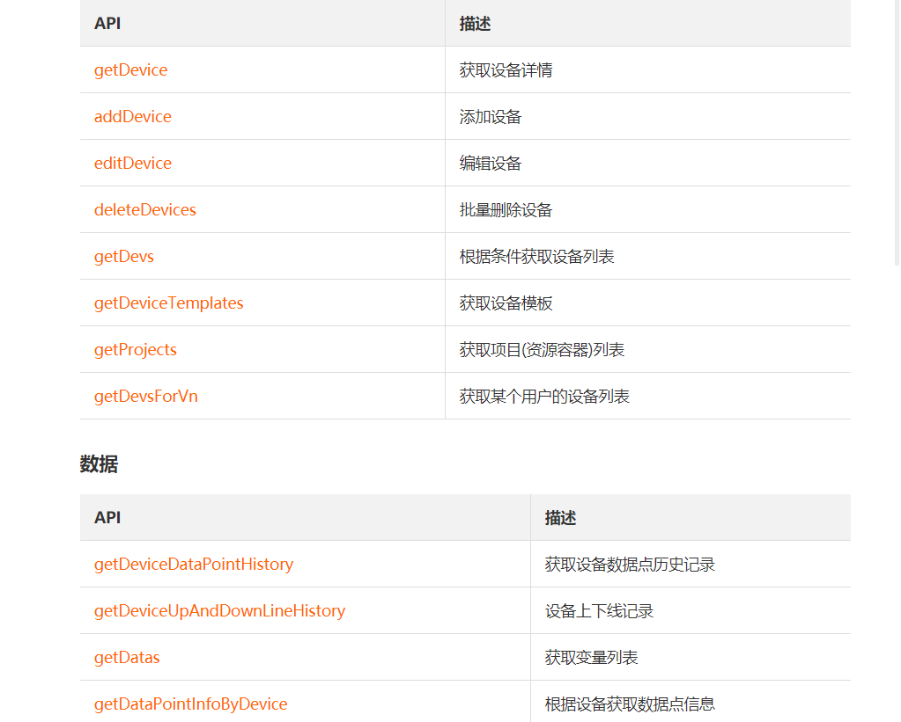
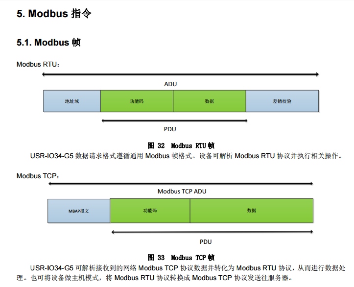

## 项目

- 文档的书写和整理
- 扫码动态添加服务器地址
    - 初次安装，点开app图标会显示弹窗，点击确定则会跳转到扫码页面，如果点击取消，则会退出应用。
    - 扫码也可以点击右上角“相册”从相册中选取二维码图片，进行设置，注意请勿选取错误二维码，否则，app将不能正常工作。扫码成功后，会提示设置成功，大越1秒后会自动重启App，然后正常设置即可
    - 如果服务器的IP地址更换的话，原来的服务器地址会失效，这时候需要点击登录页右下角的扫码图标，然后进行与上面相同操作即可更换服务器地址。
    - 
    - 
    - 

```js
/**
* 扫码设置服务器路径
*/
scan() {
    // 调用扫码 api
    uni.scanCode({
    	success: res => {
	        // 将服务器路径存入本地存储
            uni.setStorageSync('serviceUrl', res.result)
		    this.$tool.toast('设置成功！重启应用中……')
            // 一秒后重启应用，防止太快重启出现问题
		    setTimeout(() => {
        	    uni.hideLoading()
        	    plus.runtime.restart() // 重启 api ，对 IOS 不一定有用
		    }, 1000)
        },
	    fail: () => {
    	    this.$tool.toast('设置失败，请重试！')
        }
    })
},
/**
* 检验本地是否存在服务器路径
* @return {Boolean}
*/
async testServiceUrl() {
    const serviceUrl = uni.getStorageSync('serviceUrl')
    if (!serviceUrl) {
	    const flag = await this.$tool.modal('未检测到服务器地址，是否确定填入服务器地址？')
		if (!flag.confirm) {
    	    plus.runtime.quit()// 退出应用 api ，对 IOS 不一定有用
	        return false
    	}
	    this.scan()
        return false
	}
	return true
},
```

- 保养登记的计划获取和后端做了调整，改为默认获取该年度的
- 完成修改的部分

## 有人云

- 使用说明
- 
- api没有控制接口
- 