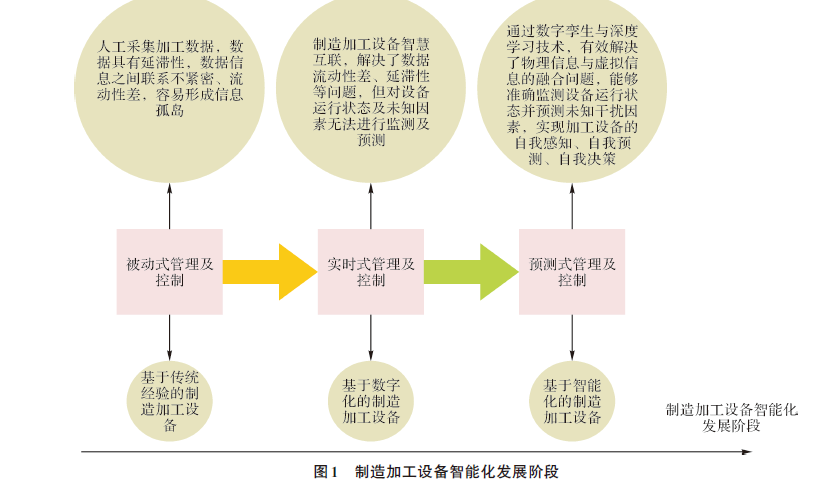

## 总体思路

建立能反映制造加工设备真实状态的数字孪生体，基于**历史加工大数据**，通过数字孪生体对加工过程的行为进行建模及深度学习和训练，并利用训练好的人工神经网络根据采集到的实时数据来**预测制造加工设备下一时刻的状态**，然后根据制造设备的状态建立可加工设备列表，再利用智能算法进行实时主动调度 

为了实现这个目标，需解决以下3个问题：

1. 如何在信息层中建立一个能够实时反映制造加工设备真实状态的数字孪生体；
2. 如何使物理层和信息层的数据保持同步，从而实现物理信息与虚拟信息的完美融合；
3. 如何在物理信息与虚拟信息融合的基础上生成对制造加工设备有价值的信息，使它能实现自我决策。

### 数字孪生的概念和在系统中承担的作用

### 建立基于数字孪生的制造加工设备的状态检测的步骤和要点

### 创新点是什么

