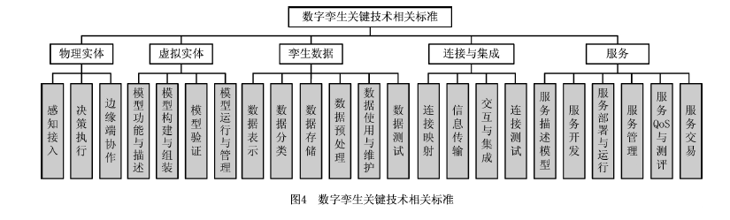
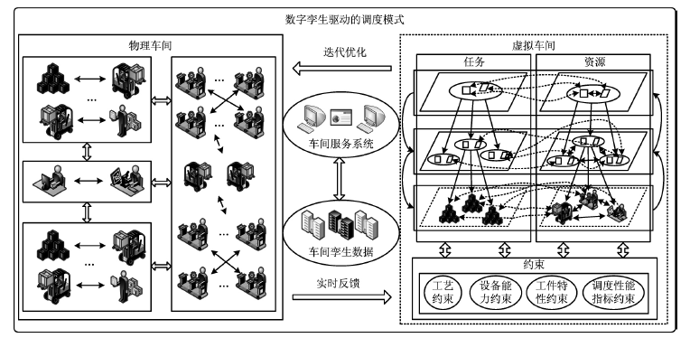
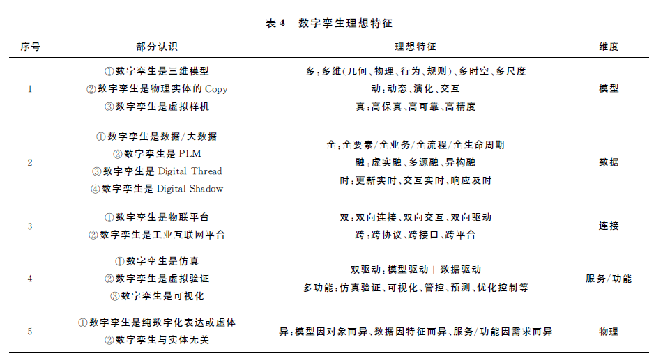
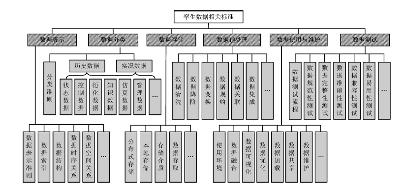

学习总结

1. 研究数字孪生的定义，由于数字孪生还没有明确的定义，首先需要明确，数字孪生到底是什么，怎么去落实，理想的数字孪生特征是什么？
2. 北航的提出来了数字孪生的五维模型，如图
3. 
4. 关于各个部分的关键技术和标准，已经清晰
5. 
6. 同时发现了一个基于数字孪生的调度模式，如图
7. 
8. 这个调度模式主要基于调度要素在物理车间和虚拟车间相互映射，形成虚实共生的协同优化网络。物理车间主动感知生产状态，虚拟车间通过自组织、自学习、自仿真方式进行**调度状态解析、调度方案调整、调度决策评估，快速确定异常范围，敏捷响应，智能决策**

下一步计划

1. 根据数字孪生的五维模型，结合自己的课题，将自己的调度模式提练出来
2. 确定自己整个调度模式后，将自己第一篇文章的工作归类到整个调度模式的某一环中
3. 确立自己需要搭建的模型，然后在选取对应的方法，实现数据孪生的建模
4. 目前有个模糊的方向，因为自己主要建立一个生产趋势预测的模型，对于车间的设备建立剩余寿命模型，加工时间变化趋势等，主要的方法可能采用贝叶斯网络

#### 何为数字孪生？

1. 模型维度　一类观点认为数字孪生是三维模型、是物理实体的ｃｏｐｙ［１０］，或是虚拟样机［１１］。这些认识从模型需求与功能的角度，重点关注了数字孪生的模型维度。综合现有文献分析，**理想的数字孪生模型涉及几何模型、物理模型、行为模型、规则模型等多维多时空多尺度模型**，且期望数字孪生模型具有高保真、高可靠、高精度的特征，进而能**真实刻画物理世界**。此外，有别于传统模型，数字孪生模型还强调虚实之间的交互，能实时更新与动态演化，从而实现对物理世界的动态真实映射。

2. 数据维度　根据文献［１２］，Ｇｒｉｅｖｅｓ教授曾在美国密歇根大学产品全生命周期管理（ＰＬＭ）课程中提出了与数字孪生相关的概念，因而有一种观点认为数字孪生就是ＰＬＭ。与此类似，还有观点认为数字孪生是数据／大数据，是Ｄｉｇｉｔａｌ　Ｓｈａｄｏｗ，或是Ｄｉｇｉｔａｌ　Ｔｈｒｅａｄ。这些认识侧重了数字孪生在产品全生命周期数据管理、数据分析与挖掘、数据集成与融合等方面的价值。数据是数字孪生的核心驱动力，数字孪生数据不仅包括贯穿产品全生命周期的全要素／全流程／全业务的相关数据［２］，还强**调数据的融合，如信息物理虚实融合、多源异构融合等**。此外，数字孪生在数据维度还应具备实时动态更新、实时交互、及时响应等特征。

3. 连接维度　一类观点认为数字孪生是**物联网平台或工业互联网平台**，这些观点侧重从**物理世界到虚拟世界的感知接入、可靠传输、智能服务**。从满足信息物理全面连接映射与实时交互的角度和需求出发，理想的数字孪生不仅要支持跨接口、跨协议、跨平台的互联互通，还强调数字孪生不同维度（物理实体、虚拟实体、孪生数据、服务／应用）间的双向连接、双向交互、双向驱动，且强调实时性，从而形成信息物理闭环系统。

4. 服务／功能维度　一类观点认为数字孪生是仿真［１３］，**是虚拟验证，或是可视化**，这类认识主要是从功能需求的角度，对数字孪生可支持的部分功能／服务进行了解读。目前，数字孪生已在不同行业不同领域得到应用，基于模型和数据双驱动，数字孪生不仅在仿真、虚拟验证和可视化等方面体现其应用价值，还可针对不同的对象和需求，在产品设计［１４－１５］、运行监测［１６－１７］、能耗优化［１８］、智能管控［１９］、故障预测与诊断［２０－２１］、设备健康管理［２２－２３］、循环与再利用［２４］等方面提供相应的功能与服务。由此可见，数字孪生的服务／功能呈现多元化

5. 物理维度　一类观点认为数字孪生仅是物理实体的数字化表达或虚体，其概念范畴不包括物理实体。实践与应用表明，物理实体对象是数字孪生的重要组成部分，数字孪生的模型、数据、功能／服务与物理实体对象是密不可分的。数字孪生模型因物理实体对象而异、数据因物理实体特征而异、功能／服务因物理实体需求而异。此外，信息物理交互是数字孪生区别于其他概念的重要特征之一，若数字孪生概念范畴不包括物理实体，则交互缺乏对象。

 

#### 数字孪生五维模型：物理实体、虚拟实体、连接、孪生数据和服务

1.  物理实体　是数字孪生五维模型的构成基础。由于物理实体实时状态感知与多物理尺度特征向虚拟层面的映射（**信息上传**）、物理实体接收并执行来自虚拟层面的反向控制指令（**控制反馈**）缺乏标准指导，不同开发人员**不清楚物理实体需要感知哪些状态、映射哪些属性特征、反向控制哪些行为，导致物理实体接口形式不统一、技术层级不明确、功能边界不清晰**。
2. 虚拟实体　是物理实体在数字空间的真实、客观、完整的映射，是孪生数据的载体。由于其描述方式、建模方法、组合规则、运行机制、验证策略等缺乏标准指导，导致不同人员开发的虚拟实体描述层级一致性差、格式兼容性低、组合机制适配性弱，因而可用性低、难以集成。
3. 孪生数据　是数字孪生的核心驱动力，为虚拟实体与物理实体融合提供准确全面的信息源。由于孪生数据的表示、分类、预处理、存储、使用、测试等缺乏标准指导，导致数据分类不统一、数据格式不兼容，因而通用性差、互操作困难、数据融合困难。
4. 连接　实现物理实体、虚拟实体、孪生数据和服务之间的互联互通。由于其连接方式、信息传输、交互机制、测试方法等缺乏标准指导，导致输入输出难以兼容、交互机制难以匹配、虚拟运行难以协同。
5. 服务　是数字孪生功能高效行使的媒介。由于其描述方法、开发要求、运行管理、测试评价等缺乏标准指导，导致不同人员开发的服务兼容性差、互操作性低。

#### 数字孪生关键技术标准

#### 孪生数据标准

#### 　基于数字孪生的车间生产调度优化

生产调度是生产车间决策优化、过程管控、性能提升的神经中枢，是生产车间有序平稳、均衡经济和敏捷高效的运营支柱。数字孪生驱动的调度模式是在数字孪生系统的支撑下，通过全要素、全数据、全模型、全空间的虚实映射和交互融合，形成虚实响应、虚实交互、以虚控实、迭代优化的新型调度机制，实现“工件—机器—约束—目标”调度要素的协同匹配与持续优化。在数字孪生驱动的调度模式下，**调度要素**在物理车间和虚拟车间相互映射，形成虚实共生的协同优化网络。物理车间主动感知生产状态，虚拟车间通过自组织、自学习、自仿真方式进行**调度状态解析、调度方案调整、调度决策评估，快速确定异常范围，敏捷响应，智能决策**，具有更好的变化适应能力、扰动响应能力和异常解决能力.

数字孪生驱动的调度模式使调度优化与过程管控呈现出新的转变，即**驱动方式由能量驱动向数据驱动转变**，调度要素由实体互联向虚实映射转变，响应方式由被动响应向主动应对转变，过程控制由粗放控制向精确控制转变，管理形式由层级结构向扁平化结构转变。

围绕数字孪生驱动的调度技术研究，亟需在以下难点问题取得突破：

- 在虚实交互机理方面，系统研究虚实交互行为，揭示自组织、自学习、自优化机制下虚实交互机理，从而实现调度要素的优化匹配和高效运作；
- 在动态迭代优化方面：研究新的调度优化方法，能够进行“任务—资源”自主决策、动态迭代和连续优化等。

