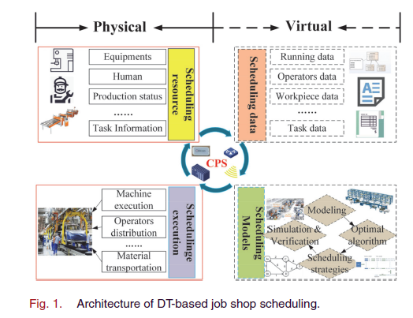
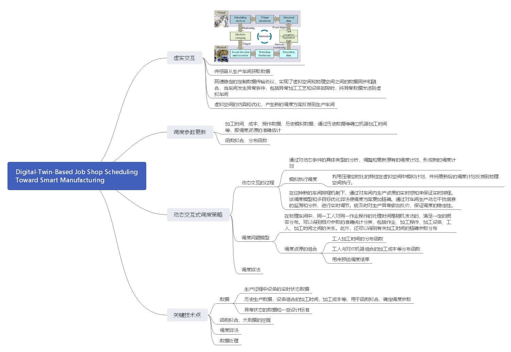
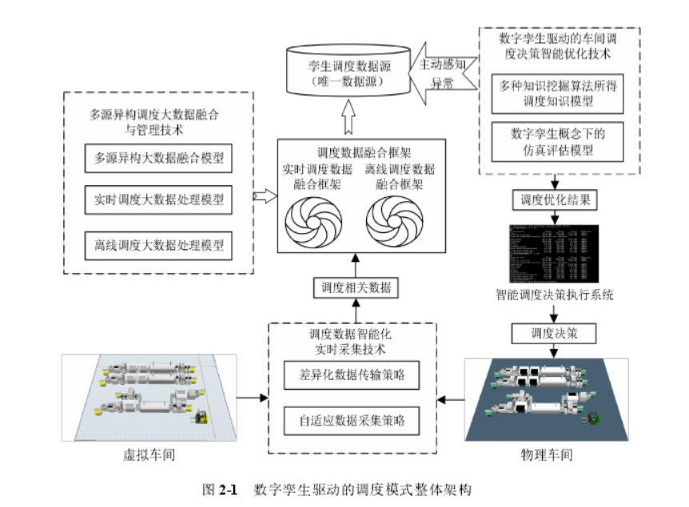
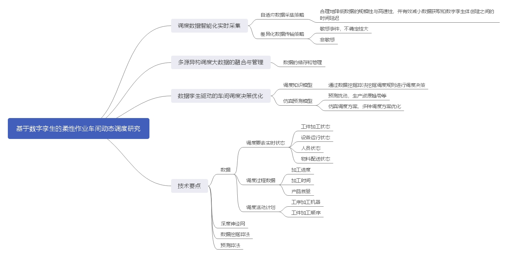
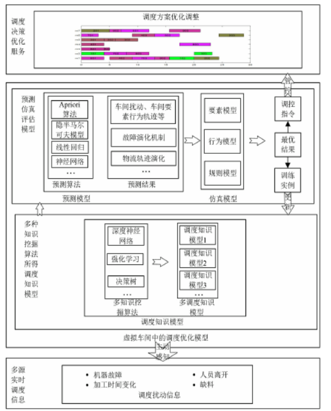
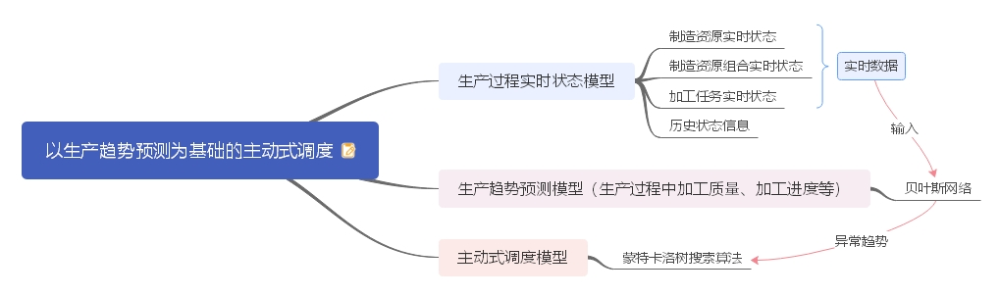
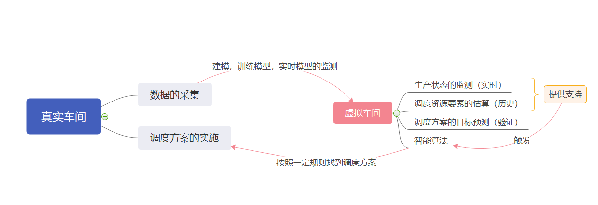
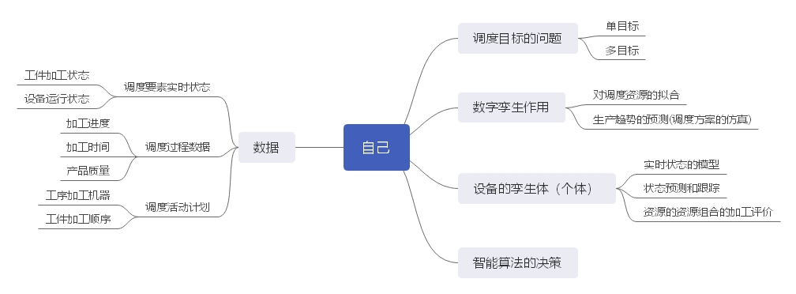

## 几篇文章提到的数字孪生的调度模式

### Digital-Twin-Based Job Shop Scheduling Toward Smart Manufacturing

### 基于数字孪生的柔性作业车间动态调度研究

### 以生产趋势预测为基础的主动式调度

### 小结

1. 虚实交互，着重于数字孪生数据对于调度资源的预测和组合
2. 着重于数据的挖掘，数据提取有用的调度信息
3. 实时调度，缺乏指导，数据的作用

## 自己的模式

建立能反映制造加工设备真实状态的数字孪生体，基于**历史加工大数据**，通过数字孪生体对加工过程的行为进行建模及深度学习和训练，并利用训练好的人工神经网络根据采集到的实时数据来**预测制造加工设备下一时刻的状态**，然后根据制造设备的状态建立可加工设备列表，再利用智能算法进行实时主动调度!

