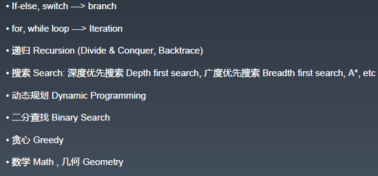
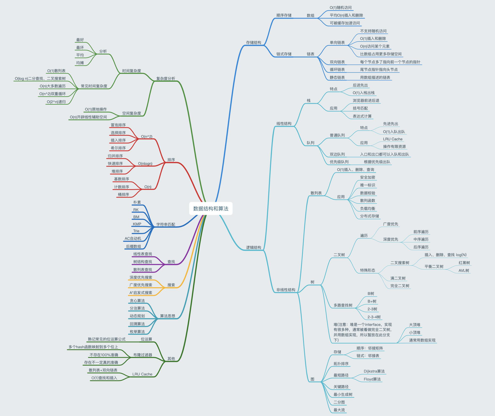

## 精通一个领域

-  Chunk it up 切碎知识点
-  Deliberate Practicing 刻意练习
-  Feedback 反馈

## 数据结构

- 一维：
  - 基础：数组，链表
  - 高级：栈，队列，双端队列，集合，映射等等

- 二维：
  - 基础：树图
  - 高级：二叉搜索树，堆，并查集，字典树等

- 特殊：
  - 位运算
  - 布隆过滤器
  - LRU Cache

## 算法

## 切题四件套

- 分析题目
- 尽可能想到多的解题方法
  - 比较他们的时间和算法复杂度
  - 加强

- 写代码
- 测试用例测试

## 刷题步骤

**第一遍**

- 5分钟读题 + 思考
- 直接看解法，多解法比较优劣
- 背诵默写好的解法

**第二遍**

- 马上自己写-》提交leetcode
- 多种解法比较-》优化

**第三遍**

- 过了一天后，重复做题
- 不同的解法熟练程度-》专项练习

**第四遍**

- 过了一周反复回来联系相同的题目

**第五遍**

- 面试前一周恢复性训练

