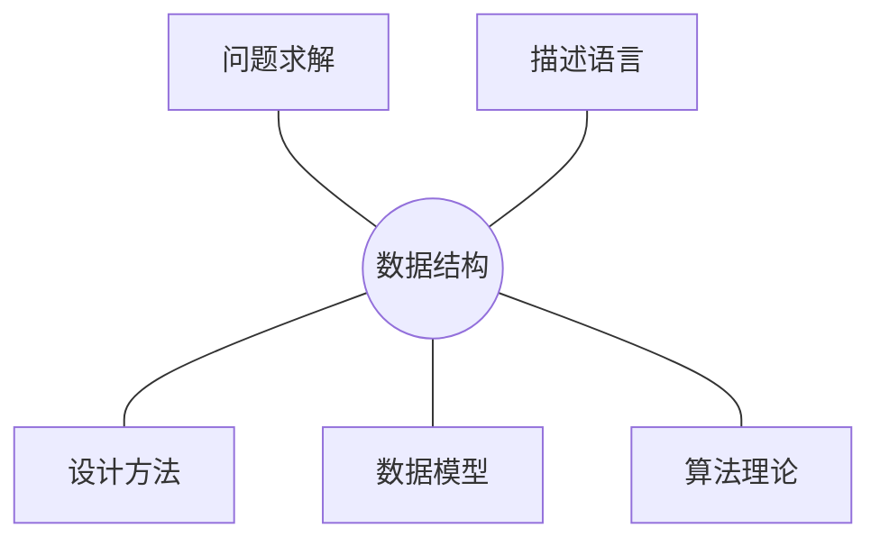
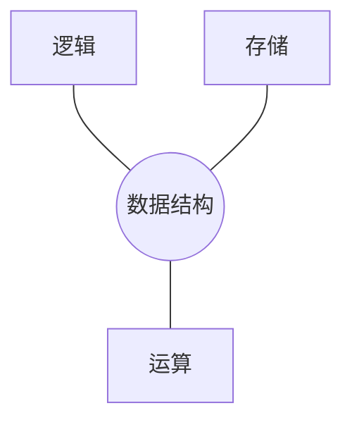

# 问题求解

 + 编写计算机程序的目的？
    + 解决实际的应用问题
    
1. 问题抽象
    + 分析和抽象任务需求，建立问题模型
2. 数据抽象
    + 确定恰当的数据结构表示数学模型
3. 算法抽象
    + 在数据模型的基础上设计合适的算法
4. 数据结构＋算法，进行程序设计
    + 模拟和解决实际问题
    

# 数据结构及抽象数据类型
+ **结构: 实体 + 关系**
+ 数据结构:
    + 按照`逻辑关系`组织起来的一批数据,
    + 按一定的`存储方法`把它存储在计算机中
    + 在这些数据上定义了一个`运算`的集合

## 数据结构的逻辑组织

+ 线性结构
    + 线性表（表，栈，队列，串等）
+ 非线性结构
    + 树（二叉树，Huffman树， 二叉检索树等）
    + 图（有向图，无向图等）
    + 图  树 二叉树  线性表
## 数据的存储结构
**逻辑结构到物理存储空间的`映射`**

+ 计算机主存储器（内存）（内存其实被看作从低地址到高地址的一个编码的线性结构）
    + `非负整数`地址编码，`相邻单元`的集合
        + 基本单位是字节
        + 访问不同地址所需时间基本相同（即随机访问）
        

## 抽象数据类型
+ **简称ADT (Abstract Data Type)**
    + 定义了一组运算的数学模型
    + 与物理存储结构无关
    + 使软件系统建立在数据之上(面向对象)
+ 模块化的思想的发展
    + 隐藏运算实现的细节和内部数据结构
    + 软件复用
+ 抽象数据结构二元组 <数据对象D，数据操作P>
    + 先定义逻辑结构，再定义运算
    - 逻辑结构：数据对象及其关系
    - 运算：数据操作