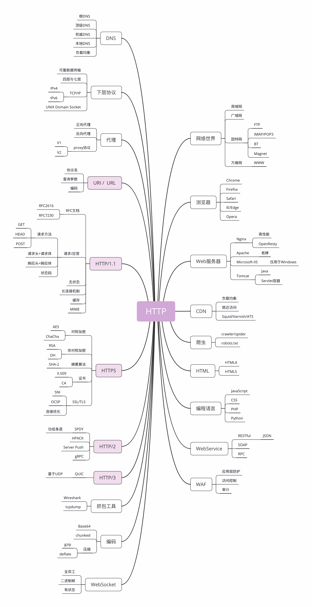

## HTTP 是什么

- HTTP 就是超文本传输协议，也就是 HyperText Transfer Protocol。

“超文本传输协议”，它可以拆成三个部分，分别是：**“超文本”“传输”和“协议”**。

- **HTTP 是一个用在计算机世界里的协议。它使用计算机能够理解的语言确立了一种计算机之间交流通信的规范，以及相关的各种控制和错误处理方式。**
- HTTP 是一个“**传输协议**”，所谓的“传输”（Transfer）其实很好理解，就是把一堆东西从 A 点搬到 B 点，或者从 B 点搬到 A 点，即“A<===>B”。别小看了这个简单的动作，它也至少包含了两项重要的信息。**HTTP 是一个在计算机世界里专门用来在两点之间传输数据的约定和规范。**
    - HTTP 协议是一个**“双向协议”**。也就是说，有两个最基本的参与者 A 和 B，从 A 开始到 B 结束，数据在 A 和 B 之间双向而不是单向流动。通常我们把先发起传输动作的 A 叫做**请求方**，把后接到传输的 B 叫做**应答方或者响应方**。
    - 数据虽然是在 A 和 B 之间传输，但并没有限制只有 A 和 B 这两个角色，允许中间有**“中转”或者“接力”**。
- **HTTP 是一个在计算机世界里专门在两点之间传输文字、图片、音频、视频等超文本数据的约定和规范**
    - 所谓“超文本”，就是“超越了普通文本的文本”，它是文字、图片、音频和视频等的混合体，最关键的是含有“超链接”，能够从一个“超文本”跳跃到另一个“超文本”，**形成复杂的非线性、网状的结构关系**。

## HTTP不是什么

- HTTP 不是互联网。
- 不存在“单独的实体”
- HTTP 不是编程语言。
- HTTP 不是 HTML
- HTTP 不是一个孤立的协议。
    - 在互联网世界里，HTTP 通常跑在 TCP/IP 协议栈之上，依靠 IP 协议实现寻址和路由、TCP 协议实现可靠数据传输、DNS 协议实现域名查找、SSL/TLS 协议实现安全通信。此外，还有一些协议依赖于 HTTP，例如 WebSocket、HTTPDNS 等。这些协议相互交织，构成了一个协议网，而 HTTP 则处于中心地位。

## 小结

1. HTTP 是一个用在计算机世界里的协议，它确立了一种计算机之间交流通信的规范，以及相关的各种控制和错误处理方式。
2. HTTP 专门用来在两点之间传输数据，不能用于广播、寻址或路由。
3. HTTP 传输的是文字、图片、音频、视频等超文本数据。
4. HTTP 是构建互联网的重要基础技术，它没有实体，依赖许多其他的技术来实现，但同时许多技术也都依赖于它。

把这些综合起来，使用递归缩写方式（模仿 PHP），我们可以把 HTTP 定义为“**与 HTTP 协议相关的所有应用层技术的总和**”。

