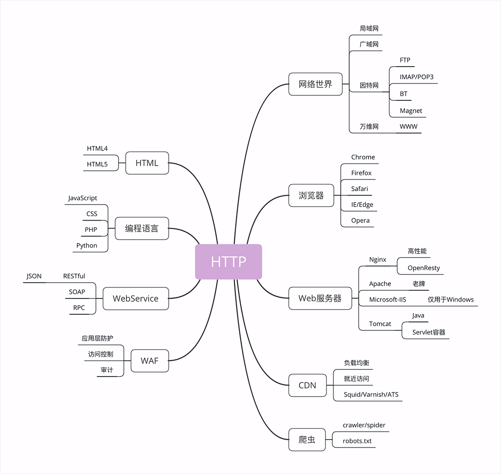

``

## 网络世界

**互联网世界更像是由数不清的大小岛屿组成的“千岛之国”。**

互联网的正式名称是 Internet，里面存储着无穷无尽的信息资源，我们通常所说的“上网”实际上访问的只是互联网的一个子集“万维网”（World Wide Web），它基于 HTTP 协议，传输 HTML 等超文本资源，能力也就被限制在 HTTP 协议之内。互联网上还有许多万维网之外的资源，例如常用的电子邮件、BT 和 Magnet 点对点下载、FTP 文件下载、SSH 安全登录、各种即时通信服务等等，它们需要用各自的专有协议来访问。不过由于 HTTP 协议非常灵活、易于扩展，而且“超文本”的表述能力很强，所以很多其他原本不属于 HTTP 的资源也可以“包装”成 HTTP 来访问，这就是我们为什么能够总看到各种“网页应用”——例如“微信网页版”“邮箱网页版”——的原因。综合起来看，现在的互联网 90% 以上的部分都被万维网，也就是 HTTP 所覆盖，所以把互联网约等于万维网或 HTTP 应该也不算大错。

## 浏览器

浏览器本质上是一个 HTTP 协议中的**请求方**，使用 HTTP 协议获取网络上的各种资源。

当然，为了让我们更好地检索查看网页，它还集成了很多额外的功能。例如，HTML 排版引擎用来展示页面，JavaScript 引擎用来实现动态化效果，甚至还有开发者工具用来调试网页，以及五花八门的各种插件和扩展。

**在 HTTP 协议里，浏览器的角色被称为“User Agent”即“用户代理”**，意思是作为访问者的“代理”来发起 HTTP 请求。不过在不引起混淆的情况下，我们通常都简单地称之为“客户端”。

## web服务器

**协议另一端的应答方**

当我们谈到“Web 服务器”时有两个层面的含义：硬件和软件。

硬件含义就是物理形式或“云”形式的机器，在大多数情况下它可能不是一台服务器，而是利用反向代理、负载均衡等技术组成的庞大集群。但从外界看来，它仍然表现为一台机器，但这个形象是“虚拟的”。

软件含义的 Web 服务器可能我们更为关心，它就是提供 Web 服务的应用程序，通常会运行在硬件含义的服务器上。它利用强大的硬件能力响应海量的客户端 HTTP 请求，处理磁盘上的网页、图片等静态文件，或者把请求转发给后面的 Tomcat、Node.js 等业务应用，返回动态的信息。

## CDN

**CDN，全称是“Content Delivery Network”，翻译过来就是“内容分发网络”。它应用了 HTTP 协议里的缓存和代理技术，代替源站响应客户端的请求**

CDN 有什么好处呢？简单来说，它可以缓存源站的数据，让浏览器的请求不用“千里迢迢”地到达源站服务器，直接在“半路”就可以获取响应。如果 CDN 的调度算法很优秀，更可以找到离用户最近的节点，**大幅度缩短响应时间**。

CDN 也是现在互联网中的一项重要基础设施，除了基本的**网络加速外，还提供负载均衡、安全防护、边缘计算、跨运营商网**络等功能，能够成倍地“放大”源站服务器的服务能力，很多云服务商都把 CDN 作为产品的一部分，我也会在后面用一讲的篇幅来专门讲解 CDN。

## 爬虫

前面说到过浏览器，它是一种用户代理，代替我们访问互联网。但 HTTP 协议并没有规定用户代理后面必须是“真正的人类”，它也完全可以是“机器人”，这些“机器人”的正式名称就叫做“爬虫”（Crawler），实际上是一种可以自动访问 Web 资源的应用程序

## HTML/WebService/WAF

HTML 是 HTTP 协议传输的主要内容之一，它描述了超文本页面，用各种“标签”定义文字、图片等资源和排版布局，最终由浏览器“渲染”出可视化页面。

Web  Service 是一种由 W3C 定义的应用服务开发规范，使用 client-server 主从架构，通常使用 WSDL 定义服务接口，使用 HTTP 协议传输 XML 或 SOAP 消息，也就是说，**它是一个基于 Web（HTTP）的服务架构技术，既可以运行在内网，也可以在适当保护后运行在外网**。

**WAF 是近几年比较“火”的一个词，意思是“网络应用防火墙”。与硬件“防火墙”类似，它是应用层面的“防火墙”，专门检测 HTTP 流量，是防护 Web 应用的安全技术**

## 小结

1. 互联网上绝大部分资源都使用 HTTP 协议传输；
2. 浏览器是 HTTP 协议里的请求方，即 User Agent；
3. 服务器是 HTTP 协议里的应答方，常用的有 Apache 和 Nginx；
4. CDN 位于浏览器和服务器之间，主要起到缓存加速的作用；
5. 爬虫是另一类 User Agent，是自动访问网络资源的程序。

**你觉得 CDN 在对待浏览器和爬虫时会有差异吗？为什么？**

CDN 应当是不区分的，因为爬虫本身也是对 Web 资源的访问，且对于爬虫识别并不是 100% 准确的，因此 CDN 只会去计算实际使用了多少资源而不管其中多少来自爬虫；

**你怎么理解 WebService 与 Web Server 这两个非常相似的词？**

个人理解，Web Service 是网络服务实体，而 Web Server 是网络服务器，后者的存在是为了承载前者。
