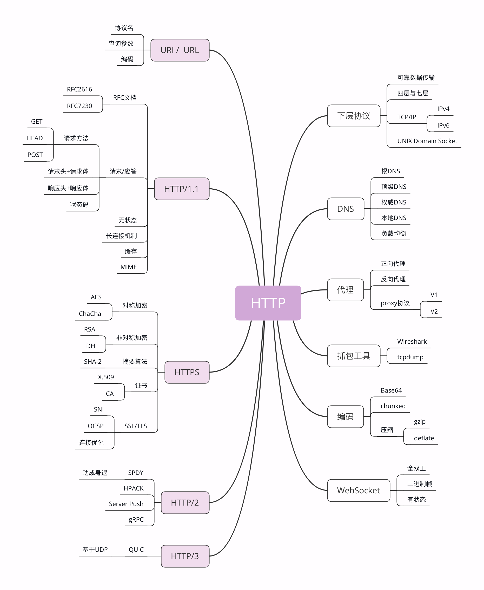

## TCP/IP

TCP/IP 协议实际上是一系列网络通信协议的统称，其中最核心的两个协议是 **TCP 和 IP**，其他的还有 UDP、ICMP、ARP 等等，共同构成了一个复杂但有层次的协议栈。

这个协议栈有四层，最上层是“应用层”，最下层是“链接层”，TCP 和 IP 则在中间：**TCP 属于“传输层”，IP 属于“网际层”**。协议的层级关系模型非常重要，我会在下一讲中再专门讲解，这里先暂时放一放。

**IP 协议是“Internet Protocol”的缩写，主要目的是解决寻址和路由问题，以及如何在两点间传送数据包**。IP 协议使用“**IP 地址**”的概念来定位互联网上的每一台计算机。

**TCP 协议是“Transmission Control Protocol”的缩写，意思是“传输控制协议”，它位于 IP 协议之上，基于 IP 协议提供可靠的、字节流形式的通信，是 HTTP 协议得以实现的基础**

- **可靠”是指保证数据不丢失，“字节流”是指保证数据完整**，所以在 TCP 协议的两端可以如同操作文件一样访问传输的数据，就像是读写在一个密闭的管道里“流动”的字节。

HTTP 是一个"传输协议"，但它不关心寻址、路由、数据完整性等传输细节，而要求这些工作都由下层来处理。因为互联网上最流行的是 TCP/IP 协议，而它刚好满足 HTTP 的要求，所以**互联网上的 HTTP 协议就运行在了 TCP/IP 上**，HTTP 也就可以更准确地称为“HTTP over TCP/IP”。

## DNS

**域名系统**（Domain Name System）出现了，用有意义的名字来作为 IP 地址的等价替代。

**把域名做一个转换，“映射”到它的真实 IP，这就是所谓的“域名解析”**

## URI/URL

**URI（Uniform Resource Identifier）**，中文名称是 统一资源标识符，使用它就能够唯一地标记互联网上资源。
 
URI 另一个更常用的表现形式是 **URL（Uniform Resource Locator）， 统一资源定位符**，也就是我们俗称的“网址”，它实际上是 URI 的一个子集，不过因为这两者几乎是相同的，差异不大，所以通常不会做严格的区分。

```
http://nginx.org/en/download.html
```

你可以看到，URI 主要有三个基本的部分构成：

1. 协议名：即访问该资源应当使用的协议，在这里是“http”；
2. 主机名：即互联网上主机的标记，可以是域名或 IP 地址，在这里是“nginx.org”；
3. 路径：即资源在主机上的位置，使用“/”分隔多级目录，在这里是“/en/download.html”。

## HTTPS

HTTPS 的全称是“HTTP over SSL/TLS”，也就是**运行在 SSL/TLS 协议上的 HTTP**。

注意它的名字，这里是 SSL/TLS，而不是 TCP/IP，它是一个负责加密通信的安全协议，建立在 TCP/IP 之上，所以也是个可靠的传输协议，可以被用作 HTTP 的下层。

因为 HTTPS 相当于“**HTTP+SSL/TLS+TCP/IP**”，其中的“HTTP”和“TCP/IP”我们都已经明白了，只要再了解一下 SSL/TLS，HTTPS 也就能够轻松掌握。

SSL 的全称是“Secure Socket Layer”，由网景公司发明，当发展到 3.0 时被标准化，改名为 TLS，即“Transport Layer Security”，但由于历史的原因还是有很多人称之为 SSL/TLS，或者直接简称为 SSL。

SSL 使用了许多密码学最先进的研究成果，综合了对称加密、非对称加密、摘要算法、数字签名、数字证书等技术，能够在不安全的环境中为通信的双方创建出一个秘密的、安全的传输通道，为 HTTP 套上一副坚固的盔甲。

## 代理

**代理（Proxy）是 HTTP 协议中请求方和应答方中间的一个环节，作为“中转站”，既可以转发客户端的请求，也可以转发服务器的应答**

代理有很多的种类，常见的有：

1. 匿名代理：完全“隐匿”了被代理的机器，外界看到的只是代理服务器；
2. 透明代理：顾名思义，它在传输过程中是“透明开放”的，外界既知道代理，也知道客户端；
3. 正向代理：靠近客户端，代表客户端向服务器发送请求；
4. 反向代理：靠近服务器端，代表服务器响应客户端的请求；

上一讲提到的 CDN，实际上就是一种代理，它代替源站服务器响应客户端的请求，通常扮演着**透明代理和反向代理**的角色。

由于代理在传输过程中插入了一个“中间层”，所以可以在这个环节做很多有意思的事情，比如：

1. 负载均衡：把访问请求均匀分散到多台机器，实现访问集群化；
2. 内容缓存：暂存上下行的数据，减轻后端的压力；
3. 安全防护：隐匿 IP, 使用 WAF 等工具抵御网络攻击，保护被代理的机器；
4. 数据处理：提供压缩、加密等额外的功能。

## 小结

1. TCP/IP 是网络世界最常用的协议，HTTP 通常运行在 TCP/IP 提供的可靠传输基础上；
2. DNS 域名是 IP 地址的等价替代，需要用域名解析实现到 IP 地址的映射；
3. URI 是用来标记互联网上资源的一个名字，由“协议名 + 主机名 + 路径”构成，俗称 URL；
4. HTTPS 相当于“HTTP+SSL/TLS+TCP/IP”，为 HTTP 套了一个安全的外壳；
5. 代理是 HTTP 传输过程中的“中转站”，可以实现缓存加速、负载均衡等功能。