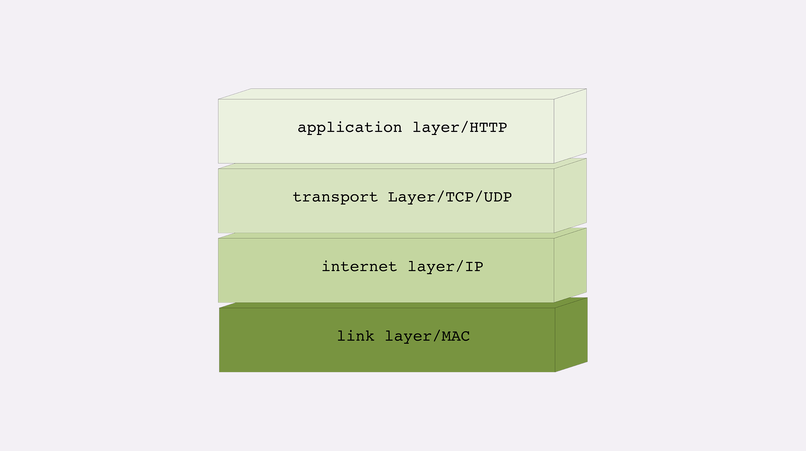
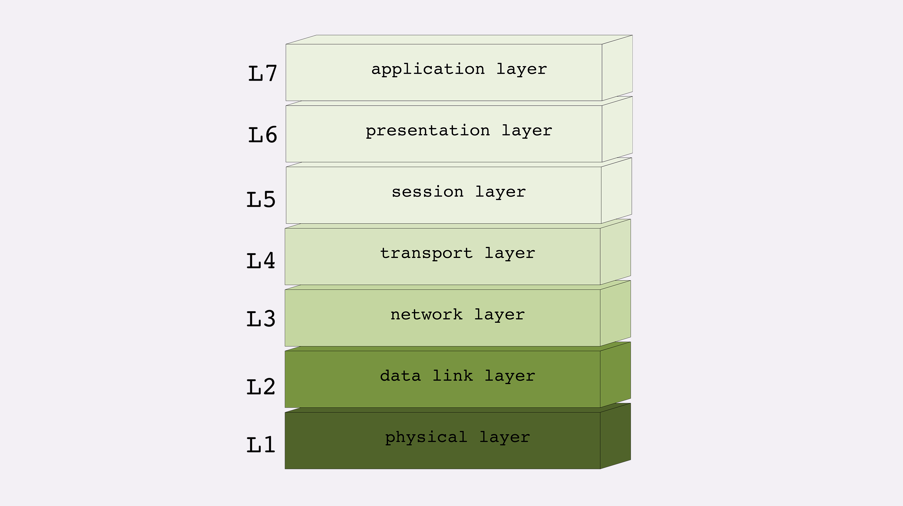
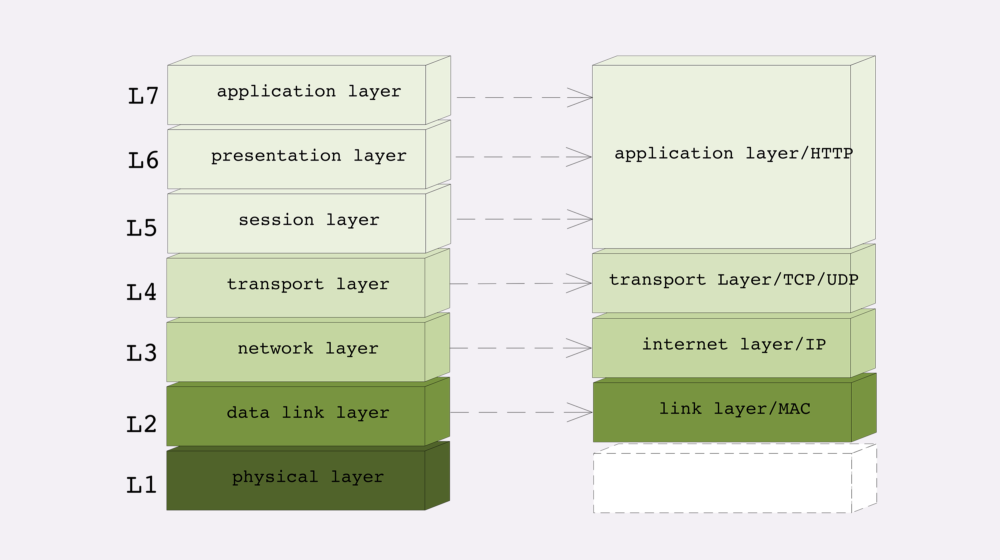

## TCP/IP 网络分层模型

它的层次顺序是“**从下往上**”数的，所以第一层就是最下面的一层。

第一层叫“**链接层**”（link layer），负责在以太网、WiFi 这样的底层网络上发送原始数据包，工作在网卡这个层次，使用 MAC 地址来标记网络上的设备，所以有时候也叫 MAC 层。

第二层叫“**网际层**”或者“**网络互连层**”（internet layer），IP 协议就处在这一层。因为 IP 协议定义了“IP 地址”的概念，所以就可以在“链接层”的基础上，用 IP 地址取代 MAC 地址，把许许多多的局域网、广域网连接成一个虚拟的巨大网络，在这个网络里找设备时只要把 IP 地址再“翻译”成 MAC 地址就可以了。

第三层叫“**传输层**”（transport layer），这个层次协议的职责是保证数据在 IP 地址标记的两点之间“可靠”地传输，是 TCP 协议工作的层次，另外还有它的一个“小伙伴”**UDP**。

**TCP 是一个有状态的协议，需要先与对方建立连接然后才能发送数据，而且保证数据不丢失不重复。而 UDP 则比较简单，它无状态，不用事先建立连接就可以任意发送数据，但不保证数据一定会发到对方。两个协议的另一个重要区别在于数据的形式。TCP 的数据是连续的“字节流”，有先后顺序，而 UDP 则是分散的小数据包，是顺序发，乱序收。**关于 TCP 和 UDP 可以展开讨论的话题还有很多，比如最经典的“三次握手”和“四次挥手”，一时半会很难说完，好在与 HTTP 的关系不是太大，以后遇到了再详细讲解。

第四层叫“**应用层**”（application layer），由于下面的三层把基础打得非常好，所以在这一层就“百花齐放”了，有各种面向具体应用的协议。例如 **Telnet、SSH、FTP、SMTP 等等，当然还有我们的 HTTP**。

MAC 层的传输单位是**帧**（frame），IP 层的传输单位是**包**（packet），TCP 层的传输单位是**段**（segment），HTTP 的传输单位则是**消息或报**文（message）。但这些名词并没有什么本质的区分，可以统称为**数据包**。

## OSI 网络分层模型

**OSI，全称是“开放式系统互联通信参考模型”（Open System Interconnection Reference Model）**

1. 第一层：物理层，网络的物理形式，例如电缆、光纤、网卡、集线器等等；
2. 第二层：数据链路层，它基本相当于 TCP/IP 的链接层；
3. 第三层：网络层，相当于 TCP/IP 里的网际层；
4. 第四层：传输层，相当于 TCP/IP 里的传输层；
5. 第五层：会话层，维护网络中的连接状态，即保持会话和同步；
6. 第六层：表示层，把数据转换为合适、可理解的语法和语义；
7. 第七层：应用层，面向具体的应用传输数据

## 两个分层模型的映射关系

1. 第一层：物理层，TCP/IP 里无对应；
2. 第二层：数据链路层，对应 TCP/IP 的链接层；
3. 第三层：网络层，对应 TCP/IP 的网际层；
4. 第四层：传输层，对应 TCP/IP 的传输层；
5. 第五、六、七层：统一对应到 TCP/IP 的应用层

所谓的“四层负载均衡”就是指工作在传输层上，基于 TCP/IP 协议的特性，例如 IP 地址、端口号等实现对后端服务器的负载均衡。

所谓的“七层负载均衡”就是指工作在应用层上，看到的是 HTTP 协议，解析 HTTP 报文里的 URI、主机名、资源类型等数据，再用适当的策略转发给后端服务器。

## TCP/IP 协议栈的工作方式

HTTP 协议的传输过程就是这样通过协议栈逐层向下，每一层都添加本层的专有数据，层层打包，然后通过下层发送出去。

接收数据则是相反的操作，从下往上穿过协议栈，逐层拆包，每层去掉本层的专有头，上层就会拿到自己的数据。但下层的传输过程对于上层是完全“透明”的，上层也不需要关心下层的具体实现细节，所以就 HTTP 层次来看，它不管下层是不是 TCP/IP 协议，看到的只是一个可靠的传输链路，只要把数据加上自己的头，对方就能原样收到。

## 小结

1. TCP/IP 分为四层，核心是二层的 IP 和三层的 TCP，HTTP 在第四层；
2. OSI 分为七层，基本对应 TCP/IP，TCP 在第四层，HTTP 在第七层；
3. OSI 可以映射到 TCP/IP，但这期间一、五、六层消失了；
4. 日常交流的时候我们通常使用 OSI 模型，用四层、七层等术语；
5. HTTP 利用 TCP/IP 协议栈逐层打包再拆包，实现了数据传输，但下面的细节并不可见。

有一个辨别四层和七层比较好的（但不是绝对的）小窍门，“两个凡是”：**凡是由操作系统负责处理的就是四层或四层以下，否则，凡是需要由应用程序（也就是你自己写代码）负责处理的就是七层**。

**你能用自己的话解释一下“二层转发”“三层路由”吗？**
**你认为上一讲中的 DNS 协议位于哪一层呢？**
**你认为 CDN 工作在那一层呢**

1. 二层转发：设备工作在链路层，帧在经过交换机设备时，检查帧的头部信息，拿到目标mac地址，进行本地转发和广播
2. 三层路由：设备工作在ip层，报文经过有路由功能的设备时，设备分析报文中的头部信息，拿到ip地址，根据网段范围，进行本地转发或选择下一个网关
3. dns，网络请求的第一步是域名解析，所以工作在应用层
4. cdn，应用层
