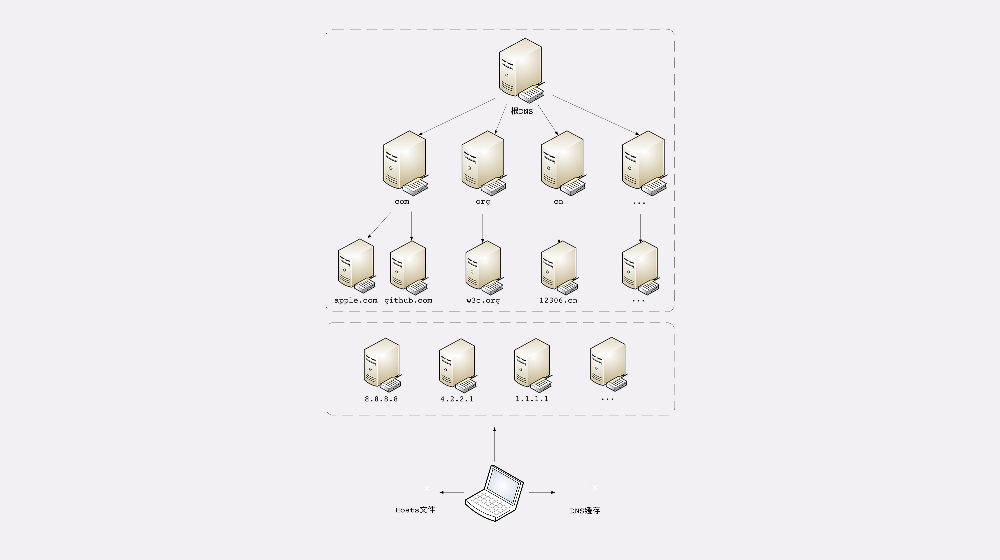

## 域名的形式

域名是一个有层次的结构，是一串用“.”分隔的多个单词，最右边的被称为“顶级域名”，然后是“二级域名”，**层级关系向左依次降低**。

最左边的是主机名，通常用来表明主机的用途，比如“www”表示提供万维网服务、“mail”表示提供邮件服务，不过这也不是绝对的，名字的关键是要让我们容易记忆。看一下极客时间的域名“time.geekbang.org”，这里的“org”就是顶级域名，“geekbang”是二级域名，“time”则是主机名。使用这个域名，DNS 就会把它转换成相应的 IP 地址，你就可以访问极客时间的网站了。

## 域名的解析

DNS 的核心系统是一个三层的树状、分布式服务，基本对应域名的结构：

1. 根域名服务器（Root DNS Server）：管理顶级域名服务器，返回“com”“net”“cn”等顶级域名服务器的 IP 地址；
2. 顶级域名服务器（Top-level DNS Server）：管理各自域名下的权威域名服务器，比如 com 顶级域名服务器可以返回 apple.com 域名服务器的 IP 地址；
3. 权威域名服务器（Authoritative DNS Server）：管理自己域名下主机的 IP 地址，比如 apple.com 权威域名服务器可以返回 www.apple.com 的 IP 地址。

例如，你要访问“www.apple.com”，就要进行下面的三次查询：

1. 访问根域名服务器，它会告诉你“com”顶级域名服务器的地址；
2. 访问“com”顶级域名服务器，它再告诉你“apple.com”域名服务器的地址；
3. 最后访问“apple.com”域名服务器，就得到了“www.apple.com”的地址。

然核心的 DNS 系统遍布全球，服务能力很强也很稳定，但如果全世界的网民都往这个系统里挤，即使不挤瘫痪了，访问速度也会很慢。所以在核心 DNS 系统之外，还有两种手段用来减轻域名解析的压力，并且能够更快地获取结果，基本思路就是“**缓存**”。

首先，许多大公司、网络运行商都会**建立自己的 DNS 服务器，作为用户 DNS 查询的代理，代替用户访问核心 DNS 系统**。这些“野生”服务器被称为“非权威域名服务器”，可以缓存之前的查询结果，如果已经有了记录，就无需再向根服务器发起查询，直接返回对应的 IP 地址。

其次，操作系统里也会对 DNS 解析结果做**缓存**，如果你之前访问过“www.apple.com”，那么下一次在浏览器里再输入这个网址的时候就不会再跑到 DNS 那里去问了，直接在操作系统里就可以拿到 IP 地址。

另外，操作系统里还有一个特殊的“主机映射”文件，通常是一个可编辑的文本，在 Linux 里是“/etc/hosts”，在 Windows 里是“C:\WINDOWS\system32\drivers\etc\hosts”，**如果操作系统在缓存里找不到 DNS 记录，就会找这个文件**。

**浏览器缓存->操作系统dnscache ->hosts文件->非权威域名服务器->根域名服务器->顶级域名服务器->二级域名服务器->权威域名服务器。**

## 域名的“新玩法”

第一种，也是最简单的，“**重定向**”。因为域名代替了 IP 地址，所以可以让对外服务的域名不变，而主机的 IP 地址任意变动。当主机有情况需要下线、迁移时，可以更改 DNS 记录，让域名指向其他的机器。

第二种，因为域名是一个名字空间，所以可以使用 bind9 等开源软件搭建一个在**内部使用的 DNS**，作为名字服务器。这样我们开发的各种内部服务就都用域名来标记，比如数据库服务都用域名“mysql.inner.app”，商品服务都用“goods.inner.app”，发起网络通信时也就不必再使用写死的 IP 地址了，可以直接用域名，而且这种方式也兼具了第一种“玩法”的优势。

第三种“玩法”包含了前两种，也就是基于域名实现的负载均衡。

这种“玩法”也有两种方式，两种方式可以混用。第一种方式，因为域名解析可以返回多个 IP 地址，所以**一个域名可以对应多台主机**，客户端收到多个 IP 地址后，就可以自己使用轮询算法依次向服务器发起请求，实现负载均衡。第二种方式，**域名解析可以配置内部的策略，返回离客户端最近的主机**，或者返回当前服务质量最好的主机，这样在 DNS 端把请求分发到不同的服务器，实现负载均衡。

如果有一些不怀好意的 DNS，那么它也可以在域名这方面“做手脚”，弄一些比较“恶意”的“玩法”，举两个例子：“**域名屏蔽**”，对域名直接不解析，返回错误，让你无法拿到 IP 地址，也就无法访问网站；“**域名劫持**”，也叫“域名污染”，你要访问 A 网站，但 DNS 给了你 B 网站。

## 小结

1. 域名使用字符串来代替 IP 地址，方便用户记忆，本质上一个名字空间系统；
2. DNS 就像是我们现实世界里的电话本、查号台，统管着互联网世界里的所有网站，是一个“超级大管家”；
3. DNS 是一个树状的分布式查询系统，但为了提高查询效率，外围有多级的缓存；
4. 使用 DNS 可以实现基于域名的负载均衡，既可以在内网，也可以在外网

**在浏览器地址栏里随便输入一个不存在的域名，比如就叫“www. 不存在.com”，试着解释一下它的 DNS 解析过程。**

1. 检查本地dns缓存是否存在解析"www.不存在.com"域名的ip
2. 如果没有找到继续查找本地hosts文件内是否有对应的固定记录
3. 如果hosts中还是没有那就根据本地网卡被分配的 dns server ip 来进行解析，dns server ip 一般是“非官方”的ip，比如谷歌的“8.8.8.8”，本身它也会对查找的域名解析结果进行缓存，如果它没有缓存或者缓存失效，则先去顶级域名服务器“com”去查找“不存在.com”的域名服务器ip，结果发现不存在，于是直接返回告诉浏览器域名解析错误，当然这两次查找过程是基于udp协议

**如果因为某些原因，DNS 失效或者出错了，会出现什么后果？**

如果dns失效或出错，那就访问不了了呗，我现在有个域名在国外某些国家每天都有不少访问失败的http请求，客户端直接报“Failed host lookup”的错误