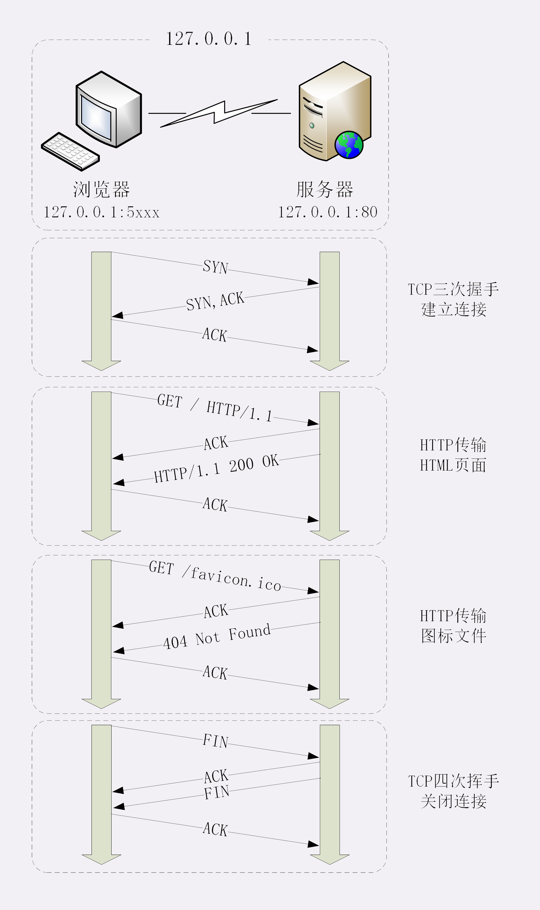
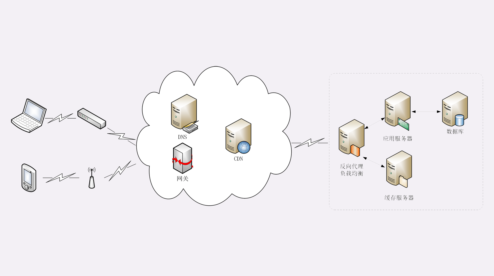

## IP访问Web服务器

HTTP 协议是运行在 TCP/IP 基础上的，依靠 TCP/IP 协议来实现数据的可靠传输。**所以浏览器要用 HTTP 协议收发数据，首先要做的就是建立 TCP 连接**。

因为我们在地址栏里直接输入了 IP 地址“127.0.0.1”，而 Web 服务器的默认端口是 80，所以浏览器就要依照 TCP 协议的规范，使用“**三次握手**”建立与 Web 服务器的连接。对应到 Wireshark 里，就是最开始的三个抓包，浏览器使用的端口是 52085，服务器使用的端口是 80，经过 **SYN、SYN/ACK、ACK** 的三个包之后，浏览器与服务器的 TCP 连接就建立起来了

有了可靠的 TCP 连接通道后，HTTP 协议就可以开始工作了。于是，浏览器按照 HTTP 协议规定的格式，通过 TCP 发送了一个“GET / HTTP/1.1”请求报文，也就是 Wireshark 里的**第四个包**。至于包的内容具体是什么现在先不用管，我们下一讲再说。

随后，Web 服务器回复了**第五个包**，在 TCP 协议层面确认：“刚才的报文我已经收到了”，不过这个 TCP 包 HTTP 协议是看不见的。

Web 服务器收到报文后在内部就要处理这个请求。同样也是依据 HTTP 协议的规定，**解析报文**，看看浏览器发送这个请求想要干什么。

它一看，原来是要求获取根目录下的默认文件，好吧，那我就从磁盘上把那个文件全读出来，再拼成符合 HTTP 格式的报文，发回去吧。这就是 Wireshark 里的**第六个包**“HTTP/1.1 200 OK”，底层走的还是 TCP 协议。

同样的，浏览器也要给服务器回复一个 TCP 的**ACK 确认**，“你的响应报文收到了，多谢”，即**第七个包**。

这时浏览器就收到了响应数据，但里面是什么呢？所以也要解析报文。一看，服务器给我的是个 HTML 文件，好，那我就调用排版引擎、JavaScript 引擎等等处理一下，然后在浏览器窗口里展现出了欢迎页面。

我为这个过程画了一个交互图，你可以对照着看一下。不过要提醒你，图里 TCP 关闭连接的“四次挥手”在抓包里没有出现，这是因为 HTTP/1.1 长连接特性，默认不会立即关闭连接

再简要叙述一下这次最简单的**浏览器 HTTP 请求过程**：

1. 浏览器从地址栏的输入中获得服务器的 IP 地址和端口号；
2. 浏览器用 TCP 的三次握手与服务器建立连接；
3. 浏览器向服务器发送拼好的报文；
4. 服务器收到报文后处理请求，同样拼好报文再发给浏览器；
5. 浏览器解析报文，渲染输出页面。

## 使用域名访问 Web 服务器

浏览器看到了网址里的“www.chrono.com”，发现它不是数字形式的 IP 地址，那就肯定是域名了，于是就会发起域名解析动作，通过访问一系列的域名解析服务器，试图把这个域名翻译成 TCP/IP 协议里的 IP 地址。

## 真实的网络世界

## 小结

1. HTTP 协议基于底层的 TCP/IP 协议，所以必须要用 IP 地址建立连接；
2. 如果不知道 IP 地址，就要用 DNS 协议去解析得到 IP 地址，否则就会连接失败；
3. 建立 TCP 连接后会顺序收发数据，请求方和应答方都必须依据 HTTP 规范构建和解析报文；
4. 为了减少响应时间，整个过程中的每一个环节都会有缓存，能够实现“短路”操作；
5. 虽然现实中的 HTTP 传输过程非常复杂，但理论上仍然可以简化成实验里的“两点”模型。

浏览器判断是不是ip地址，不是就进行域名解析，依次通过**浏览器缓存，系统缓存，host文件**，还是没找到的请求DNS服务器获取IP解析(解析失败的浏览器尝试换别的DNS服务器，最终失败的进入错误页面)，有可能获取到CDN服务器IP地址，访问CDN时先看是否缓存了，缓存了响应用户，无法缓存，缓存失效或者无缓存，回源到服务器。经过防火墙外网网管路由到nginx接入层。ng缓存中存在的直接放回，不存在的负载到web服务器。web服务器接受到请后处理，路径不存在404。存在的返回结果(服务器中也会有redis,ehcache(堆内外缓存)，disk等缓存策略)。原路返回，CDN加入缓存响应用户。

你能试着解释一下在浏览器里点击页面链接后发生了哪些事情吗？

浏览器判断这个链接是要在当前页面打开还是新开标签页，然后走一遍本文中的访问过程:拿到ip地址和端口号，建立tcp/ip链接，发送请求报文，接收服务器返回并渲染。

这一节课里讲的都是正常的请求处理流程，如果是一个不存在的域名，那么浏览器的工作流程会是怎么样的呢？

先查浏览器缓存，然后是系统缓存-＞hosts文件-＞局域网域名服务器-＞广域网域名服务器-＞顶级域名服务器-＞根域名服务器。这个时间通常要很久，最终找不到以后，返回一个报错页面，chrome是ERR_CONNECTION_ABORTED

