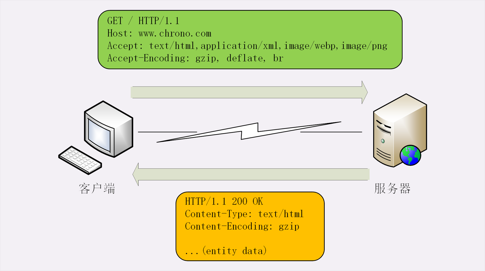

# http实体数据

## 数据类型与编码

HTTP 协议则不同，它是应用层的协议，数据到达之后工作只能说是完成了一半，还必须要告诉上层应用这是什么数据才行，否则上层应用就会“不知所措”。你可以设想一下，假如 HTTP 没有告知数据类型的功能，服务器把“一大坨”数据发给了浏览器，浏览器看到的是一个“黑盒子”，这时候该怎么办呢？

“**多用途互联网邮件扩展**”（Multipurpose Internet Mail Extensions），简称为 **MIME**。MIME 是一个很大的标准规范，但 HTTP 只“顺手牵羊”取了其中的一部分，用来标记 body 的数据类型，这就是我们平常总能听到的“MIME type”

MIME 把数据分成了八大类，每个大类下再细分出多个子类，形式是“**type/subtype**”的字符串，巧得很，刚好也符合了 HTTP 明文的特点，所以能够很容易地纳入 HTTP 头字段里。

这里简单列举一下在 HTTP 里经常遇到的几个类别：

1. text：即文本格式的可读数据，我们最熟悉的应该就是 text/html 了，表示超文本文档，此外还有纯文本 text/plain、样式表 text/css 等。
2. image：即图像文件，有 image/gif、image/jpeg、image/png 等。
3. audio/video：音频和视频数据，例如 audio/mpeg、video/mp4 等。
4. application：数据格式不固定，可能是文本也可能是二进制，必须由上层应用程序来解释。常见的有 application/json，application/javascript、application/pdf 等，另外，如果实在是不知道数据是什么类型，像刚才说的“黑盒”，就会是 application/octet-stream，即不透明的二进制数据。

但仅有 MIME type 还不够，因为 HTTP 在传输时为了节约带宽，有时候还会压缩数据，为了不要让浏览器继续“猜”，还需要有一个“**Encoding type**”，告诉数据是用的什么**编码格式**，这样对方才能正确解压缩，还原出原始的数据。

比起 MIME type 来说，Encoding type 就少了很多，常用的只有下面三种：

1. gzip：GNU zip 压缩格式，也是互联网上最流行的压缩格式；
2. deflate：zlib（deflate）压缩格式，流行程度仅次于 gzip；
3. br：一种专门为 HTTP 优化的新压缩算法（Brotli）

## 数据类型使用的头字段

有了 MIME type 和 Encoding type，无论是浏览器还是服务器就都可以轻松识别出 body 的类型，也就能够正确处理数据了。

HTTP 协议为此定义了两个 Accept 请求头字段和两个 Content 实体头字段，用于客户端和服务器进行“**内容协商**”。也就是说，客户端用 Accept 头告诉服务器希望接收什么样的数据，而服务器用 Content 头告诉客户端实际发送了什么样的数据



Accept 字段标记的是客户端可理解的 MIME type，可以用“,”做分隔符列出多个类型，让服务器有更多的选择余地，例如下面的这个头：

```text
Accept: text/html,application/xml,image/webp,image/png
```

这就是告诉服务器：“我能够看懂 HTML、XML 的文本，还有 webp 和 png 的图片，请给我这四类格式的数据”。

相应的，服务器会在响应报文里用头字段 Content-Type 告诉实体数据的真实类型：

```text
Content-Type: text/html
Content-Type: image/png
```