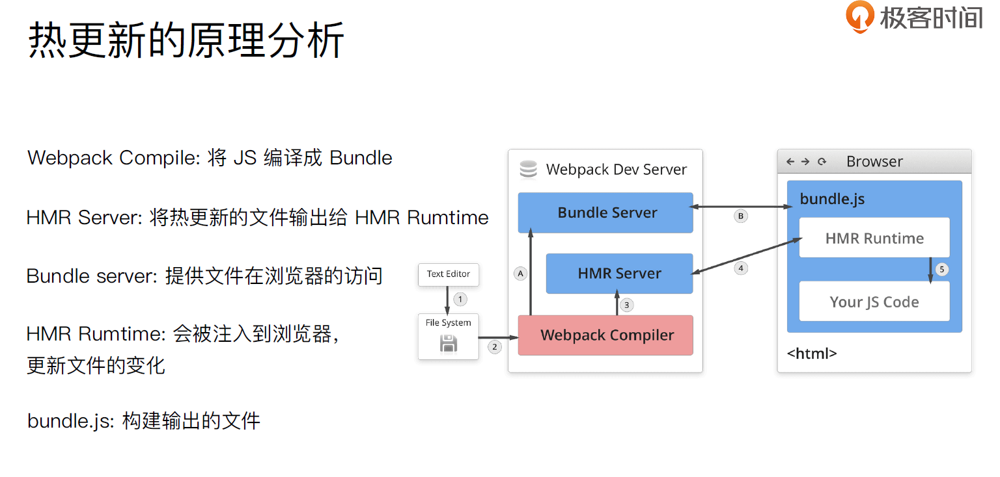

## 文件监听

- 文件监听是在发现源码发⽣生变化时，自动重新构建出新的输出⽂文件。
- webpack 开启监听模式，有两种⽅方式：
    - 启动webpack 命令时，带上--watch 参数
    - 在配置webpack.config.js 中设置watch: true

- 使用（需要手动刷新浏览器）

```js
{
    "name": "hello-webpack",
    "version": "1.0.0",
    "description": "Hello webpack",
    "main": "index.js",
    "scripts": {
        "build": "webpack ",
+       "watch": "webpack --watch"
    },
    "keywords": [],
    "author": "",
    "license": "ISC"
}
```

### 文件监听原理

- 轮询判断文件的最后编辑时间是否变化
- 某个文件发⽣生了了变化，并不会立刻告诉监听者，而是先缓存起来，等aggregateTimeout

```js
module.export = {
    //默认false，也就是不不开启
    watch: true,
    //只有开启监听模式时，watchOptions才有意义
    wathcOptions: {
        //默认为空，不监听的文件或者文件夹，支持正则匹配
        ignored: /node_modules/,
        //监听到变化发生后会等300ms再去执行，默认300ms
        aggregateTimeout: 300,
        //判断文件是否发生变化是通过不停询问系统指定文件有没有变化实现的，默认每秒问1000次
        poll: 1000
    }
}
```

## webpack 热更新

[文档](https://www.webpackjs.com/concepts/hot-module-replacement/)

- WDS 不刷新浏览器
- WDS 不输出文件，而是放在内存中
- 使用 `HotModuleReplacementPlugin` 插件

```js
{
    "name": "hello-webpack",
    "version": "1.0.0",
    "description": "Hello webpack",
    "main": "index.js",
    "scripts": {
        "build": "webpack ",
+       "dev": "webpack-dev-server --open"
    },
    "keywords": [],
    "author": "",
    "license": "ISC"
}

// webpack.config,js

const path = require('path')
const webpack = require('webpack')

module.exports = {
  mode: 'development',
  entry: {
    index: './src/index.js',
    search: './src/search.js'
  },
  output: {
    filename: '[name].js',
    path: path.join(__dirname, 'dist')
  },
  module: {
    rules: [
      {
        test: /\.js$/,
        use: 'babel-loader'
      },
      {
        test: /\.css$/,
        use: ['style-loader', 'css-loader']
      },
      {
        test: /\.less$/,
        use: ['style-loader', 'css-loader', 'less-loader']
      }
    ]
  },
  plugins: [new webpack.HotModuleReplacementPlugin()],
  devServer: {
    contentBase: './dist',
    hot: true
  }
}
```

### 使用原理



