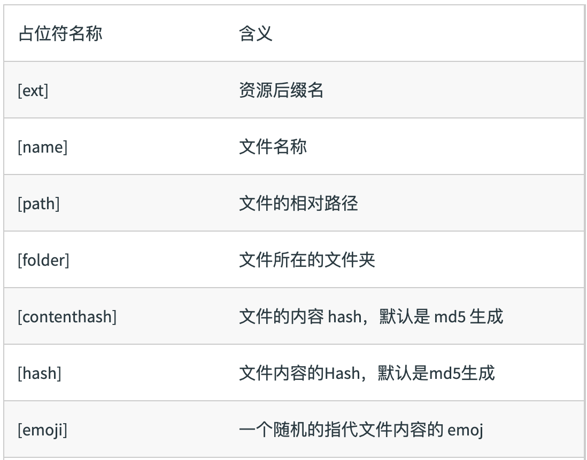

# 文件指纹

## 什么是文件指纹？

- 打包后输出的⽂件名的后缀


### 文件指纹如何⽣生成

- Hash：和整个项目的构建相关，只要项目文件有修改，整个项目构建的hash 值就会更改
- Chunkhash：和webpack 打包的chunk 有关，不同的entry 会生成不同的chunkhash 值
- Contenthash：根据文件内容来定义hash ，文件内容不变，则contenthash 不变

### 使用

- 设置output 的filename，使用[chunkhash]

```js
module.exports = {
    entry: {
        app: './src/app.js',
        search: './src/search.js'
    },
    output: {
+       filename: '[name][chunkhash:8].js',
        path: __dirname + '/dist'
    }
};
```

- css文件指纹 设置MiniCssExtractPlugin 的filename，使用[contenthash]

```js
module.exports = {
    entry: {
        app: './src/app.js',
        search: './src/search.js'
    },
    output: {
        filename: '[name][chunkhash:8].js',
        path: __dirname + '/dist'
    },
    plugins: [
+       new MiniCssExtractPlugin({
+           filename: `[name][contenthash:8].css
+       })
    ]
};
```

- 图片的文件指纹   设置file-loader 的name，使用[hash]
- 

```js
{
    test: /\.(png|svg|jpg|gif)$/,
    use: [{
        loader: 'file-loader’,
+       options: {
+           name: 'img/[name][hash:8].[ext] '
+       }
    }]
}
```