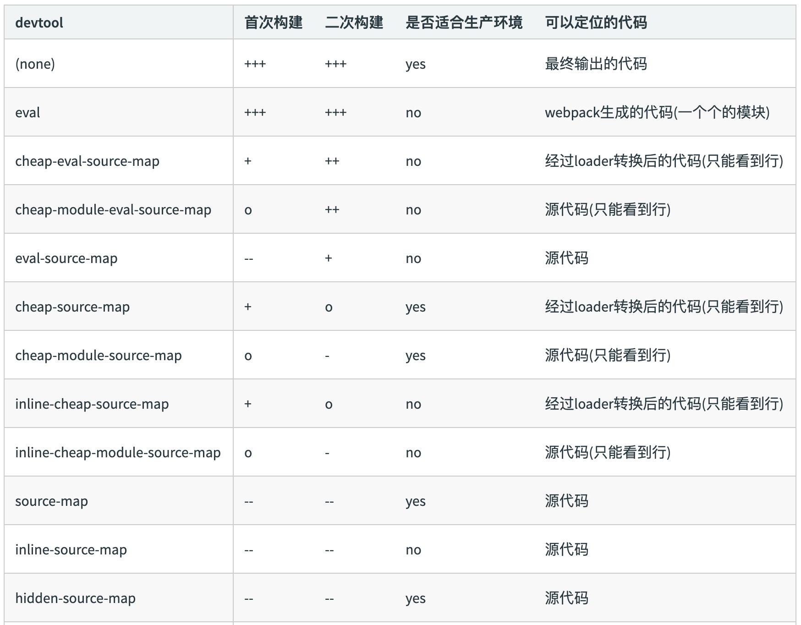

## 多页应用打包通用方案

- **多页面应用(MPA)概念**：每一次页面跳转的时候，后台服务器都会给返回一个新的html 文档，这种类型的网站也就是多页网站，也叫做多页应用。
- SEO友好
- 页面解耦

### 基本思路

- 每个页面对应一个entry，一个html-webpack-plugin
- 缺点：每次新增或删除页面需要改webpack 配置

```js
module.exports = {
    entry: {
        index: './src/index.js',
        search: './src/search.js ‘
    }
};
```

### 通用方案

- 动态获取entry 和设置html-webpack-plugin 数量
- 利用 glob.sync  `npm i glob -D`
- `entry: glob.sync(path.join(__dirname, './src/*/index.js'))`

```js
module.exports = {
    entry: {
        index: './src/index/index.js',
        search: './src/search/index.js ‘
    }
}
```

## 使用source map

- `devtool: 'source-map'`
- 作用：通过source map 定位到源代码
    - [source map科普文](http://www.ruanyifeng.com/blog/2013/01/javascript_source_map.html)
- 开发环境开启，线上环境关闭
    - 线上排查问题的时候可以将sourcemap 上传到错误监控系统

### source map 关键字

- source map: 产⽣生.map⽂文件
- eval: 使⽤用eval包裹模块代码
- cheap: 不不包含列列信息
- inline: 将.map作为DataURI嵌⼊入，不不单独⽣生成.map⽂文件
- module:包含loader的sourcemap

### source map 类型


