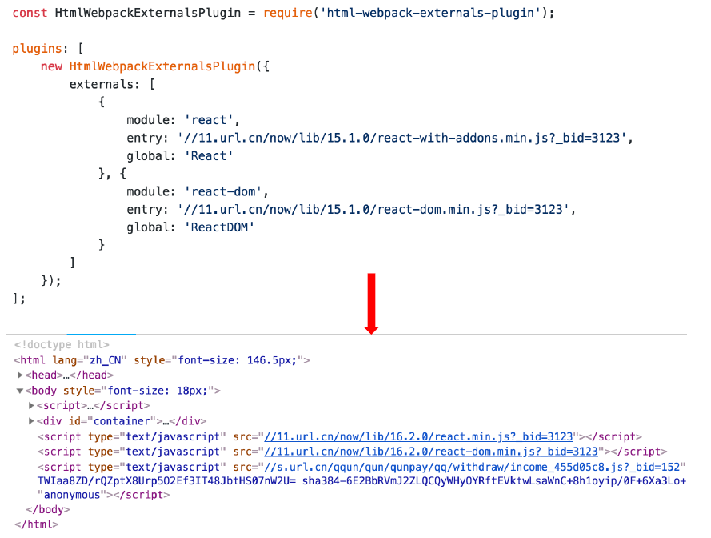

# 提取页面共公共资源

## 基础库分离

- 思路：将react、react-dom 基础包通过cdn 引入，不打入bundle 中
- 方法：使用 html-webpackexternals-plugin



## 利用SplitChunksPlugin 进行公共脚本分离

- Webpack4 内置的，替代CommonsChunkPlugin插件
- chunks 参数说明：
    - async 异步引入的库进行分离(默认)
    - initial 同步引入的库进行分离
    - all 所有引入的库进行分离(推荐)

```js
module.exports = {
  optimization: {
    splitChunks: {
      chunks: 'async',
      minSize: 30000,
      maxSize: 0,
      minChunks: 1,
      maxAsyncRequests: 5,
      maxInitialRequests: 3,
      automaticNameDelimiter: '~',
      name: true,
      cacheGroups: {
        vendors: {
          test: /[\\/]node_modules[\\/]/,
          priority: -10
        }
      }
    }
  }
}
```

### 利用SplitChunksPlugin 分离基础包

- test: 匹配出需要分离的包
- 

```js
module.exports = {
  optimization: {
    splitChunks: {
      cacheGroups: {
        commons: {
          test: /(react|react-dom)/,
          name: 'vendors',
          chunks: 'all'
        }
      }
    }
  }
}
```

### 利用SplitChunksPlugin 分离页面公共文件

- minChunks: 设置最小引用次数为2次
- minuSize: 分离的包体积的大小

```js
module.exports = {
  optimization: {
    splitChunks: {
      minSize: 0,
      cacheGroups: {
        commons: {
          name: 'commons',
          chunks: 'all',
          minChunks: 2
        }
      }
    }
  }
}
```

与HtmlWebpackPlugin结合使用，它已经会注入所有生成的chunk，不需要额外在new HtmlWebpackPlugin的chunks中再声明。