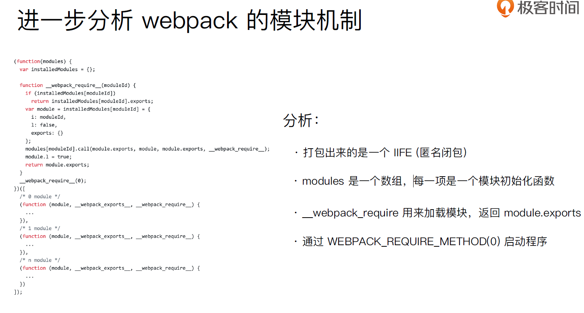

## scope Hoisting使用和原理分析

- 现象：构建后的代码存在大量闭包代码


- 会导致什么问题？
    - 运行代码时创建的函数作用域变多，内存开销变大
    - 大量作用域包裹代码，导致体积增大（模块越多越明显）

### 模块转换分析


结论：

- 被webpack 转换后的模块会带上⼀一层包裹
- import 会被转换成__webpack_require



### scope hoisting 原理

- 原理：将所有模块的代码按照引用顺序放在一个函数作用域里，然后适当的重命名一些变量以防止变量名冲突
- 对比: 通过scope hoisting 可以减少函数声明代码和内存开销
- webpack mode 为production 默认开启
- 必须是ES6 语法，CJS 不不⽀支持

```js
module.exports = {
  entry: {
    app: './src/app.js',
    search: './src/search.js'
  },
  output: {
    filename: '[name][chunkhash:8].js',
    path: __dirname + '/dist'
  },
+ plugins: [new webpack.optimize.ModuleConcatenationPlugin()]
}
```

