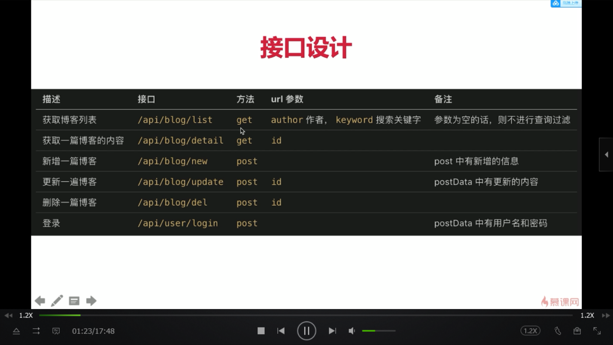

### Nodejs和JS的区别

- 核心语法不变，都遵守ECMScript 
    - 定义了语法，两者都要遵守
    - 变量定义等
    - 不能操作Dom，不能监听Click事件，不能发送ajax
    - 不能处理http，不能操作文件
- javascript
    - 使用ECMScript语法规范，外加Web Api（W3C)
    - Dom、Bom、事件绑定、Ajax等
    - 两者结合，即可完成浏览器的任何操作
- Node
    - 使用ECMScript语法规范，外加nodejs Api
    - 后端 fs http buffer event os
    - server端

### Commonjs
#### 基本使用
在 Node.js 模块系统中，每个文件都被视为一个独立的模块。 例如，假设有一个名为 foo.js 的文件：

```js
const circle = require('./circle.js');
console.log(`半径为 4 的圆的面积是 ${circle.area(4)}`);
```

在第一行中， foo.js 加载了与 foo.js 在同一目录中的 circle.js 模块。
以下是 circle.js 的内容：

```js
const { PI } = Math;
exports.area = (r) => PI * r ** 2;
exports.circumference = (r) => 2 * PI * r;
```

circle.js 模块导出了 area() 和 circumference() 函数。 通过在特殊的 exports 对象上指定额外的属性，可以将函数和对象添加到模块的根部。
模块内的本地变量是私有的，因为模块由 Node.js 封装在一个函数中（详见模块封装器）。 在这个例子中，变量 PI 对 circle.js 是私有的。
可以为 module.exports 属性分配新的值（例如函数或对象）。

下面的例子中， bar.js 使用了导出 Square 类的 square 模块：

```js
const Square = require('./square.js');
const mySquare = new Square(2);
console.log(`mySquare 的面积是 ${mySquare.area()}`);
```
square 模块定义在 square.js 中：

// 赋值给 `exports` 不会修改模块，必须使用 `module.exports`。
```js
module.exports = class Square {
  constructor(width) {
    this.width = width;
  }
  area() {
    return this.width ** 2;
  }
};
```
模块系统在 require('module') 模块中实现。

#### 访问主模块

当 Node.js 直接运行一个文件时， require.main 会被设为它的 module。 这意味着可以通过 require.main === module 来判断一个文件是否被直接运行：
对于 foo.js 文件，如果通过 node foo.js 运行则为 true，但如果通过 require('./foo') 运行则为 false
因为 module 提供了一个 filename 属性（通常等同于 __filename），所以可以通过检查 require.main.filename 来获取当前应用程序的入口点。

### http


### sever开发和前端开发的区别

- 服务稳定性
    - server端可能会遭受各种恶意攻击和误操作
    - 单个客户端可以挂掉，服务端不能
    - PM2进程守候
- 考虑内存和CPU(优化、扩展)
    - 客户端独占一个浏览器，内存和CPU问题影响不大
    - server端承载请求多，cpu和内存是稀缺资源
    - stream写日志，redis存session
- 日志
    - 前端也记录日志，但只发送日志
    - server端记录日志 、存储日志、分析日志
- 安全
    - server端要随时准备接受各种恶意攻击，前端很少
    - 如：越权操作，数据库操作
    - 预防xss验证攻击和sql注入
- 集群和服务拆分
    - 产品发展速度块，流量迅速增加
    - 如何通过扩展机器和服务拆分来承载大流量？
    - 从设计上支持服务拆分

### 博客项目介绍

1. 目标
    1. 博客系统，具有博客的基本功能
    2. 只开发server
2. 需求
    1. 首页、作者主页，博客详情页
    2. 登录页
    3. 管理中心，新建页，编辑页
3. 技术方案
    
### 初始化路由




分层
```
blog-1                        //根目录
 ├── app.js                    // 基础、共用的功能            2
 ├── bin
 │   └── www.js                //httpserver                1
 ├── package-lock.json
 ├── package.json
 └── src
     ├── controller            //获取数据，返回数据
     │   └── blog.js
     ├── model                //
     │   └── resModel.js
     └── router                //路由
         ├── blog.js
         └── user.js
```

### cookie


### express中间件原理
