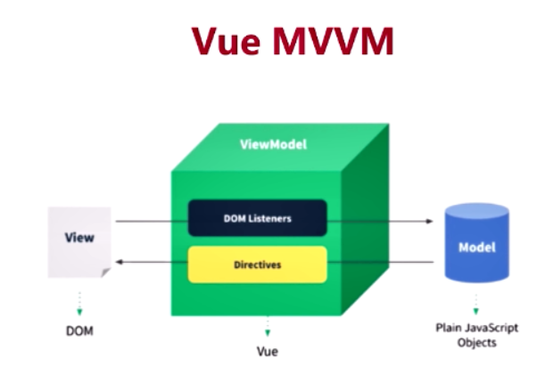

## 什么是MVVM模式[^1][^2]?

[^1]:[MVVM 模式介绍](https://github.com/xitu/gold-miner/blob/master/TODO%2Fapproaching-android-with-mvvm.md)
[^2]:[vue.js和MVVM](https://blog.csdn.net/u014346301/article/details/53812770)

(数据驱动视图的思想)

**Model-View-ViewModel**就是将其中的 View 的状态和行为抽象化，让我们可以将 UI 和业务逻辑分开。当然这些工作 ViewModel 已经帮我们做了，它可以取出 Model 的数据同时帮忙处理 View 中由于需要展示内容而涉及的业务逻辑。

MVVM模式是通过以下三个核心组件组成，每个都有它自己独特的角色：

- Model - 包含了业务和验证逻辑的数据模型
- View - 定义屏幕中View的结构，布局和外观
- ViewModel - 扮演“View”和“Model”之间的使者，帮忙处理 View 的全部业务逻辑

那这和我们曾经用过的MVC模式有什么不同呢？以下是MVC的结构

- View 用来把数据以某种方式呈现给用户。
- Model 其实就是数据。
- Controller 接收并处理来自用户的请求，并将 Model 返回给用户。

MVVM模式和MVC有些类似，但有以下不同：

- ViewModel 替换了 Controller，在UI层之下
- ViewModel 向 View 暴露它所需要的数据和指令对象
- ViewModel 接收来自 Model 的数据
- 你可以看到这两种模式有着相似的结构，但新加入的 ViewModel 是用不同的方法将组件们联系起来的，它是双向的，而MVC只能单向连接。

概括起来，MVVM是由MVC发展而来 - 通过在 Model 之上而在 View 之下增加一个非视觉的组件将来自 Model 的数据映射到 View 中。