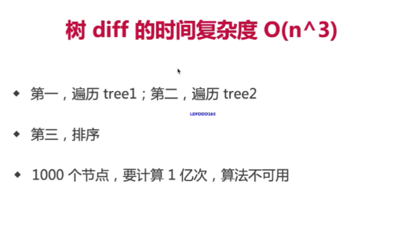

- [什么是虚拟DOM](https://juejin.im/post/5d36cc575188257aea108a74)
- js执行速度快，用 JS 模拟 DOM 结构，计算出最小的变更，操作 DOM
- [snabbdom](https://github.com/snabbdom/snabbdom)

## diff算法概述

[vdom](https://www.cnblogs.com/xuntu/p/6800547.html)

[sabbbdom](https://www.jianshu.com/p/1f1ef915e83e)