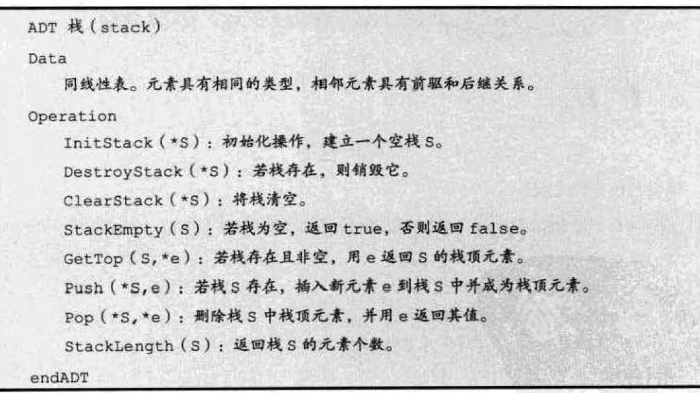
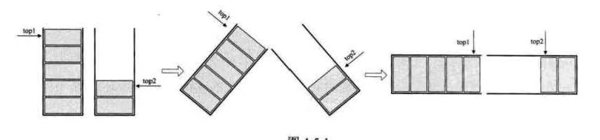

## 要点
* 栈（Stack）：只允许在一端进行插入或删除操作的线性表。
* 栈顶（Top）：线性表允许进行插入和删除的那一端。
* 栈底（Bottom）：固定的，不允许进行插入和删除的另一端
* 特点：
1. 栈是受限的线性表，所以自然具有线性关系。
2. 栈中元素后进去的必然先出来，即后进先出 LIFO（Last In First Out）

- 栈的抽象数据类型
- 

* 顺序栈
    * 栈是线性表的特例，那栈的顺序存储也是线性表顺序存储的简化。栈的顺序存储结构也叫作顺序栈。
    * 顺序栈的操作
        1. 判空：
        2. 进栈：
        3. 出栈：
        4. 读取栈顶元素：
* 共享栈
    * 顺序栈的存储空间大小需要事先开辟好，很多时候对每个栈各自单独开辟存储空间的利用率不如将各个栈的存储空间共享
    * 示意图：数组有两个端点，两个栈有两个栈底，让一个栈的栈底为数组的始端，即下标为 `0` 处，另一个栈的栈底为数组的末端，即下标为数组长度`n - l` 处。这样，两个栈如果增加元素，就是两端点向中间延伸。`top1` 和`top2` 是栈1 和枝2的栈顶指针，可以想象，只要它们俩不见面，两个栈就可以一直使用。
    * 
    * 若栈2 是空栈，栈1 的`top1`等于 `n-1` 时，就是栈1 满了。反之，当栈1 为空技时， `top2` 等于0，为栈2 满。但更多的情况，两个栈见面之时，也就是两个指针之间相差1 时，即回`top1 + 1 == top2` 为栈满。
    * 共享栈的操作：（进栈）
* 链式栈
    * 栈是线性表的特例，线性表的存储结构还有链式存储结构，所以也可以用链表的方式来实现栈。栈的链式存储结构也叫作链栈。
    * 特点
        1. 链栈一般不存在栈满的情况。
        2. 空栈的判定条件通常定为top==NULL；
    * 结构
    * 链式栈的操作
        1. 进栈
        2. 出栈

## 创建一个基于数组的栈

```js
/**
 * 数组创建栈
 *
 * @class Stack
 */
class Stack {
  constructor() {
    this.items = []
  }

  /**
   * 向栈顶添加元素
   * @param {*} elements
   * @memberof Stack
   */
  push(...elements) {
    this.items.push(...elements)
  }

  /**
   * 移除栈顶元素，返回被移除的元素
   * @returns element
   * @memberof Stack
   */
  pop() {
    return this.items.pop()
  }

  /**
   *查看栈顶元素
   *
   * @returns
   * @memberof Stack
   */
  peek() {
    const length = this.items.length
    return this.items[length-1]
  }

  /**
   * 检查栈是否为空
   *
   * @returns
   * @memberof Stack
   */
  isEmpty() {
    return this.items.length === 0
  }

  /**
   * 清空栈
   *
   * @memberof Stack
   */
  clear() {
    this.items = []
  }

  /**
   * 栈的元素个数
   *
   * @returns
   * @memberof Stack
   */
  size() {
    return this.items.length
  }
}
```

## 创建一个基于对象的栈

- 创建一个Stack类最简单的方式是使用一个数组来存储其元素。在使用数组时，大部分方法的时间复杂度是 `O(*n*)`。
- 数组是一个有序集合，为了保证，排列有序，会占用更多内存。

```js
/**
 * 对象创建栈
 *
 * @class Stack
 */
class Stack {
	constructor() {
		this.count = 0
		this.items = {}
	}

	/**
	 * 插入数组元素（只能插入一个）
	 *
	 * @param {*} element
	 * @memberof Stack
	 */
	push(element) {
		this.items[this.count] = element
		this.count++
	}

	/**
	 * 检查栈是否为空
	 *
	 * @returns
	 * @memberof Stack
	 */
	isEmpty() {
		return this.count === 0
	}

	/**
	 * 移除栈顶元素，返回被移除的元素
	 * @returns element
	 * @memberof Stack
	 */
	pop() {
		if (this.isEmpty()) {
			return
		}
		this.count--
		const result = this.items[this.count]
		delete this.items[this.count]
		return result
	}

	/**
	 *查看栈顶元素
	 *
	 * @returns
	 * @memberof Stack
	 */
	peek() {
		if (this.isEmpty()) {
			return
		}
		return this.items[this.count - 1]
	}

	/**
	 * 清空栈
	 *
	 * @memberof Stack
	 */
	clear() {
		this.items = {}
		this.count = 0
	}

	/**
	 * 栈的元素个数
	 *
	 * @returns
	 * @memberof Stack
	 */
	size() {
		return this.count
	}
	
	/**
	 * 像数组一样打印栈的内容
	 *
	 * @returns
	 * @memberof Stack
	 */
	 
	toString() {
		if (this.isEmpty()) {
			return ""
		}
		let objString = `${this.items[0]}`
		for (let i = 1; i < this.count; i++) {
			const element = this.items[i]
			objString += `,${element}`
		}
		return objString
	}
}
```

## 保护数据结构内部元素

- ES6 类是基于原型的。尽管基于原型的类能节省内存空间并在扩展方面由于基于函数的类，但这种方式不能定义私有属性（变量）和方法。

### 下划线命名约定

```js
class Stack {
  constructor() {
    this._count = 0
    this._items = {}
  }
}
```

- 只是一种约定，并不能保护数据

### ES6 的限定作用域的 Symbol 实现栈

- `Symbol()` 函数会返回 `symbol` 类型的值，该类型具有静态属性和静态方法。它的静态属性会暴露几个内建的成员对象；它的静态方法会暴露全局的 `symbol` 注册，且类似于内建对象类，但作为构造函数来说它并不完整，因为它不支持语法："`new Symbol()`"。
- 每个从 `Symbol()` 返回的 `symbol` 值都是唯一的。一个 `symbol` 值能作为对象属性的标识符；这是该数据类型仅有的目的。更进一 步的解析见—— glossary entry for Symbol。
- `symbol` 是一种基本数据类型 （`primitive data type`）。
- [MDN文档](https://developer.mozilla.org/zh-CN/docs/Glossary/Symbol)

```js
const _items = Symbol("StackItems")
/**
 * symbol创建栈
 *
 * @class Stack
 */
class Stack {
	constructor() {
		this[_items] = []
	}

	/**
	 * 向栈顶添加元素
	 * @param {*} elements
	 * @memberof Stack
	 */
	push(...elements) {
		this[_items].push(...elements)
	}

	/**
	 * 移除栈顶元素，返回被移除的元素
	 * @returns element
	 * @memberof Stack
	 */
	pop() {
		return this[_items].pop()
	}

	/**
	 *查看栈顶元素
	 *
	 * @returns
	 * @memberof Stack
	 */
	peek() {
		const length = this[_items].length
		return this[_items][length - 1]
	}

	/**
	 * 检查栈是否为空
	 *
	 * @returns
	 * @memberof Stack
	 */
	isEmpty() {
		return this[_items].length === 0
	}

	/**
	 * 清空栈
	 *
	 * @memberof Stack
	 */
	clear() {
		this[_items] = []
	}

	/**
	 * 栈的元素个数
	 *
	 * @returns
	 * @memberof Stack
	 */
	size() {
		return this[_items].length
	}
}
```

- 用 `stack[objectSymbols[0]]` 可以访问到  `_items`的，无论对象还是数组都可以实现从中间删除或者添加元素，这是不对的

### ES6 的 WeakMap 实现

- `WeakMap` 对象是一组键/值对的集合，其中的键是弱引用的。其键必须是对象，而值可以是任意的。
- `WeakMap` 的 `key` 只能是 `Object` 类型。 原始数据类型 是不能作为 `key` 的（比如 `Symbol`）。

```js
const items = new WeakMap()
/**
 * WeakMap创建栈
 *
 * @class Stack
 */
class Stack {
	constructor() {
		items.set(this, [])
	}

	/**
	 * 向栈顶添加元素
	 * @param {*} elements
	 * @memberof Stack
	 */
	push(...elements) {
		const s = items.get(this)
		s.push(...elements)
	}

	/**
	 * 移除栈顶元素，返回被移除的元素
	 * @returns element
	 * @memberof Stack
	 */
	pop() {
		const s = items.get(this)
		return s.pop()
	}

	/**
	 *查看栈顶元素
	 *
	 * @returns
	 * @memberof Stack
	 */
	peek() {
		const s = items.get(this)
		const length = s.length
		return s[length - 1]
	}

	/**
	 * 检查栈是否为空
	 *
	 * @returns
	 * @memberof Stack
	 */
	isEmpty() {
		const s = items.get(this)
		return s.length === 0
	}

	/**
	 * 清空栈
	 *
	 * @memberof Stack
	 */
	clear() {
		const s = items.get(this)
		s = []
	}

	/**
	 * 栈的元素个数
	 *
	 * @returns
	 * @memberof Stack
	 */
	size() {
		const s = items.get(this)
		return s.length
	}
}
```
- 虽然实现了私有属性，但代码可读性不强，扩展该类时无法继承私有属性

## 用栈解决问题

### 用两个栈实现一个队列

- [两个栈实现一个队列](https://leetcode-cn.com/problems/yong-liang-ge-zhan-shi-xian-dui-lie-lcof/)

```js
var CQueue = function () {
	this.stack1 = []
	this.stack2 = []
}

/**
 * @param {number} value
 * @return {void}
 */
CQueue.prototype.appendTail = function (value) {
	this.stack1.push(value)
}

/**
 * @return {number}
 */
CQueue.prototype.deleteHead = function () {
	if (this.stack2.length === 0) {
		while (this.stack1.length > 0) {
			this.stack2.push(this.stack1.pop())
		}
	}
	return this.stack2.pop() || -1
}

/**
 * Your CQueue object will be instantiated and called as such:
 * var obj = new CQueue()
 * obj.appendTail(value)
 * var param_2 = obj.deleteHead()
 */

```

### 包含min函数的栈

- [包含min函数的栈](https://leetcode-cn.com/problems/bao-han-minhan-shu-de-zhan-lcof/)

```js
/**
 * initialize your data structure here.
 */
var MinStack = function () {
	this.items = []
	this.minArr = []
}

/**
 * @param {number} x
 * @return {void}
 */
MinStack.prototype.push = function (x) {
	this.items.push(x)
	if (this.minArr.length === 0 || x <= this.minArr[this.minArr.length - 1]) {
		this.minArr.push(x)
	}
}

/**
 * @return {void}
 */
MinStack.prototype.pop = function () {
	if (this.items.length === 0) {
		return
	}
	var x = this.items.pop()
	if (x === this.minArr[this.minArr.length - 1]) {
		this.minArr.pop()
	}
}

/**
 * @return {number}
 */
MinStack.prototype.top = function () {
	return this.items[this.items.length - 1]
}

/**
 * @return {number}
 */
MinStack.prototype.min = function () {
	return this.minArr[this.minArr.length - 1]
}

/**
 * Your MinStack object will be instantiated and called as such:
 * var obj = new MinStack()
 * obj.push(x)
 * obj.pop()
 * var param_3 = obj.top()
 * var param_4 = obj.min()
 */

```

### 滑动窗口的最大值

- [滑动窗口的最大值](https://leetcode-cn.com/problems/hua-dong-chuang-kou-de-zui-da-zhi-lcof/)

```js
/**
 * @param {number[]} nums
 * @param {number} k
 * @return {number[]}
 */
var maxSlidingWindow = function (nums, k) {
	const result = []
	if (k === 0) {
		return []
	}
	while (nums.length >= k) {
		result.push(getMax(nums))
		nums.pop()
	}
	return result.reverse()
	function getMax(arr) {
		let length = arr.length
		let newArr = arr.slice(length - k, length)
		return Math.max(...newArr)
	}
}

```
