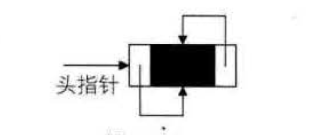

## 要点

- 线性表的链式存储结构的特点是用一组任意的存储单元存储线性表的数据元素，这组存储单元可以是连续的，也可以是不连续的。这就意味着，这些数据元素可以存在内存未被占用的任意位置(如图所示) 。
- 
- 以前在顺序结构中，每个数据元素只需要存数据元素信息就可以了。现在链式结构中，除了要存数据元素信息外， 还要存储它的后继元素的存储地址。因此， 为了表示每个数据元素 a~i~ 与其直接后继数据元素 a~i+1~ 之间的逻辑关系， 对数据元素 a~i~ 来说， 除了存储其本身的信息之外，还需存储一个指示其直接后继的信息(即直接后继的存储位置)。我们把存储数据元素信息的域称为**数据域**， 把存储直接后继位置的域称为**指针域**。指针域中存储的信息称做**指针或链**。这两部分信息组成数据元素 a~i~ 的存储映像，称为**结点(Node)** 。

### 单链表

- n 个结点( al 的存储映像) 链结成一个链表，即为线性表( a1 ， a2,…, aD ) 的链式存储结构，因为此链表的每个结点中只包含一个指针域，**所以叫做单链表**。单链表正是通过每个结点的指针域将线性表的数据元素按其逻辑次序链接在一起， 如图所示。
- 
- **链表中第一个结点的存储位置叫做头指针**
- 为了更加方便地对链表进行操作，会在单链表的第一个结点前附设一个结点，称为**头结点**。头结点的数据域可以不存储任何信息，也可以存储如线性表的长度等附加信息，头结点的指针域存储指向第一个结点的指针，如图所示。
- 
* 头结点和头指针的区别？
    * 不管带不带头结点，头指针始终指向链表的第一个结点，而头结点是带头结点链表中的第一个结点，结点内通常不存储信息
* 为什么要设置头结点？
    * 1.处理操作起来方便 例如：对在第一元素结点前插入结点和删除第一结点起操作与其它结点的操作就统一了
    * 2.无论链表是否为空，其头指针是指向头结点的非空指针，因此空表和非空表的处理也就统一了。

```js
class Node {
	constructor(value) {
		this.value = value
		this.next = null
	}
}

class LinkedList {
	constructor() {
		// 初始化头结点，存储长度
		this.head = new Node(0)
	}

	/**
	 * 两个元素是否相等
	 *
	 * @param {*} a
	 * @param {*} b
	 * @returns
	 * @memberof LinkedList
	 */
	isEqual(a, b) {
		return a === b
	}
	/**
	 * 尾部插入一个新元素
	 *
	 * @param {*} value
	 * @memberof LinkedList
	 */
	push(value) {
		const node = new Node(value)
		let lastNode = this.head
		while (lastNode.next !== null) {
			lastNode = lastNode.next
		}
		lastNode.next = node
		this.head.value++
	}
	/**
	 * 获取某个位置的元素
	 *
	 * @param {*} index
	 * @returns
	 * @memberof LinkedList
	 */
	getElementAt(index) {
		if (index > 0 && index <= this.head.value) {
			let targetNode = this.head
			for (let i = 1; i <= index; i++) {
				targetNode = targetNode.next
			}
			return targetNode
		}
		return null
	}
	insert(value, index) {
		const targetNode = this.getElementAt(index)
		const prevNode = index === 1 ? this.head : this.getElementAt(index - 1)
		if (targetNode === null) {
			return false
		}
		const newNode = new Node(value)
		newNode.next = targetNode
		prevNode.next = newNode
		this.head.value++
		return true
	}
	/**
	 * 删除某位置的元素
	 *
	 * @param {number} index
	 * @returns
	 * @memberof LinkedList
	 */
	removeAt(index) {
		const targetNode = this.getElementAt(index)
		const prevNode = index === 1 ? this.head : this.getElementAt(index - 1)
		if (targetNode === null) {
			return false
		}

		prevNode.next = targetNode.next
		this.head.value--
		return true
	}
	isEmpty() {
		return this.size() === 0
	}
	size() {
		return this.head.value
	}
}
```

### 双向链表

- **双向链表(double linked List) **是在单链袤的每个结点中，再设置一个指向其前驱结点的指针域。**所以在双向链表中的结点都有两个指针域， 一个指向直接后继，另一个指向直接前驱**

```js
const Node = require("./node类")

class DoublyNode extends Node {
	constructor(value) {
		super(value)
		this.prev = null
	}
}

class DoublyLinkedList {
	constructor() {
		// 初始化头结点
		this.head = new DoublyNode(0)
	}
	/**
	 * 尾部插入一个新元素
	 *
	 * @param {*} value
	 * @memberof LinkedList
	 */
	push(value) {
		const node = new Node(value)
		let lastNode = this.head
		while (lastNode.next !== null) {
			lastNode = lastNode.next
		}
		lastNode.next = node
		node.prev = lastNode
		this.head.value++
	}
	/**
	 * 获取某个位置的元素
	 *
	 * @param {*} index
	 * @returns
	 * @memberof DoublyLinkedList
	 */
	getElementAt(index) {
		if (index > 0 && index <= this.head.value) {
			let targetNode = this.head
			for (let i = 1; i <= index; i++) {
				targetNode = targetNode.next
			}
			return targetNode
		}
		return null
	}
	insert(value, index) {
		const targetNode = this.getElementAt(index)
		const prevNode = targetNode.prev
		if (targetNode === null) {
			return false
		}
		const newNode = new Node(value)
		newNode.next = targetNode
		newNode.prev = targetNode.prev
		targetNode.prev = newNode
		prevNode.next = newNode
		this.head.value++
		return true
	}
	/**
	 * 删除某位置的元素
	 *
	 * @param {number} index
	 * @returns
	 * @memberof LinkedList
	 */
	removeAt(index) {
		const targetNode = this.getElementAt(index)
		const prevNode = targetNode.prev
		if (targetNode === null) {
			return false
		}

		prevNode.next = targetNode.next
		targetNode.next.prev = targetNode.prev
		this.head.value--
		return true
	}
	isEmpty() {
		return this.size() === 0
	}
	size() {
		return this.head.value
	}
}
```

### 循环链表

- **将单链表中终端结点的指针端自空指针改为指向头结点，就使整个单链表形成一个环，这种头尾:相接的单链表称为单循环链表，简称循环链表( circular linked list)**
- 
- 循环链表和单链表的主要差异就在于循环的判断条件土，原沫是判断p->next是否为空，现在则是p -> next 不等于头结点，则循环未结束。
- 在单链表中，我们有了头结点时，我们可以用0(1) 的时间访问第一个结点，但对于要访问到最后一个结点，却需要O(n)时间，因为我们需要将单链表全部扫描一遍。
- 不用头指针，而是用指向终端结点的尾指针来表示循环链表(如图所示) ，此时查找开始结点和终端结点都很方便了。
- 
- 终端结点用尾指针rear 指示，则查找终端结点是O(1) ，而开始结点，其实就是rear->next->next ，其时间复杂也为O(1) 。
- **双向链表的循环带头结点的空链表如图所示**
- 
- 非空的循环的带头结点的双向链表
- 