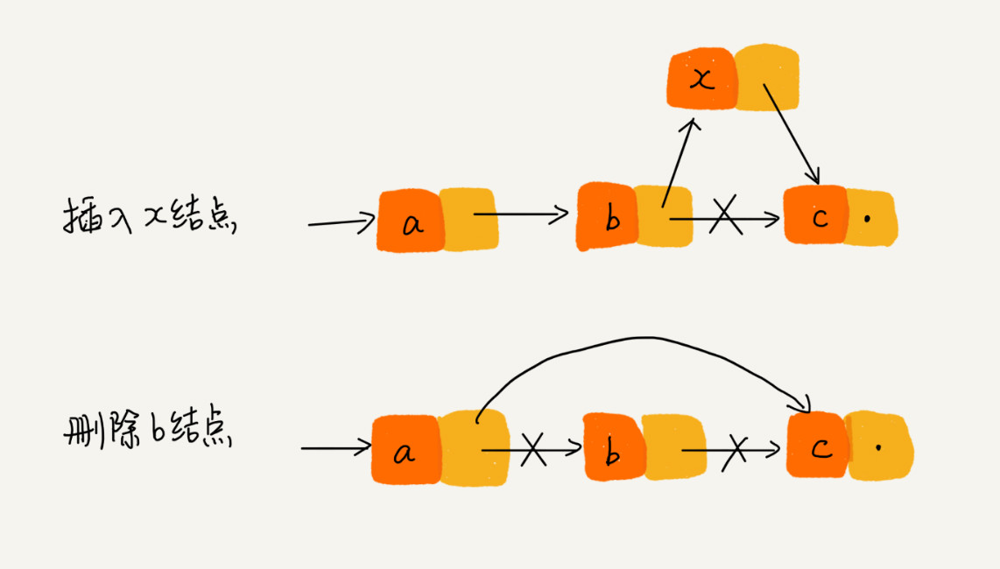
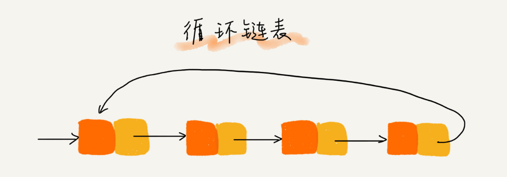
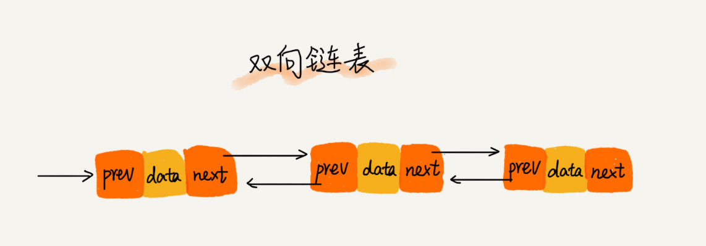

# 06-链表（上）：如何实现LRU淘汰算法

## 内容摘要

**LRU 缓存淘汰算法**：缓存是一种提高数据读取性能的技术，在硬件设计、软件开发中都有着非常广泛的应用，比如常见的 CPU 缓存、数据库缓存、浏览器缓存等等。缓存的大小有限，当缓存被用满时，哪些数据应该被清理出去，哪些数据应该被保留？这就需要缓存淘汰策略来决定。常见的策略有三种：**先进先出策略 FIFO（First In，First Out）、最少使用策略 LFU（Least Frequently Used）、最近最少使用策略 LRU（Least Recently Used）**。

### 五花八门的链表结构

**数组和链表的区别：**

从底层的存储结构上看

数组需要一块**连续的内存空间来存储**，**对内存的要求比较高**。如果我们申请一个 100MB 大小的数组，**当内存中没有连续的、足够大的存储空间时**，即便内存的剩余总可用空间大于 100MB，仍然会申请失败

链表**并不需要一块连续的内存空间**，它通过“指针”**将一组零散的内存块串联起来使用**，所以如果我们申请的是 100MB 大小的链表，根本不会有问题。

#### 单链表

链表通过指针将一组零散的内存块串联在一起。其中，把内存块称为链表的“**结点**”。为了将所有的结点串起来，每个链表的结点除了存储数据之外，还需要记录链上的下一个结点的地址。把这个记录下个结点地址的指针叫作**后继指针 next**。

有两个结点是比较特殊的，它们分别是**第一个结点**和**最后一个结点**。我们习惯性地把第一个结点叫作**头结点**，把最后一个结点叫作**尾结点**。其中，**头结点用来记录链表的基地址**。有了它，我们就可以遍历得到整条链表。**而尾结点特殊的地方是：指针不是指向下一个结点，而是指向一个空地址 NULL，表示这是链表上最后一个结点。**

插入和删除操作如图

链表要想随机访问第 k 个元素，就没有数组那么高效了。因为链表中的数据并非连续存储的，需要根据指针一个结点一个结点地依次遍历，直到找到相应的结点。所以，链表随机访问的性能没有数组好，需要 O(n) 的时间复杂度。

#### 循环链表

循环链表是一种特殊的单链表，它跟单链表唯一的区别就在尾结点，**循环链表的尾结点指针是指向链表的头结点**

循环链表的优点是从链尾到链头比较方便。当要**处理的数据具有环型结构特点**时，就特别适合采用循环链表。比如著名的**约瑟夫问题**。尽管用单链表也可以实现，但是用循环链表实现的话，代码就会简洁很多。

#### 双向链表

双向链表，它支持两个方向，每个结点不止有一个**后继指针 next** 指向后面的结点，还有一个**前驱指针 prev**指向前面的结点。

存储同样多的数据，双向链表要比单链表占用更多的内存空间，虽然两个指针比较浪费存储空间，但可以支持双向遍历，这样也带来了双向链表操作的灵活性

相比单链表，双向链表适合解决哪种问题呢？从结构上来看，双向链表可以支持**O(1) 时间复杂度的情况下找到前驱结点**，正是这样的特点，也使双向链表在某些情况下的插入、删除等操作都要比单链表简单、高效。单链表的插入、删除操作的时间复杂度已经是 O(1) 了，双向链表还能再怎么高效呢？分析一下链表的两个操作。

**删除操作**

在实际的软件开发中，从链表中删除一个数据无外乎这两种情况：

- 删除结点中“值等于某个给定值”的结点；
- 删除给定指针指向的结点。

对于第一种情况，不管是单链表还是双向链表，为了查找到值等于给定值的结点，都需要从头结点开始一个一个依次遍历对比，直到找到值等于给定值的结点，然后再通过我前面讲的指针操作将其删除。

对于第二种情况，我们已经找到了要删除的结点，但是删除某个结点 q 需要知道其前驱结点，而**单链表并不支持直接获取前驱结点**，所以，为了找到前驱结点，我们还是**要从头结点开始遍历链表**，直到 p->next=q，说明 p 是 q 的前驱结点。

对于双向链表来说，这种情况就比较有优势了。因为双向链表中的结点已经保存了前驱结点的指针，不需要像单链表那样遍历。所以，针对第二种情况，单链表删除操作需要 O(n) 的时间复杂度，而双向链表只需要在 `O(1)` 的时间复杂度内就搞定了！

2. **插入操作** 

#### 用空间换时间的设计思想

当内存空间充足的时候，如果我们更加追求代码的执行速度，我们就可以选择空间复杂度相对较高、但时间复杂度相对很低的算法或者数据结构。相反，如果内存比较紧缺，比如代码跑在手机或者单片机上，这个时候，就要反过来用**时间换空间**的设计思路。

缓存实际上就是利用了空间换时间的设计思想。如果我们把数据存储在硬盘上，会比较节省内存，但每次查找数据都要询问一次硬盘，会比较慢。但如果我们通过缓存技术，事先将数据加载在内存中，虽然会比较耗费内存空间，但是每次数据查询的速度就大大提高了

- 对于执行较慢的程序，可以通过消耗更多的内存（空间换时间）来进行优化；
- 而消耗过多内存的程序，可以通过消耗更多的时间（时间换空间）来降低内存的消耗

#### 双向循环链表

### 链表 VS 数组性能大比拼

在实际的软件开发中，**不能仅仅利用复杂度分析就决定使用哪个数据结构来存储数据**。

- 数组简单易用，在实现上使用的是连续的内存空间，可以**借助 CPU 的缓存机制，预读数组中的数据，所以访问效率更高**。而链表在内存中并不是连续存储，所以对 CPU 缓存不友好，没办法有效预读
- 数组的缺点是**大小固定**，一经声明就要占用整块连续内存空间。如果声明的数组过大，系统可能没有足够的连续内存空间分配给它，导致“内存不足（out of memory）”。如果声明的数组过小，则可能出现不够用的情况。这时只能再申请一个更大的内存空间，把原数组拷贝进去，非常费时。链表本身没有大小的限制，**天然地支持动态扩容**。

除此之外，如果你的代码对内存的使用非常苛刻，那数组就更适合你。因为链表中的每个结点都需要消耗额外的存储空间去存储一份指向下一个结点的指针，所以内存消耗会翻倍。而且，对链表进行频繁的插入、删除操作，还会导致频繁的内存申请和释放，容易造成内存碎片，如果是 Java 语言，就有可能会导致频繁的 GC（Garbage Collection，垃圾回收）

### 如何基于链表实现 LRU 缓存淘汰算法？

思路：维护一个有序单链表，越靠近链表尾部的结点是越早之前访问的。当有一个新的数据被访问时，我们从链表头开始顺序遍历链表。

1. 如果此数据之前已经被缓存在链表中了，我们遍历得到这个数据对应的结点，并将其从原来的位置删除，然后再插入到链表的头部。
2. 如果此数据没有在缓存链表中，又可以分为两种情况：
    - 如果此时缓存未满，则将此结点直接插入到链表的头部；
    - 如果此时缓存已满，则链表尾结点删除，将新的数据结点插入链表的头部。

因为不管缓存有没有满，我们都需要遍历一遍链表，所以这种基于链表的实现思路，缓存访问的**时间复杂度为 O(n)**

我们可以继续优化这个实现思路，比如引入散列表（Hash table）来记录每个数据的位置，将缓存访问的时间复杂度降到 O(1)

## 总结与思考

今天我们讲了一种跟数组“相反”的数据结构，链表。它跟数组一样，也是非常基础、非常常用的数据结构。不过链表要比数组稍微复杂，从普通的单链表衍生出来好几种链表结构，比如双向链表、循环链表、双向循环链表。

和数组相比，链表更适合插入、删除操作频繁的场景，查询的时间复杂度较高。不过，在具体软件开发中，要对数组和链表的各种性能进行对比，综合来选择使用两者中的哪一个。

**思考**：

[回文链表](https://leetcode-cn.com/problems/palindrome-linked-list/)

[题解](https://leetcode-cn.com/problems/palindrome-linked-list/solution/hui-wen-lian-biao-1zhan-2kuai-man-zhi-zhen-fan-zhu/)
如何判断一个字符串是否是回文字符串的问题。如果字符串是通过单链表来存储的，那该如何来判断是一个回文串呢？你有什么好的解决思路呢？相应的时间空间复杂度又是多少呢？

## 评论

CPU在从内存读取数据的时候，会先把读取到的数据加载到CPU的缓存中。而CPU每次从内存读取数据并不是只读取那个特定要访问的地址，而是读取一个数据块(这个大小我不太确定。。)并保存到CPU缓存中，然后下次访问内存数据的时候就会先从CPU缓存开始查找，如果找到就不需要再从内存中取。这样就实现了比内存访问速度更快的机制，也就是CPU缓存存在的意义:为了弥补内存访问速度过慢与CPU执行速度快之间的差异而引入。

----

**思考题：**

使用快慢两个指针找到链表中点，慢指针每次前进一步，快指针每次前进两步。在慢指针前进的过程中，同时修改其 next 指针，使得链表前半部分反序。最后比较中点两侧的链表是否相等。

 O(n) 时间复杂度和 O(1) 空间复杂度