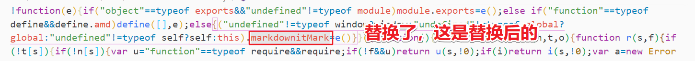

## 前言

**2020-4-6**

继续我的自建博客之旅，平时写文章，记笔记，都用在本地用markdown来写（我用的[VNote](https://tamlok.github.io/vnote)，超级好用，安利一波😜），所以想着自己的博客能直接使用自己的markdown文件就好了🤔。
于是我就开始找各种解决方案的道路，如果要将markdown内容网页显示，必不可少的要转为html。目前了解到目前博客渲染markdown为有两种方案：

- 直接将markdown转成html储存起来，访问文章直接访问html
- 在访问文章的时候将markdown渲染成html输出，然后呈现

两种方案各有千秋，我现在也没考虑啥SEO友好的，也不想产生多余的html文件，只要我的markdown，所以理所当然选择了后者。（我不会说我技术不够，只想到了这个🐶）。

当然了，动态渲染markdown也分**前端渲染**和**后端渲染**，作为一个前端新手毫不犹豫选择了前端渲染（因为后端目前我只会一点点PHP，又感觉到了自己的无知🙃），所以我要先搞一个（**嫖一个**）**浏览器环境**使用的markdown渲染器。

## 实现

### 使用`markdown-it`

markdown渲染器（还是叫markdown解析器，我也没分清😂）就是将输入markdown语法的字符串然后解析成HTML字符串。网上开源的md解析库很多，当然我找的是`JS`的解析库，像`marked`，`showdown`，`markdown-it`等等，我选的是**`markdown-it`**，我也不懂什么优缺点，只是为了和我本地的[VNote](https://tamlok.github.io/vnote)保持一致，本地使用，我选的就是这个渲染器，然后加各种插件拓展功能。

**使用的插件列表：**

- `markdown-it-sub` 上标
- `markdown-it-sup` 下标
- `markdown-it-footnote` 脚注
- `markdown-it-deflist` 定义列表
- `markdown-it-mark` 标记
- `markdown-it-task-lists` 任务列表
- `markdown-it-anchor`和`markdown-it-toc-done-right` 这两个好兄弟是来弄目录的
- `highlight.js` 代码高亮

具体使用看文档研究啦，还好有👉[中文文档](https://markdown-it.docschina.org/api/MarkdownIt.html)👈。

**官方文档这么说的：**
```
//安装
npm install markdown-it --save
bower install markdown-it --save
```

```js
// node.js, 用“类”的方式：
var MarkdownIt = require('markdown-it'),
    md = new MarkdownIt();
var result = md.render('# markdown-it rulezz!');

// 还是 node.js, 但使用更爽的方式：
var md = require('markdown-it')();
var result = md.render('# markdown-it rulezz!');

// 没有 AMD 的浏览器环境，在 js 脚本加载时才添加到“window”
// 注意，“markdownit” 中没有破折号。
var md = window.markdownit();
var result = md.render('# markdown-it rulezz!');
```
**看文档里好像很简单，但是我只知道`npm`怎么用，还不会`node`，我只是浏览器使用它，怎么办？** **没事，勇敢的面对它，找解决方案**


#### 从dist文件夹导入js文件

因为使用浏览器环境，所以直接引入脚本文件，（没有` AMD` 的浏览器环境，在 `js` 脚本加载时才添加到`window`），即`node_modules/对应插件名称/dist/`目录下的js文件即可。（注意顺序）
到时候用的时候单独把这些脚本文件复制出来，直接用记好了（我用的相对路径，`index.html`和`node_modules`同级）

```html
    <link rel="stylesheet" href="./atom-one-dark.css">//导入代码高亮样式文件
    ***********************************************************************
/*从dist文件夹导入js文件*/
    <script src="./highlight.pack.js"></script>//代码高亮
    <script src="./node_modules/markdown-it/dist/markdown-it.min.js"></script>
    <script src="./node_modules/markdown-it-sub/dist/markdown-it-sub.min.js"></script>
    <script src="./node_modules/markdown-it-sup/dist/markdown-it-sup.min.js"></script>
    <script src="./node_modules/markdown-it-footnote/dist/markdown-it-footnote.min.js"></script>
    <script src="./node_modules/markdown-it-deflist/dist/markdown-it-deflist.min.js"></script>
    <script src="./node_modules/markdown-it-mark/dist/markdown-it-mark.min.js"></script>
    <script src="./node_modules/markdown-it-task-lists/dist/markdown-it-task-lists.min.js"></script>
    //这俩特殊，别导错了
    <script src="./node_modules/markdown-it-anchor/dist/markdownItAnchor.umd.js"></script>
    <script src="./node_modules/markdown-it-toc-done-right/dist/markdownItTocDoneRight.umd.js"></script>

```
#### 初始化使用

浏览器下使用的插件对象都是挂载在`window`上的，注意对象名称是否正确，及时看看控制台报错。

```js
    var md = window.markdownit({
        html: true, //可以识别html
        linkify: true,//自动检测像链接的文本
        breaks: true,//回车换行
        typographer: true,//优化排版，标点
        //代码高亮
        highlight: function (str, lang) {
                    if (lang && hljs.getLanguage(lang)) {
                        try {
                            return '<pre class="hljs"><code>' +
                                hljs.highlight(lang, str, true).value +
                                '</code></pre>';
                        } catch (__) {}
                    }

                    return '<pre class="hljs"><code>' + md.utils.escapeHtml(str) + '</code></pre>';
                }
            }).use(window.markdownitSub)
            .use(window.markdownitSup)
            .use(window.markdownitFootnote)
            .use(window.markdownitDeflist)
            .use(window.markdownitTaskLists)
            .use(window.markdownitMark)
            .use(window.markdownItAnchor, {
                permalink: false,
                permalinkBefore: false,
                permalinkSymbol: '#'
            })
            .use(window.markdownItTocDoneRight, {
                containerClass: 'toc',
                containerId: 'toc',
                listType: 'ul',
                listClass: 'listClass',
                itemClass: 'itemClass',
                linkClass: 'linkClass',
                callback: function (html, ast) {
                    //把目录单独列出来
                    left.innerHTML = html;
                }
            });
```
#### `markdown-it-mark`引入文件的小坑

引入了`markdown-it-mark`插件后，我在文档上没看到它`window`上的对象名称，于是我直接用了`use(window.markdownitMark)`，这是我猜的，毫不意外控制台报错了`Uncaught TypeError: Cannot read property 'apply' of undefined`，说明我的名称写错了。于是我打印了`window`，然后找这个插件对象的名称，然后发现了叫它叫`markdown-it-mark.js`。我一脸的问号（保持微笑🙂x1），什么鬼？这一点不好引用，于是我打开了`markdown-it-mark.min.js`这个文件，`Ctrl+F`查找`markdown-it-mark.js`，然后替换为`markdownitMark`，然后`use(window.markdownitMark)`，一切都完美了。

**注：大概是在图中的位置**



### 独立导航目录

要把目录独立出来需借助`markdown-it-anchor`和`markdown-it-toc-done-right` 这两个插件，但是这两个插件又坑到一个作为新手的我了。

1. **引入的脚本文件是`markdownItAnchor.umd.js`和`markdownItTocDoneRight.umd.js`两个，这是我打印`window`试出来的（保持微笑🙂x2）**
2. **官方文档的示例代码是`use(window.markdownitAnchor)`和`use(window.markdownitTocDoneRight)`，但是我打印了控制台发现其实应该这么用`use(window.markdownItAnchor)`和`use(window.markdownItTocDoneRight)`，字母大小写`i`和`I`（保持微笑🙂x3，请想像我的心情），都不考虑下新手的感受的，我那么信任文档。**
3. **具体的实现思路就是利用`markdown-it-toc-done-right` 的回调函数`callback`把目录的`HTML`取出来放到别的盒子里，具体的配置根据喜好配吧（去看看文档😂）**
```js
use(window.markdownItAnchor, {
                permalink: false,
                permalinkBefore: false//这些有需要就去看文档吧
            })
            .use(window.markdownItTocDoneRight, {
                containerClass: 'toc',//生成的容器的类名，这样最后返回来的字符串是 <nav class="toc"><nav/>
                containerId: 'toc',//生成的容器的ID，这样最后返回来的字符串是 <nav id="toc"><nav/>
                listType: 'ul',//导航列表使用ul还是ol
                listClass: 'listClass',//li标签的样式名
                linkClass: 'linkClass',//a标签的样式名
                callback: function (html, ast) {
                    //把目录单独列出来
                    left.innerHTML = html;
                }
            })
```
## 最终成果


