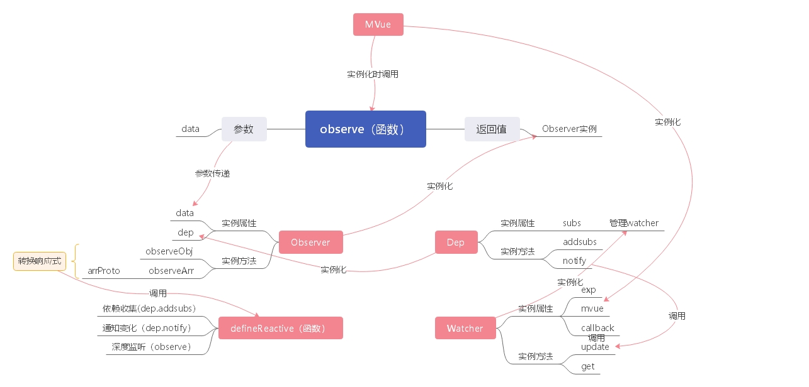

## 前言

这个同样是写博客的产出，之前在写博客的时候，瞎弄了一个模板引擎，当时就想之后把他优化一下，把 `Vue` 响应式原理放进去，弄成一个小的可以用来减少我写博客前端代码的组件化的”框架“，于是我就来填坑了。这个只是自己用来学习 `Vue2.0`响应式原理的一个小项目，代码的实现可能很初级，有些地方写的会比较差，请见谅。这篇文章接着上篇，说下响应式的实现。

项目源码：[传送门](https://github.com/Ray-daydayup/myblog-webpack/tree/master/src/lib/min-vue)
实现效果：[我的博客](http://raydaydayup.cn/)就是用这个小框架改造的

## 什么是MVVM模式[^1][^2]?

[^1]:[MVVM 模式介绍](https://github.com/xitu/gold-miner/blob/master/TODO%2Fapproaching-android-with-mvvm.md)
[^2]:[vue.js和MVVM](https://blog.csdn.net/u014346301/article/details/53812770)

**Model-View-ViewModel**就是将其中的 View 的状态和行为抽象化，让我们可以将 UI 和业务逻辑分开。当然这些工作 ViewModel 已经帮我们做了，它可以取出 Model 的数据同时帮忙处理 View 中由于需要展示内容而涉及的业务逻辑。

MVVM模式是通过以下三个核心组件组成，每个都有它自己独特的角色：

- Model - 包含了业务和验证逻辑的数据模型
- View - 定义屏幕中View的结构，布局和外观
- ViewModel - 扮演“View”和“Model”之间的使者，帮忙处理 View 的全部业务逻辑，通过双向数据绑定把 View 层和 Model 层连接了起来。

## Vue2.0的响应式原理

`vue`的响应式是怎么实现的呢？很多文章也解析过了，`vue` 是通过数据劫持的形式进行响应式的实现，最最关键的就是`Object.defineProperty`，利用它可以 把传入 `Vue` 实例`property` 全部转为`getter/setter`。像下面这样：

```js
function defineReactive(obj, key, value) {
  let val = value
  Object.defineProperty(obj, key, {
    enumerable: true, // 可枚举
    configurable: true, // 当且仅当该属性的 configurable 为 true 时，该属性描述符才能够被改变，同时该属性也能从对应的对象上被删除。默认为 false。
    get: function () {
      // val 闭包
      return val
    },
    set: function (newVal) {
      // val 一直在闭包中，此处设置完之后，再 get 时也是会获取最新的值
      val = newVal
    }
  })
}
```

当`obj`对用的`key`的值发生变化了我们就能监听到了。那么又如何实现，数据变化后进行相关的操作的呢？

`Vue`的响应式主要包括三大部分：`Observer`、`Dep`和`Watcher`。

- `Observer`：将每个目标对象（即`data`）的键值转换成`getter/setter`形式，用于进行依赖收集以及调度更新。响应式数据中每一个对象，对应一个`Observer`的实例
- `Dep`：`Observer`实例的`data`在触发 `getter` 时，`Dep` 实例就会收集依赖的 `Watcher`实例 ， `Dep`实例是一个管理员 ，可以管理多个`Watcher`实例，当`data`变动时，就会通过 `Dep`实例 给 `Watcher`实例 发通知进行更新。响应式数据中每一个对象的属性，对应一个`Dep`的实例
- `Watcher`：是一个观察者对象。依赖收集以后 `Watcher` 对象会被`Dep`实例进行管理，数据变动的时候`Dep`实例会通知`Watcher`实例，然后由`Watcher`实例进行视图的更新。

## 响应式实现的思路

响应式的实现主要实现一个`observe`函数，传入的参数是响应式数据`data`，返回值是`Observer`实例。`observe`函数的执行流程是：

1. 判断传入的对象是否是数组或者对象，否则返回`undefined`
2. 如果是，判断是否已经为响应式数据，如果是则返回已经存在的`Observer`实例，否则实例化一个新的`Observer`实例并返回。

```js
/**
 * 监听
 * @param {Object} data
 */
export default function observe(data) {
  if (typeof data !== 'object' || data === null) {
    // 不是对象或数组
    return
  }
  let ob
  if (data.hasOwnProperty('__ob__') && data.__ob__ instanceof Observer) {
    ob = data.__ob__ //__ob__为定义的响应式数据的Observer实例
  } else {
    ob = new Observer(data)
  }
  return ob
}
```

### `Observer`类的实现

那么我们再来看看`Observer`类的定义：

```js
class Observer {
  constructor(data) {
    this.data = data // 初始化属性
    this.dep = new Dep()// 初始化dep实例，在数组的监听中会用到
    def(data, '__ob__', this) // 给对象的本身添加一个属性指向响应式对象，用于判断数据是否已经成为响应式式数据，并可以通过数据对象找到
    if (Array.isArray(data)) {//判断是否为数组，如果是数组即进行数组的监听
      if ('__proto__' in {}) {
        data.__proto__ = arrProto
      } else {
        addSelfMethod(data, arrProto, arrayKeys)
      }
      this.observeArr(data)
    } else {//如果是对象进行对象的监听
      this.observeObj(data)
    }
  }
// 监听对象
  observeObj(obj) { 
    const keys = Object.keys(obj)
    for (let i = 0; i < keys.length; i++) {
      defineReactive(obj, keys[i], obj[keys[i]])
    }
  }
  //监听数组
  observeArr(arr) {
    for (let i = 0; i < arr.length; i++) {
      observe(arr[i])
    }
  }
}
```

从定义可以看出，在`Observer`类实例化得过程中有几个关键的地方：实例属性`dep`，数组的监听和对象的监听，那么我们接下来看一看`Dep`类的实现。

### `Dep`类的实现

```js
export default class Dep {
  constructor() {
    this.subs = [] // 数组，管理Watcher实例
  }
  addSub(sub) { //添加Watcher实例
    this.subs.push(sub)
  }
  notify(isArrayMethod = false) { // 调用Watcher实例的更新方法
    this.subs.forEach(function (sub) {
      sub.update(isArrayMethod)
    })
  }
}

Dep.target = null //静态属性，用于添加Watcher实例
```

从上面的代码可以看出，`Dep`类的实现比较简单，只需要维护一个数组管理`Watcher`实例，可以添加`Watcher`实例，通知`Watcher`实例，并调用其更新方法。关于`notify`的参数`isArrayMethod`并不是`vue`源码之中实现方法，只是为了辨别是否为数组方法所产生数组变化，然后做出响应，后续会解释。

既然`Dep`类的实现已经清楚，那么接下来回到`Observer`类的实例化过程，首先看下，如何实现对象的监听。

### 对象的监听

在`Observer`类的定义中，对对象的监听是对对象的每一个属性调用`defineReactive`函数，这个函数其实就是实现响应式的关键部分，如下代码。

```js
/**
 * 定义响应式
 * @param {Object} data 数据
 * @param {string} key 属性名
 * @param {*} val 值
 */
function defineReactive(obj, key, value) {
  let val = value
  let childOb = observe(val) // 递归深度遍历，实现深度监听，如果值不是对象或者数组，childOb为undefined
  let dep = childOb ? childOb.dep : new Dep()// 如果属性为对象或者数组，则使用其Observer实例的属性dep来管理，否则就实例化一个Dep实例，利用闭包，实现对原始值的管理
  Object.defineProperty(obj, key, {
    enumerable: true, // 可枚举
    configurable: true, // 当且仅当该属性的 configurable 为 true 时，该属性描述符才能够被改变，同时该属性也能从对应的对象上被删除。默认为 false。
    get: function () {
      // val 闭包
      if (Dep.target) { // 添加`watcher`实例
        dep.addSub(Dep.target)
      }
      return val
    },
    set: function (newVal) {
      // 如果对象的属性为对象或数组，那么由于是引用类型，值更改之后，需要将原来响应式数据dep管理的`watcher`实例继承过来，然后再深度监听
      if (childOb) {
        let temp = dep
        childOb = observe(newVal) // 递归深度遍历，实现深度监听
        childOb.dep.subs.push(...temp.subs)
        dep = childOb.dep
      }
      // val 一直在闭包中，此处设置完之后，再 get 时也是会获取最新的值
      val = newVal
      dep.notify()
    }
  })
}
```

在上面的代码中，有三个地方有些特殊：

1. `let dep = childOb ? childOb.dep : new Dep()`，为什么属性为对象或者数组，使用其`Observer`实例的属性`dep`来管理？在数组的监听的过程中，需要借助这个属性才能实现对数组方法的监听
2.  `get`函数中，关于`dep`管理`Watcher`实例那部分代码的`Dep.target`是什么？`Dep.target`其中存储的是`Watcher`实例，因为同一时刻只能存在一个`Watcher`实例被纳入管理。或许不太清楚，具体解释会在后面依赖收集中进行解释
3. `set`函数中关于新的值的递归遍历处理是存在问题的。
    -  在代码注释里我的解释其实不完全正确的，如果对象对应的属性是`Object`或`Array`，而且新的值是同类型的且值内部的被依赖的属性是相同的，那么这是没有问题的。
    - 如果对象对应的属性是原始值，新的值是`Object`或`Array`，那么新的值是无法被准换响应式的
    - 如果对象对应的属性是`Object`或`Array`，而且新的值是原始值，这段代码会报错。
    - 有一行代码是的目的是将原来响应式数据`dep`管理的`Watcher`实例继承过来,但是我并没有考虑到，原本的`Watcher`实例如果不需要使用的情况，这可能导致`dep`的`subs`数组越来越大，然后内存溢出。
    - 但只是解释响应式够了，所以这段代码没有优化修改。

```js
// 如果对象的属性为对象或数组，那么由于是引用类型，值更改之后，需要将原来响应式数据dep管理的`watcher`实例继承过来，然后再深度监听
if (childOb) {
  let temp = dep
  childOb = observe(newVal) // 递归深度遍历，实现深度监听
  childOb.dep.subs.push(...temp.subs)//将原来响应式数据dep管理的`watcher`实例继承过来
  dep = childOb.dep
}
```

### 数组的监听

在`Observer`类的定义中，`Array`的监听是这样实现的：

```js
if ('__proto__' in {}) {
  data.__proto__ = arrProto
} else {
  addSelfMethod(data, arrProto, arrayKeys)
}
this.observeArr(data)
```

在这段代码中，`observeArr`不用解释的。重点是`data.__proto__ = arrProto`和`addSelfMethod`两个部分的实现。在解释这两个之前，先要弄清楚数组的监听是指对于一些常用的数组的方法的引起的改变的监听。`arr[0]=4`和`arr.length=1`这种类型的改变是无法监听的。

这里利用了原型链的原理，先来看看`arrProto`和`arrayKeys`的实现。

```js
// 重新定义数组原型
const oldArrayProperty = Array.prototype
// 创建新对象，原型指向 oldArrayProperty ，再扩展新的方法不会影响原型
const arrProto = Object.create(oldArrayProperty)
;['push', 'pop', 'shift', 'unshift', 'splice', 'sort', 'reverse'].forEach(
  (methodName) => {
    arrProto[methodName] = function (...args) {
      const result = oldArrayProperty[methodName].call(this, ...args) //执行原来的数组方法
      const ob = this.__ob__ // 获取对应的`Observer`实例
      let inserted
      switch (methodName) {
        case 'push':
        case 'unshift':
          inserted = args
          break
        case 'splice':
          inserted = args.slice(2)
          break
      }
      if (inserted) ob.observeArr(inserted) // 监听新增的值
      ob.dep.notify(true) //通知更改
      return result
    }
  }
)
export default arrProto

const arrayKeys = Object.getOwnPropertyNames(arrProto)
```

由于`__proto__`不是标准的属性，所以有的浏览器可能没实现，如果存在这个属性，那么就让原本的数组的`__proto__`指向我们更改后的对象，这样可以实现，对数组方法的监听。如果不存在就调用`addSelfMethod`，在对象身上添加对应的不可枚举的方法，实现拦截。

```js
/**
 *
 * @param {obj} target
 * @param {*} src
 * @param {*} keys
 */
function addSelfMethod(target, src, keys) {
  for (let i = 0, l = keys.length; i < l; i++) {
    const key = keys[i]
    def(target, key, src[key])//给数组对象的本身添加对应的方法
  }
}
```

其实到上面已经很清楚，为什么`Observer`实例上会存在`dep`实例，为什么对象或者数组要用`Observer`实例上的`dep`实例来管理`Watcher`实例。因为这样可以在非`defineReactive`函数内部访问和调用。

到这里，除了`Watcher`，主要的响应式核心已经完成了。那么，我们先来整合一下实现一个简单的响应式类。

### 基础的`MVue`类的实现

作为一个框架肯定要有一个入口，那么就是响应式实例，响应式实例主要负责将数据转换成响应式的，还有一些生命周期钩子什么的，实现比较简单。

```js
import observe from './observer/index'
import { proxy } from './utils/index'

export default class MVue {
  constructor(options) {
    const { el, data, methods, created } = options
    if (data) {
      this.data = typeof data === 'function' ? data() : data // 函数则执行获取返回值
      proxy(this.data, this)
      observe(this.data) //转换响应式
    }
    Object.assign(this, methods)
    if (el) {
      this.elSelector = el
    }
    created && created.call(this)
  }
}
```

这就实现了一个简单的响应式类，调用`observe`实现响应式数据，其中`proxy`函数是实现访问`实例.a`相当于访问`实例.data.a`，代码如下：

```js
export function proxy(data, mVue) {
  const me = mVue
  Object.keys(data).forEach(function (key) {
    Object.defineProperty(me, key, {
      configurable: false,
      enumerable: true,
      get: function () {
        return me.data[key]
      },
      set: function (newVal) {
        me.data[key] = newVal
      }
    })
  })
}
```

### 依赖收集

响应式实例有了，数据变化也能监听到了，那么怎么样执行相关操作呢？这就涉及到依赖收集，关于依赖收集课参考[这篇文章](https://juejin.im/post/5adf0085518825673123da9a)的说法。我的理解，依赖收集就是在模板中使用的响应式数据才会根据数据的变化执行渲染。也就是用到了响应式对象的属性就在对应的`dep`实例添加`Watcher`实例。

那么我们再回到对象监听的`defineReactive`函数里面关于`get`函数的部分。

```js
get: function () {
      // val 闭包
  if (Dep.target) { // 添加`watcher`实例
    dep.addSub(Dep.target)
  }
    return val
}
```

当我们访问响应数据的时候都会经过`get`函数，如果这个时候需要进行依赖收集的话，那么`Dep.target`的值就是待管理的`Watcher`实例，然后进行依赖收集。如果不需要收集的话就让`Dep.target = null`。

**那么我们整理一下依赖收集的思路**：假设我们在模板中需要用到响应式数据的属性`a`的值，在模板编译过程中，实例化一个`Watcher`实例，并定义相关操作，然后将`Dep.target`指向该`Watcher`实例，去响应式实例中访问这个属性，然后就能够添加管理，最后再`Dep.target = null`，等待下一次收集。

**那么如何去访问响应式实例的数据呢？**

```js
/**
 * 获取变量
 * @param {String} expPath 变量路径
 */
export function parsePath(expPath) {
  let path = expPath
  //实现对数组的访问类似arr[0]
  if (path.indexOf('[')) {
    path = path.replace(/\[/g, '.')
    path = path.replace(/\]/g, '.')
    if (/\.$/.test(path)) {
      path = path.slice(0, path.length - 1)
    }
    if (/\.\./.test(path)) {
      path = path.replace('..', '.')
    }
  }
  const bailRE = /[^\w.$]/
  if (bailRE.test(path)) {
    return
  }
  const segments = path.split('.')
  return function (object) {
    let obj = object
    for (let i = 0; i < segments.length; i++) {
      if (typeof obj === 'undefined') return ''
      let exp = segments[i]
      obj = obj[exp]
    }
    if (typeof obj === 'undefined') return ''
    return obj
  }
}
```

上面的函数就是实现对响应式数据的访问，传入对应的表达式（如`a.b.c`）会获得对应的函数，传入对应的响应式实例，执行函数即可获得变量的值，即调用`get`函数。

### `Watcher`类的实现

一切就绪就差一个执行者来负责实施对应的操作了，也就是`Watcher`，下面就是代码。

```js
import { parsePath } from '../utils/index'
import Dep from '../observer/dep.js'

export default class Watcher {
  constructor(mVue, exp, callback) {
    this.callback = callback //回调函数
    this.mVue = mVue // 响应式实例
    this.exp = exp // 表达式
    Dep.target = this // 开始依赖收集
    this.value = this.get() // 调用get
    Dep.target = null // 添加完毕
    this.update() // 第一次执行
  }
  async update(isArrayMethod = false) {
    const value = this.get()
    if (this.value !== value || isArrayMethod) {
      this.callback(value, this.value) // 调用回调
      this.value = value
    }
  }
  get() {
    const getter = parsePath(this.exp)
    return getter.call(this.mVue, this.mVue)
  }
}
```

从上面的代码可以知道，实例化时进行了依赖收集。我们在模板编译的时候只定义回调就好了。

## 总结

写到这里，整个响应式基本就完成了。最后整理一下，整体的思路。



