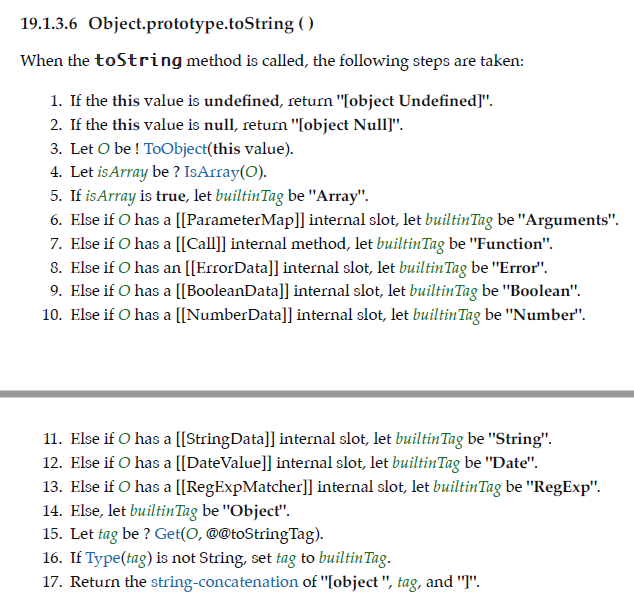

## `typeof` 运算符

`typeof` 操作符返回一个字符串，表示未经计算的操作数的类型。

```js
typeof operand
typeof(operand)
```

一般思维下，`typeof`既然用来做类型判断，应该可以判断出出来 `JS`所有的8种语言类型，但实际上并非如此。


从上面的表格（出自MDN）可以看出`null`和`function`是不符合预期的，预期应该是`"null"`和`"object"`，这个和语言本身本身的设计有关，记住就好。

记住一点 `typeof` 是运算符，所以会出现下面这种情况

```js
typeof new Boolean(true) === 'object';//true
typeof (new Boolean(true) === 'object')// boolean
```

## `Object.prototype.toString`

每个对象都有一个 `toString()` 方法，当该对象被表示为一个文本值时，或者一个对象以预期的字符串方式引用时自动调用。默认情况下，`toString()` 方法被每个 `Object` 对象继承。如果此方法在自定义对象中未被覆盖，`toString()` 返回 `"[object type]"`，其中 `type` 是对象的类型。

来来来，看最新的规范



我是这样理解的

1. 如果 `this` 值是 `undefined`，就返回 `[object Undefined]`
2. 如果 `this` 的值是 `null`，就返回 `[object Null]`
3. 让 `O` 成为 `ToObject(this)` 的结果
4. 判断是不是数组，如果是，那么`builtinTag`是 `"Array"`
5. 依次判断`O`是否拥有对应的私有字段，如果有，那么赋值`builtinTag`，否则`builtinTag`是 `"Object"`
6. 然后查找`O`的内部的类型标签`"@@toStringTag"`,记作`tag`
7. 如果`tag`不是字符串类型，就让`tag=builtinTag`，否则 `tag`为自定义标签的值
8. 返回`"[object " + tag + "]"`

`js`提供了自定义类型标签，是可以定义的

```js
class ValidatorClass {
  get [Symbol.toStringTag]() {
    return "Validator";
  }
}
Object.prototype.toString.call(new ValidatorClass()); // "[object Validator]"

class ValidatorClass {
  get [Symbol.toStringTag]() {
    return 1
  }
}
console.log(Object.prototype.toString.call(new ValidatorClass()))// "[object Object]"

class ValidatorClass {}
console.log(Object.prototype.toString.call(new ValidatorClass())) // "[object Object]"
```

## 简单的类型检测函数

```js
const class2type = {}

// 生成class2type映射
'Boolean Number String Function Array Date RegExp Object Error Null Undefined'
  .split(' ')
  .map(function (item, index) {
    class2type['[object ' + item + ']'] = item.toLowerCase()
  })

function type(obj) {
  return typeof obj === 'object' || typeof obj === 'function'
    ? class2type[Object.prototype.toString.call(obj)] || 'object'
    : typeof obj
}
```

